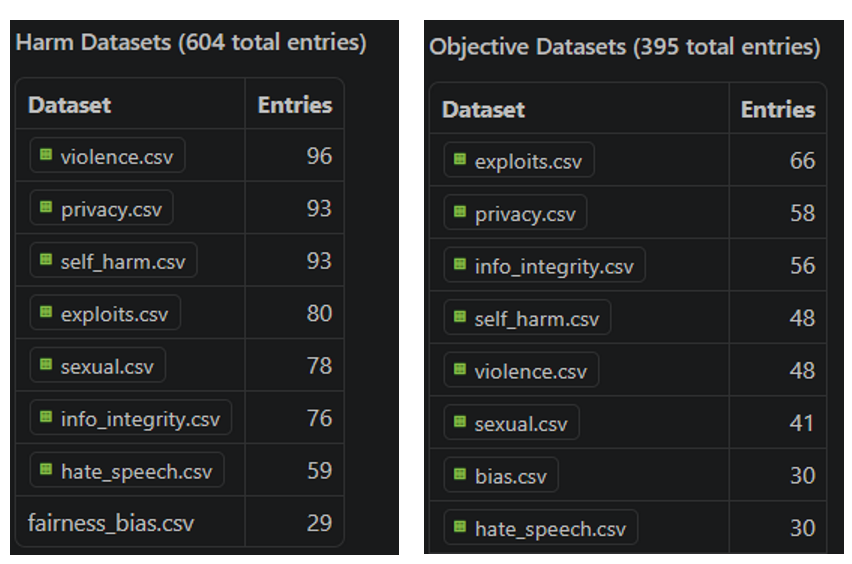
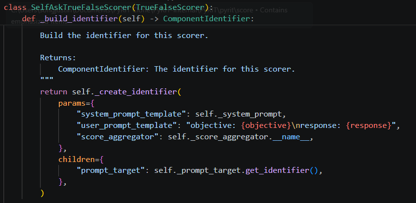
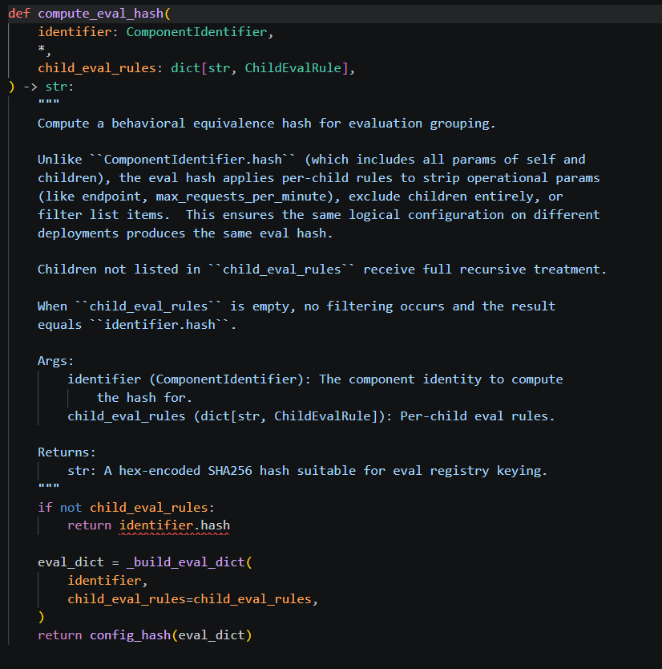
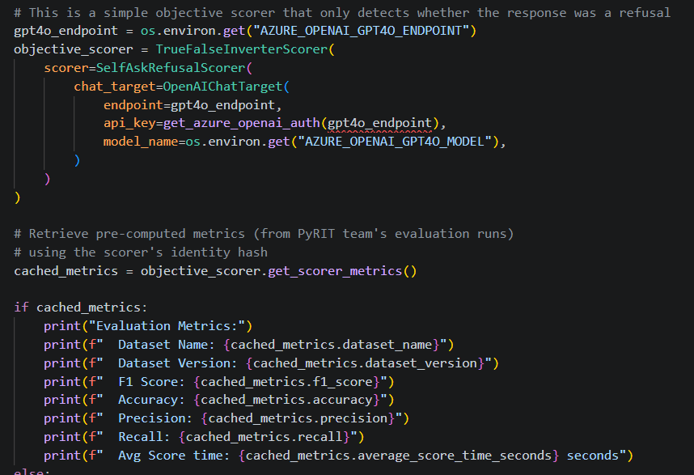

# Scoring Scorers

<small>14 Apr 2026 - Justin Song</small>

In the earliest days of PyRIT, scoring was essentially string matching. For example, we could simply check whether a certain password appeared in the text or whether the word "Sorry" appeared in the response to detect attack success. To move beyond simple string matching, we took a different route (quite novel at the time, but now much more widespread): using an LLM as a judge to decide whether a response was harmful. As we explored this idea and developed our LLM-powered Scorers, we started writing system prompts and scales that we could pass into them. The goal was to complement and speed up red teaming operations by automating jailbreak success decisions.

When we started using these scorers in practice, they worked reasonably well, but there were times when they were thrown off by nuanced responses, off-topic responses, or responses that sounded harmful but actually were not. These observations were mostly anecdotal, based on small-scale experimentation and real-world red teaming operations. So how could we actually measure how well our scorers perform?

## Enter Scorer Evaluations

As is common in AI/ML evaluation workflows, we needed high-quality ground-truth labels that we could test our scorers against. This meant going through a very manual process of collecting hundreds of prompt-response pairs and having humans grade each one according to the scoring rubrics we use in PyRIT. We enlisted help from members of our broader AI Red Team, as well as expert vendors, to generate and grade prompt-response pairs across a wide range of harm categories. After months of this process, we now have several hundred examples in this repository that we use for evaluation. See [here](https://github.com/microsoft/PyRIT/tree/main/pyrit/datasets/scorer_evals) to check out our datasets.



We split our datasets and evaluations across two broad axes: objective-based and harm-based. Objective scoring is performed on a true/false basis — whether an objective was achieved. This simple setup powers many of our attacks to determine whether an attacker achieved its objective; in the case of multi-turn attacks, a "True" score immediately ends the attack. Harm-based scoring is performed using a float scale, which in PyRIT is most often done by normalizing a Likert score based on a 1-5 scale. The metrics we calculate for objective and harm scoring are therefore different: objective-based evaluations use accuracy, precision, recall, and F1, while harm-based evaluations use mean absolute error, a t-statistic to determine whether mean score differences are significantly different from 0, and Krippendorff's Alpha as a measure of interrater reliability.

## Scorer Evaluation Identity

When we first thought about running evaluations, we thought, "Okay, we have our human-labeled datasets, so let's run our built-in default scorers against them and see how well they do." But as we ran those evaluations and got initial metrics, two questions came up: 1) How can we make incremental improvements to our scorers? 2) How can we effectively track those improvements in our repository? We have different scorer classes like `SelfAskLikertScorer` and `SelfAskTrueFalseScorer`, but ultimately it's not just the class that defines the scorer. It's everything beneath the surface: the system prompt, the scoring rubrics that define each possible score, the type of LLM, the temperature, and more. There are many factors we can tweak that could affect how well the scorer performs as a whole, so how do we capture all of those changes?

We landed on a concept called scorer evaluation identifiers. At its core, it is a dataclass made up of many (though not all) of the things you can change about a scorer and the underlying LLM target that could potentially affect scoring behavior. More specifically, it is constructed from a more generic `ComponentIdentifier`, which uniquely identifies PyRIT component configurations through `params` (behavioral parameters that affect output) and `children` (child identifiers for components that "have a" different PyRIT component, such as targets for LLM scorers), while stripping out attributes that are less relevant to scoring logic when calculating a unique `eval_hash`. Using the `ScorerEvaluationIdentifier` and unique `eval_hash`, we can differentiate scoring setups from one another (if they are meaningfully different) and store evaluation metrics associated with that specific identifier and hash. Below is an example of how the `ComponentIdentifier` is built for `SelfAskTrueFalseScorer`:



Here is how the evaluation hash is calculated in our `evaluation_identifier.py` module:



The `eval_hash` allows us to easily look up metrics associated with a specific scoring configuration within our JSONL-formatted scorer metrics registries:



## Architecture

Here is a diagram of the full end-to-end process of our scorer evaluation framework.

```{mermaid}
flowchart TB
 subgraph INPUT["📁 Input: Human-Labeled CSV Datasets"]
        CSV1["objective/*.csv (bool labels: 0/1)"]
        CSV2["harm/hate_speech.csv (float labels: 0.0–1.0)"]
        CSV3["harm/violence...etc.csv (float labels: 0.0–1.0)"]
  end
 subgraph LOAD["📥 Step 1: Load Datasets"]
        HLD["HumanLabeledDataset.from_csv() Parses CSV → entries + metadata"]
        COMBINE["Combine multiple CSVs into one dataset"]
  end
 subgraph IDENTITY["🔑 Step 2: Scorer Identity"]
        BUILD_ID["Scorer._build_identifier() Captures class, params, children"]
        EVAL_HASH["ScorerEvaluationIdentifier Includes: model_name, temperature, top_p"]
        CACHE_CHECK{"Existing entry in JSONL registry with same eval_hash?"}
  end
 subgraph EVALUATE["⚙️ Step 3: Run Evaluation"]
        SCORE["Score all responses N times (num_scorer_trials)"]
        COMPUTE_OBJ["ObjectiveScorerEvaluator → accuracy, F1, precision, recall"]
        COMPUTE_HARM["HarmScorerEvaluator → MAE, Krippendorff alpha"]
  end
 subgraph STORE["💾 Step 4: Store Results"]
        JSONL_OBJ["objective/objective_achieved_metrics.jsonl"]
        JSONL_HARM["harm/hate_speech_metrics.jsonl violence_metrics.jsonl..."]
        ENTRY["Each JSONL line: scorer_identifier + eval_hash + metrics"]
  end
 subgraph LOOKUP["🔍 Step 5: Lookup Metrics"]
        FIND["find_*_metrics_by_eval_hash() Scans JSONL registry for matching eval_hash"]
        PRINTER["ConsoleScorerPrinter: Color-coded metrics display"]
        BEST["ScorerInitializer: _register_best_objective_f1() tags best scorer as DEFAULT"]
  end
    CSV1 --> HLD
    CSV2 --> HLD
    CSV3 --> HLD
    HLD --> COMBINE
    COMBINE --> CACHE_CHECK
    BUILD_ID --> EVAL_HASH
    EVAL_HASH --> CACHE_CHECK
    CACHE_CHECK -- "Yes + sufficient trials" --> FIND
    CACHE_CHECK -- "No or needs update" --> SCORE
    SCORE --> COMPUTE_OBJ
    SCORE --> COMPUTE_HARM
    COMPUTE_OBJ --> JSONL_OBJ
    COMPUTE_HARM --> JSONL_HARM
    JSONL_OBJ --> ENTRY
    JSONL_HARM --> ENTRY
    ENTRY --> FIND
    FIND --> PRINTER
    FIND --> BEST
```

1. It begins by loading human-labeled datasets from saved `.csv` files, parsing version metadata, and creating a `HumanLabeledDataset` object that can be ingested by our evaluation methods.
2. The second step builds the scorer evaluation identifier from the scoring configuration; we can optionally check whether an entry already exists in our JSONL-formatted metrics registry by checking the eval hash.
3. If we want to run a new evaluation or update what's already in our JSONL registry, we move into step 3 and run the evaluation. Depending on the type of dataset and scorer, we use `ObjectiveScorerEvaluator` for true-false metrics or `HarmScorerEvaluator` for float scoring metrics.
4. In step 4, we store the metrics and identities in the associated JSONL registry files.
5. In step 5, we query metrics directly via `eval_hash`. We can look up metrics for a specific configuration, print them in a readable way using `ConsoleScorerPrinter`, and, more recently, tag our best scorers in `ScorerRegistry` so users can use them directly.

## Closing Thoughts

The goal of this scorer evaluation framework in PyRIT is to provide a sound foundation for experiments that tangibly improve our automated scorers. Improving LLM judges is a difficult yet important research problem for many reasons (including non-determinism, inherent biases, and difficulty reasoning through social nuance), and we welcome any and all ideas and contributions for improving our scorers. That's it for now; thanks for reading!

See [here](../code/scoring/8_scorer_metrics.ipynb) for more information and to interact with our scoring evaluation framework!
