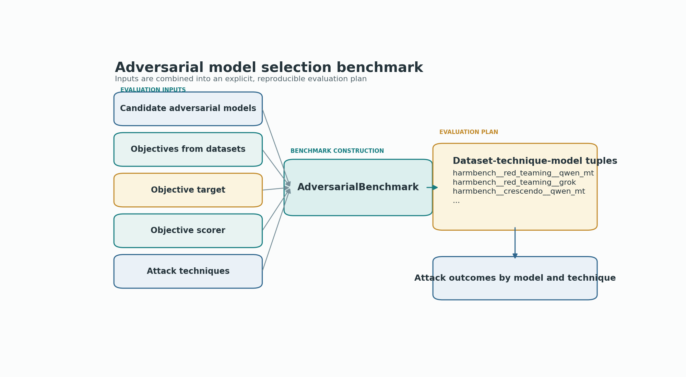
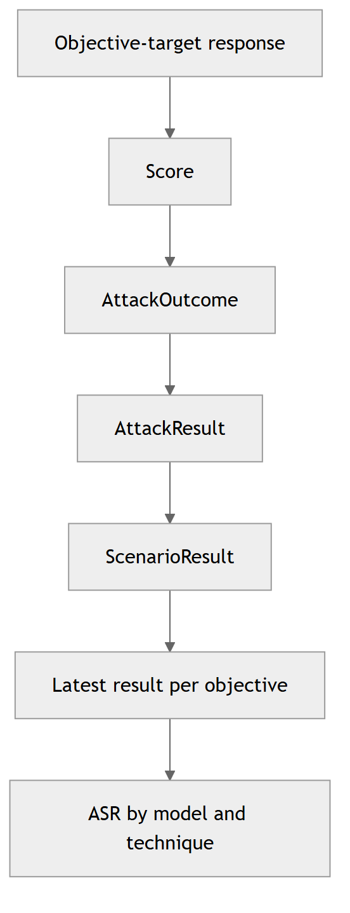
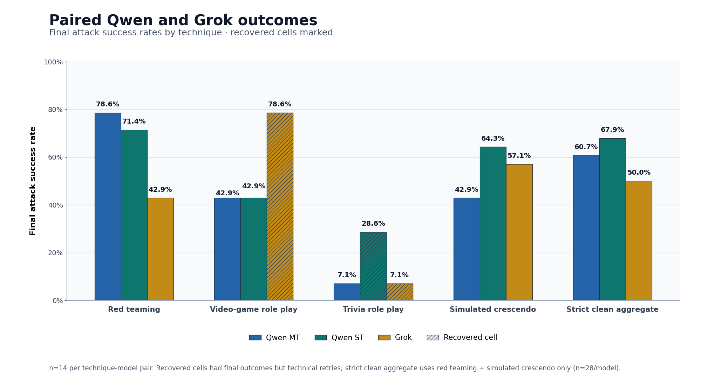

# Choosing Adversarial Models for Automated Red Teaming with PyRIT

2 Sep 2026 - Victor Valbuena, AIRT @ Microsoft

PyRIT helped us discover that we could improve the attack success rate of our adversarial chat target by more than 19 percentage points.

We use PyRIT during red teaming operations, where many automated techniques use an adversarial model for attack orchestration. We wanted better adversarial models for PyRIT, so we built a tool to automate that comparison process. This became PyRIT's `AdversarialBenchmark` scenario and turned model selection from an intuition-driven choice into a repeatable evaluation. We are scaling this evaluation through CI/CD to continuously discover effective models for automating red teaming. When we ran it against in-house models, we discovered surprising patterns in attack performance across techniques, which this post explores.

## Why the Adversarial Model Matters

Red teaming operations are increasingly orchestrated by agents built on advanced LLMs. The model driving an attack often needs to:

- Plan the attack.
- Adapt to objective-target responses that may include denial or misdirection.
- Use long conversation histories, including multi-step exploits.
- Return reliably structured output for scoring and evaluation.

If that model underperforms at any of these tasks, it becomes ineffective for the operation. The best models for automated red teaming are usually both unaligned and adversarial. **Alignment** means adherence to safety-focused post-training intended to make a model behave as a safer assistant. An **adversarial model** is a model used to generate or adapt attacks against another model. The choice of model therefore acts as a multiplier for successful automated red teaming.

There is nuance to this choice that makes intuition insufficient. Models with fewer safety restrictions, including abliterated models, may be more willing to comply with requests to probe or bypass another model's defenses, but they may also be less consistent in achieving attack goals. Effectiveness also depends on the type of objective and the attack technique being used. "Best" is conditional rather than universal: a model may excel with one attack technique or objective target while underperforming with another.

## A Controlled Way to Compare Models

PyRIT defines a controlled comparison by holding the objective target, objectives, scorer, and attack techniques constant while varying the adversarial model, then measuring the resulting attack outcomes. This gives us a fair way to compare how models perform in red teaming contexts.

### Designing a Fair Comparison

The `AdversarialBenchmark` scenario builds a matrix of attack techniques, adversarial models, and datasets. Users can run one technique, a named aggregate such as `light`, or a wider registered technique set to observe model performance along that axis. Each matrix cell corresponds to a dataset-technique-model tuple, such as `harmbench__red_teaming__qwen_mt`, and produces one result per selected objective.



*Figure 1 - The benchmark varies the adversarial model while controlling the other evaluation inputs and expands the resulting dataset-technique-model tuples.*

| Held constant | Varied | Recorded | Derived |
| --- | --- | --- | --- |
| Objective target, objectives, scorer, techniques | Adversarial model | Per-attack score and outcome | ASR, errors, retries, and coverage |

The scenario controls the comparison axes, but experimental fairness still depends on the operator. Pinning the objective set, model versions, generation parameters, rate limits, and concurrency makes the experiment more defensible. Pay special attention to datasets, which contain the attack objectives and establish the standard against which the scorer judges attack success or failure.

### Measuring Attack Success

PyRIT does not directly store an ASR value for each attack, but it retains the information necessary to calculate it. A scorer produces a normalized `Score`. The attack interprets that score and stores an `AttackResult` whose outcome is `success`, `failure`, `error`, or `undetermined`. A `ScenarioResult` then groups those records by atomic attack.



*Figure 2 - PyRIT records per-attack evidence first; the reporting step derives aggregate ASR.*

On PyRIT's current development branch, [`build_scripts/export_adversarial_benchmark_result.py`](https://github.com/microsoft/PyRIT/blob/main/build_scripts/export_adversarial_benchmark_result.py) is a command-line reporting tool for completed or partial adversarial benchmark runs. It does not run the benchmark or store ASR in PyRIT's database. After a run, the tool loads one persisted `ScenarioResult` from PyRIT's SQLite memory using its `scenario_result_id`, then writes a report to a caller-supplied output directory:

```bash
python -m build_scripts.export_adversarial_benchmark_result \
  --scenario-result-id <scenario-result-id> \
  --output-dir <output-directory>
```

A scenario can contain more than one `AttackResult` for the same objective and technique-model-dataset combination, for example after a retry. For each combination, the reporting tool keeps only the newest result for each objective based on its timestamp. It counts older records separately as `retry_records`, so retries do not count as additional benchmark attempts. From the retained results, it calculates:

$$
\mathrm{ASR}=\frac{\text{success}}{\text{success}+\text{failure}+\text{error}+\text{undetermined}}.
$$

Errors and undetermined outcomes therefore lower the reported ASR but remain visible in separate columns. This distinction matters operationally because a model that fails to achieve an objective and an endpoint that fails to return usable evidence require different responses. In the diagnostic harness used for the head-to-head below, one terminal `success` or `failure` is retained per objective for effectiveness statistics, while failed attempts remain separate operational telemetry and mark the cell as degraded.

The exporter output directory contains three views of the run:

- `technique-metrics.json`, `technique-metrics.csv`, and `technique-metrics.txt` contain latest-per-objective counts and `success_rate`, grouped by attack technique and adversarial-model registry name.
- `attacks.json` and `attacks.txt` list stored attack-result rows. The JSON is a compact table containing the attack-result ID, atomic-attack name, objective, outcome, executed turns, and optional score value; it is not a full serialization of `AttackResult`.
- `overview.txt` contains PyRIT's standard scenario summary.

## What We Observed

Three preliminary evaluations across several model families support the same high-level conclusion: the model powering an attack matters, but its advantage depends heavily on benchmark design and attack technique. These studies did not all use the same victim. The available attacker-training pilot evidence identifies only an internal objective target, while the separate Grok study and head-to-head used a GPT-4o objective target. Their objective sets, scorers, and techniques also differed, so absolute ASRs must not be compared across studies.

In an attacker-training pilot, we ran the benchmark on Qwen-series models trained by Bullwinkel et al. in [Learning to Attack and Defend: Adaptive Red Teaming of Language Models via GRPO](https://arxiv.org/pdf/2606.09701). The attacker-trained single-turn Qwen variant achieved 20 successes in 60 model-technique-objective cells, an aggregate ASR of 33.3%. A legacy adversarial GPT-4o endpoint, acting as a baseline, achieved 3 of 60, or 5.0%, for a 28.3 percentage-point gap. An abliterated open-weight derivative that was not trained as an attacker reached 10.0%.

That result supports an important distinction: removing safety behavior is not the same as learning to attack. In this pilot, the attacker-trained variants substantially outperformed the model that had only been unaligned.

A separate paired study compared Grok with a legacy GPT-4o adversarial endpoint on 50 pinned HarmBench objectives and four techniques. Under that study's harm-proxy scorer, Grok achieved 124 successes in 200 cells, or 62.0%, compared with 85 of 200, or 42.5%, for a 19.5-point gap. This was one preliminary run against one objective target, not a universal ranking.

We then ran a paired head-to-head comparison between the attacker-trained Qwen multi-turn and single-turn models and Grok. All three models received the same 14 pinned objectives under four techniques against a GPT-4o objective target. The run logs identify the objective scorer as a `FloatScaleThresholdScorer` wrapping `AzureContentFilterScorer`. All 12 technique-model cells ultimately completed and produced 168 final success-or-failure outcomes with complete responses and scores.

A database and backend-log audit found recovery activity that the final `AttackResult` retry fields did not expose. The Grok `role_play_video_game` cell retried one incomplete objective after an empty generated message caused a bad request. The Qwen ST `role_play_trivia_game` cell retried one incomplete objective after Content Safety authentication failed. The Grok trivia cell also recovered internally from an empty HTTP 204 response. We therefore treat `red_teaming` and `crescendo_simulated`, the two techniques clean across all three models, as the strict comparison. On that subset, Qwen ST achieved 19 of 28 (67.9%), Qwen MT achieved 17 of 28 (60.7%), and Grok achieved 14 of 28 (50.0%).

| Technique | Qwen MT | Qwen ST | Grok | Evidence status |
| --- | ---: | ---: | ---: | --- |
| `red_teaming` | 11/14 (78.6%) | 10/14 (71.4%) | 6/14 (42.9%) | Clean |
| `role_play_video_game` | 6/14 (42.9%) | 6/14 (42.9%) | 11/14 (78.6%) | Grok recovered through a scenario retry |
| `role_play_trivia_game` | 1/14 (7.1%) | 4/14 (28.6%) | 1/14 (7.1%) | Qwen ST retried the scenario; Grok retried an empty response internally |
| `crescendo_simulated` | 6/14 (42.9%) | 9/14 (64.3%) | 8/14 (57.1%) | Clean |
| **Strict clean aggregate** | **17/28 (60.7%)** | **19/28 (67.9%)** | **14/28 (50.0%)** | `red_teaming` and `crescendo_simulated` |
| **All terminal outcomes** | **24/56 (42.9%)** | **29/56 (51.8%)** | **26/56 (46.4%)** | Sensitivity view including recovered cells |

### Performance Depends on Attack Technique

The aggregate results conceal large within-model differences. In the attacker-training pilot, the leading Qwen variant ranged from 60% ASR on `red_teaming` to 0% on `context_compliance`. In the separate Grok study, the observed gap over the comparator ranged from 34 points on `red_teaming` to 4 points on `role_play_movie_script`.


*Figure 3 - Preliminary technique-level results from two separate, non-comparable studies.*

These interactions explain why a single pooled ASR is insufficient. The best model for a simple conversational attack may not be the best model for a technique requiring long reasoning traces, strict JSON, image input, or repeated backtracking.

The head-to-head showed the same interaction. Among the clean techniques, Qwen MT led on `red_teaming` at 78.6%, while Qwen ST led `crescendo_simulated` at 64.3%. In the recovered cells, Grok's final outcomes led `role_play_video_game` at 78.6%, and Qwen ST's final outcomes led `role_play_trivia_game` at 28.6%. No model led every technique.



*Figure 4 - Paired head-to-head across 14 objectives per technique-model pair. Hatched bars required recovery; the strict clean aggregate excludes those techniques.*

The sanitized technique-level records behind the preliminary studies are available in [CSV form](2026_09_02_adversarial_model_selection_results.csv).

## Limitations and Next Steps

These findings are preliminary. The attacker-training pilot covered three relatively simple techniques, and its two datasets were not repeated identical trials. The separate Grok comparison used one victim, one run, four techniques, and a noisy harm-proxy scorer. Its 50-objective sample also overrepresented copyright extraction, while several harm-category slices were too small to interpret independently. The new head-to-head used a balanced 14-objective subset, but it was still one run against one objective target and one automated scorer. Three cells showed recovery activity, including one transient scorer-authentication failure, so final-outcome aggregates that include those cells are sensitivity analyses rather than strict comparisons. The available artifacts also record registry aliases rather than exact adversarial deployment versions.

As a red teaming tool, PyRIT's strength depends on high-quality adversarial models, so we will keep building tooling to discover them. We intend to gather data across more models, victims, techniques, modalities, and balanced objective sets. Repeated paired trials, scorer calibration against human labels, held-out evaluation, confidence intervals, and explicit latency, reliability, and cost metrics would make model selection more defensible.

We also intend to integrate the benchmark into CI/CD so we can continuously evaluate effective adversarial models and help automated operations keep pace with frontier-model improvements.

Until then, treat pooled ASR as descriptive evidence within one benchmark context, not broad evidence of red team agent effectiveness. Preserve per-objective outcomes, report errors and retries, repeat runs, and reevaluate the selected model as targets, model versions, and operational constraints change.

---
