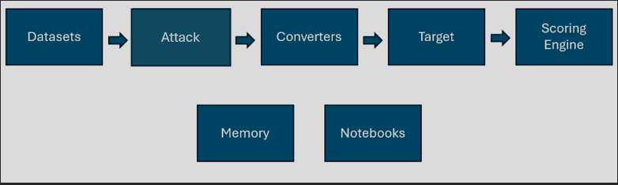

# Framework

Learn how to use PyRIT's components to build red teaming workflows.

:::::{grid} 1 1 2 3
:gutter: 3

::::{card} 📦 Datasets
:link: ./datasets/0_dataset
Load, create, and manage seed datasets for red teaming campaigns.
::::

::::{card} ⚔️ Attacks
:link: ./executor/0_executor
Run single-turn and multi-turn attacks — Crescendo, TAP, Skeleton Key, and more.
::::

::::{card} 🧩 Attack Techniques
:link: ./scenarios/0_attack_techniques
Package a configured attack — role-play, many-shot, crescendo, a jailbreak template — as a reusable, named recipe.
::::

::::{card} 📋 Scenarios
:link: ./scenarios/0_scenarios
Run standardized evaluation scenarios at scale across harm categories.
::::

::::{card} 🔄 Converters
:link: ./converters/0_converters
Transform prompts with text, audio, image, and video converters.
::::

::::{card} 🔌 Targets
:link: ./targets/0_prompt_targets
Connect to OpenAI, Azure, Anthropic, HuggingFace, HTTP endpoints, and custom targets.
::::

::::{card} 📊 Scoring
:link: ./scoring/0_scoring
Evaluate AI responses with true/false, Likert, classification, and custom scorers.
::::

::::{card} 🗂️ Registry
:link: ./registry/0_registry
Register and discover targets, scorers, and converters via class and instance registries.
::::

::::{card} 🖨️ Output
:link: ./output/0_output
Render attack results, scenario results, conversations, and scores to terminal, files, or Jupyter.
::::

::::{card} 💾 Memory
:link: ./memory/0_memory
Track conversations, scores, and attack results with SQLite or Azure SQL.
::::

::::{card} ⚙️ Setup
:link: ./setup/0_setup
Initialize PyRIT, configure defaults, and manage resiliency settings.
::::

::::{card} 📓 Framework Documentation
:link: ../contributing/7_notebooks
Keep the component notebooks concise and executable, showing how the framework is used.
::::

:::::

---

The sections above link to detailed guides for each component. The architecture below explains how the pieces fit together — it's primarily aimed at contributors.

# Architecture

The main components of PyRIT are datasets, targets, converters, scoring, and attacks — together with the attack techniques and scenarios that combine them. The best way to contribute to PyRIT is by contributing to one of these components.



As much as possible, each component is a pluggable brick of functionality. Prompts from one attack can be used in another. An attack for one scenario can use multiple targets. And sometimes you completely skip components (e.g. almost every component can be a NoOp also, you can have a NoOp converter that doesn't convert, or a NoOp target that just prints the prompts).

Each section below states what a component **owns** and, just as importantly, what it **does not own** (with a pointer to the component that does). If you are contributing to PyRIT, that work will most likely land in one of the core component buckets and be as self-contained as possible. It isn't always this clean, but when an attack scenario doesn't quite fit (and that's okay!) it's good to brainstorm with the maintainers about how we can modify our architecture. Also, if our **Framework Plans** would be helpful, please open issues!

# Core Components

## [Datasets](./datasets/0_dataset)

**Responsibility**: Provide a single place to define and manage the inputs to an attack — prompts, jailbreak templates, source images, attack strategies, and similar seeds.

- New datasets can be added in the dataset module.
- Dataset providers load seeds into memory; components then retrieve them from memory. Providers are not queried directly at attack time.
- Most components should work with seeds passed directly in (except scenarios, which may package them from memory). Never reach for dataset providers, file paths, etc. inside a component — either pass the seed as an argument or retrieve it from memory.

**Does NOT own**:

- Persisting or looking up seeds at run time — that is Memory.
- Deciding which seeds to run — that is a Scenario.

**Framework Plans**:

- There is some churn here. We haven't managed these much at scale, and we may have to redefine how it works.
- We want more investment in managing datasets and loading them more intelligently.
- We need to more consistently pass seeds or use memory.

**Contributing (difficulty: easy)**: Are there more prompts and jailbreak templates you can add for scenarios you're testing for? It is easy to add new dataset providers.

## [Attacks](./executor/0_executor)

**Responsibility**: Own the *algorithm and control flow* of achieving a single objective — managing the conversation between objective and adversarial targets, and using datasets, converters, and scorers along the way.

- Any branching decision (i.e. the next step depends on a previous result) belongs in an attack.
- An attack should branch based on a **scorer result**, never on a raw target response directly (e.g. "was this prompt blocked?" is a scorer's job, not an attack's).
- Attacks use scoring and target capabilities implicitly, and should support multi-modal.
- An attack may ship with sensible **defaults**, but it should always **accept** (never hard-code) the pieces a technique configures: scorers, datasets/seeds (fed to the objective target as `prepended_conversation` and `next_message`), targets (objective and adversarial), and converters. Exposing these as parameters is what lets the attack be packaged as an Attack Technique.
- Compound attacks are possible, combining different attacks in different ways.

**Does NOT own**:

- Interpreting a raw target response — that is Scoring.
- The specific configuration of prompts, converters, and strategy used — that is an Attack Technique.
- Choosing which attacks or techniques to run, or running them at scale — that is a Scenario.

**Framework Plans**:

- We need to move some older attacks that don't belong here. Many (e.g. FlipAttack) should just be attack techniques.
- There are potential ways we could combine different algorithms. Are Crescendo and TAP ultimately the same?
- We need to support target capabilities more implicitly.
- Other executors, like benchmarks, need better end-to-end support; potentially including an `ExpectedResult` seed and associated scorers.
- More flexible compound attacks should continue to be added.

**Contributing (difficulty: hard)**: The best way to contribute is likely opening issues if you run into limitations.

## Attack Technique

**Responsibility**: A single, declarative **configuration** of an attack — no new logic. It bundles an existing attack class with the strategy, converters, datasets, and prompts that define one named technique.

A technique should be expressible as one self-contained definition, for example:

```python
AttackTechniqueFactory(
    name="violent_durian",
    attack_class=RedTeamingAttack,
    strategy_tags=["multi_turn"],
    adversarial_system_prompt=SeedPrompt.from_yaml_file(EXECUTOR_RED_TEAM_PATH / "violent_durian.yaml"),
    adversarial_seed_prompt=SeedPrompt.from_yaml_file(
        EXECUTOR_RED_TEAM_PATH / "violent_durian_seed_prompt.yaml"
    ),
)
```

**Does NOT own**:

- Any branching or control flow — that lives in the Attack it configures.
- Selecting which techniques to run — that is a Scenario.

**Framework Plans**:

- We are still defining *where* attack techniques are registered (today this can live in setup/initializers, but that may change).
- Managing these better, so scenarios can more easily select or build the attack techniques to use.

**Contributing (difficulty: easy)**: Add the technique as a single declarative configuration, with no new logic.

## [Scenarios](./scenarios/0_scenarios)

**Responsibility**: The avenue to "run PyRIT against something" — **select** which attack techniques and datasets to run, then orchestrate them at scale.

- A scenario takes user input and uses it to package datasets with attack techniques.
- A scenario orchestrates resiliency and parallelism from a high level.
- No result should depend on a previous result — that cross-result branching is an attack's job.

**Does NOT own**:

- Per-objective branching or conversation logic — that is an Attack.
- The internal configuration of a technique — that is an Attack Technique.

**Framework Plans**:

- Scenarios are new enough that we are still discovering patterns and limitations, so they will be refactored regularly.

**Contributing (difficulty: medium)**: Is there a scanner that does something PyRIT doesn't? Add it as a scenario. Because we're still changing how this works, it is less well-defined than other areas.

## [Converters](./converters/0_converters)

**Responsibility**: Convert a prompt into something else. Converters can be stacked and combined, and can be as varied as translating a text prompt into a Word document, rephrasing a prompt, or adding a text overlay to an image.

**Does NOT own**:

- Deciding *when* to apply a conversion, or branching on the result — that is an Attack.

**Framework Plans**:

- We want to refactor our converter pipeline; some things that should be converters (e.g. partial converting) may be postponed. This is supported but could be much more dynamic.

**Contributing (difficulty: easy)**: The existing pattern is well-defined. Are there ways prompts can be converted that would be useful for an attack?

## [Target](./targets/0_prompt_targets.md)

**Responsibility**: "The thing we're sending the prompt to." Many other components use it, including scorers, attacks, and converters.

- This is often an LLM, but it doesn't have to be. For Cross-Domain Prompt Injection Attacks, the prompt target might be a storage account that a later prompt target has a reference to. Message and conversation should be generic enough to carry this extra data.
- Target capabilities are used to check whether a target is compatible with what the other components want to do.
- Targets use `message_normalizer` together with prompt capabilities to transform `Messages` into the formats a given target supports.
- Because targets are so varied, it is reasonable to return multiple tool calls, or none at all.
- One attack can have many prompt targets (and converters and scorers can use prompt targets too, to convert or score).

**Framework Plans**:

- Better agent support may require extra pieces attached to a Message.
- Better surface support may require expanding the return types.

**Contributing (difficulty: easy)**:

- The pattern is well-defined.
- Are there models you want to use at any stage or for different attacks? And could your model simply be one of the existing targets?

## [Scoring](./scoring/0_scoring.ipynb)

**Responsibility**: Give feedback to the attack on what happened with a prompt — from "was this prompt blocked?" to "was our objective achieved?". Scoring owns the *interpretation* of a response; every decision an attack makes is based on a scorer result.

**Does NOT own**:

- Acting on a score — branching, retrying, or stopping is the Attack's job.

**Framework Plans**:

- Scorers will be refactored to be more generic, so they can determine more general results (does a file exist? was a tool called?).

**Contributing (difficulty: easy)**:

- The pattern is well-defined.
- You can evaluate how accurate probabilistic scorers are and likely make them more accurate.
- Is there data you want to use to make decisions or analyze?

# Core library

The modules below are the supporting library the core components are built on.

## [Registry](./registry/0_registry)

**Responsibility**: Build and store the core components — the **construction** side of the framework.

- If you are creating a component from user input (e.g. via config, REST, or automatically), it should go through the registry.
- If you are storing an instance of a component, it should use the registry.

**Does NOT own**:

- Defining the *shape* of a component or its identifier — that is Models.

## Models

**Responsibility**: A lightweight module where core types are defined — the **description** side of the framework. These types should be used wherever possible to prevent drift.

- If you are creating a class that overlaps heavily with another, or using a dict to serialize across boundaries, consider whether you can use or move it into `pyrit.models`.
- Models includes `identifiers`, which describe the core components; together with the registry, an identifier can often recreate the component it describes.
- Models includes the types passed between components, and should be preferred in REST.
- Models should never depend on anything outside `pyrit.common` (which itself shouldn't depend on anything).

## [Output](./output/0_output)

**Responsibility**: Render finished components — attack results, scenario results, conversations, and scores — to different surfaces (terminal, files, Jupyter). Output is invoked directly by the CLI and in notebooks; the components it renders do not call into it.

**Does NOT own**:

- Live, in-run progress printing — that belongs to the scenario's own printer.

## [Memory](./memory/0_memory.md)

**Responsibility**: The canonical store that components read from and write to — seeds, conversations, scores, and attack results. When a component needs more than what is passed in, it goes through memory.

One important thing to remember about this architecture is its swappable nature. Prompts, targets, converters, attacks, and scorers should all be swappable. But sometimes one of these components needs additional information — if the target is an LLM, we need a way to look up previous messages sent to that session so we can construct the new message; if the target is a blob store, we need the URL to use for a future attack. Memory is where that shared state lives.

## [Setup](./setup/0_setup)

**Responsibility**: Initialize PyRIT and configure framework-wide defaults — memory selection, default targets, and resiliency settings.

- Setup wires up the environment a run depends on; it does not implement attack behavior.

## [Framework Documentation](../contributing/7_notebooks.md)

**Responsibility**: Show how the framework is used, concisely.

- Notebooks that contain code should be executable.
- Notebooks should execute quickly.
