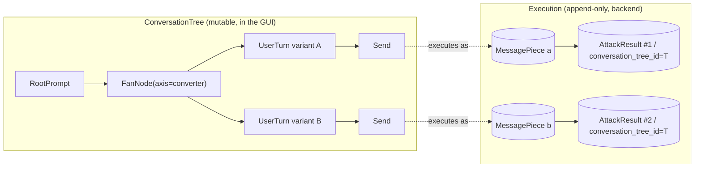
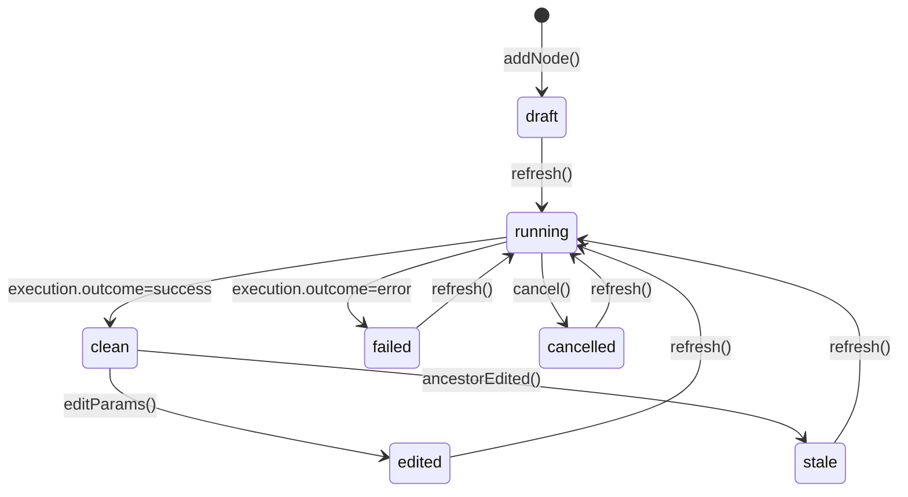

# Tree-Based UI — Foundational Primitives

> Status: **DRAFT for review (revision 18)** — design + vocabulary only, no implementation.
> Scope: foundational layer (data model, lifecycle, mapping to backend).
> Out of scope: rendering details, layout algorithm, UI affordances, telemetry.
> **V1 decision (§12.0): conversation tree persistence is client-only React state.** The persistence spike from revision 2 is deferred to V2 (preserved in §11 as future work). One consequence flows down: V1 deliberately does NOT write `conversation_tree_node_id` into `MessagePiece.prompt_metadata`, eliminating the orphaned-pointer concern that motivated the spike (see §7.3).

## 0. Rolling revision history

This preamble summarizes the rolling rationale across the doc set ([01_tree_primitives.md](01_tree_primitives.md), [02_tree_ui_affordances.md](02_tree_ui_affordances.md), [03_runner.md](03_runner.md)) so a new reader can see what changed across review cycles without diffing. Each revision absorbed a principal-engineer reviewer pass; closures are referenced from inline `(rev N, per reviewer Finding X)` notes throughout the docs.

| Rev | Dominant theme | Headline closures |
|---|---|---|
| **15** | Anti-amplification + entry-point hygiene | Q.6 intra-wave memoization cut; §3.1 step 2b retry-failed pre-readiness demotion; 5-step entry-point shim formalized; tag-hygiene gate moved out of the dispatch loop into the shim; §6.4.1 `node.execution = null` on failure made load-bearing for the resolver's `is_stale` predicate. |
| **16** | Undo correctness + wave-summary fidelity | §6.9 `UndoOp` discriminated union with state-snapshot widening (closes the silent half-broken-undo class from Findings 6+7); `complete.summary.failed` bucketed as `{transient, rate_limited, permanent}`; `legacy single-int helper` migration spelled out. |
| **17** | Surface-area cleanup (Nits U–Z) | §9.4.1 reload hoists `parent_conversation_tree_id` from leaf labels; `undoStack` carried into `branchToNewTree` clone alongside `edited` state; `refreshNode(fan_id)` aliased to `refreshSubtree(id)`; `operator: ''` defense-in-depth fallback deleted, replaced with hard assert at the `_build_labels` callsite. |
| **18** | Citation refresh + dimension-B + 4th-pass closures + rubber-duck cheap wins + Q.S.1/Q.S.2 decisions | F7 mechanical sweep updates ~16 `.py:L<n>` citations; dimension-B closes 7 deferred items (`NodeParams` union, `path.edge_slot_for`, lockManager unification, `recordExecution` null-prior semantics, two §5.x operator edge-cases, anchor sweep verified clean); 4th-pass reviewer closes 11 findings including the `cancelWave` execution-clobber gate, the `skipped` wave-summary bucket, the queue-drain-interleaving V1.0 documented limitation, the Picked-state `↻×N` exception, the `CrossTabLockManager` interface-block deletion, the `lastError` auto-clear-on-running rule, and four nit-level fixes. Rubber-duck rev-18 cheap wins: per-leaf `ExecutionRecord` timing fields + per-`WaveEvent` `emittedAt`, `version: number` on `ConversationTreeNodeBase` for V2 last-write-wins forward-compat, i18n string-registry V1.0 commitment, FanNode polymorphism honest naming + axis-addition checklist, `↻` tooltip cost-preview, `permanent` failure class surfaced distinctly in the wave-complete toast, client-side telemetry-vs-privacy line in §15. **Q.S.1 DECIDED:** accept-and-disclose — V1.0 ships without intra-wave memoization; Crescendo cost cliff documented in §1.2; revisit V1.x with [Q.S.4](03_runner.md#12-open-questions) experiment data. **Q.S.2 DECIDED:** operator-as-tag (honor-system) — §9.4.5 scaled back to relocation-only (no anonymous-rejection); the no-labels early-return preserved; V1.1 multi-operator collab revisits. **Q.S.3 remains a V1.0 gate item** pending the Q.S.4 Crescendo experiment outcome. Q.S.5–Q.S.9 are PR-sized follow-ups. |

The net architectural commitment surface (ConversationTree vs AttackResult split, AR-per-leaf, two-function branching, labels-round-trip contract, failure-class trichotomy + skipped bucket, 5-step entry-point shim, schema-versioned sessionStorage, per-tree `UndoOp[]` with state-snapshot widening, operator-as-tag honor-system per Q.S.2) has been stable since rev 15 and survived four reviewer passes plus a rubber-duck pass. The freshest rubber-duck assessment was *"substantive revisions, not back to the drawing board ... with three landed and the §E Crescendo experiment run, this is a ship-it document"* — of those three, [Q.S.1](03_runner.md#12-open-questions) (DECIDED: accept-and-disclose) and [Q.S.2](03_runner.md#12-open-questions) (DECIDED: operator-as-tag) have landed; only [Q.S.3](03_runner.md#12-open-questions) (per-target rate-limit circuit breaker) remains, gated on the [Q.S.4](03_runner.md#12-open-questions) Crescendo experiment.

### Version-scope legend

Sections below carry inline version markers. The whole doc describes the eventual V1 design; V1.0 is the shippable subset.

| Marker | Meaning |
|---|---|
| **V1.0** | Ships in the first tree-UI release. |
| **V1.1** | Designed-and-scoped; deferred from V1.0 to keep the first release small. Disabled-stub UI lands in V1.0 only where the V1.1 trigger would otherwise be repurposed (avoids behavior-change regressions). |
| **V1.x** | Designed-but-uncommitted; lands when an operator-driven need surfaces. |
| **V2** | Requires server-side conversation tree persistence (§11). |

The §1 Non-Goals enumerates the explicit V1.0 exclusions; later sections use the markers above on individual subsections.

## 1. Goals & Non-Goals

### Goals

1. **Make branching explicit and visual.** Replace the implicit "reverse-chronological list of forks" ([ConversationPanel.tsx](../../../frontend/src/components/Chat/ConversationPanel.tsx)) with a 2-D tree where every fork, retry, and converter variant is a node the user can see, edit, and reason about.
2. **One fan-out primitive, many axes.** Today "5 retries", "branch into a new conversation", and "apply each of 3 converters" are three different code paths (`max_attempts_on_failure` adds turns; `create_related_conversation_async` adds branches; `convertersApi.previewConversion` is single-shot). Collapse them into a single `FanNode` whose `axis` discriminates `attempt | prompt | converter | target | system_prompt | temperature | …`. Adding a new axis is a registration, not a new node type. (See §4.4.)
3. **Make propagation opt-in and inspectable.** When the user edits an upstream node, downstream nodes mark *stale* but do not auto-rerun. The user explicitly invokes a refresh — per-node, per-subtree, or whole-tree.
4. **Preserve previous executions through edits.** Re-running a node does not destroy what came before; the old `ExecutionRecord` is moved into `executionHistory` (capped, see §6) before the new one is recorded. The backend's append-only `MessagePiece` model ([message_piece.py#L110](../../../pyrit/models/messages/message_piece.py#L110)) handles persistence; the conversation tree layer just keeps the pointers. *Note: this is not the same as "no data duplication" — each branch is a full copy of upstream pieces; see §7 storage cost note.*
5. **Be additive.** The existing linear `ChatWindow` ([frontend/src/components/Chat/ChatWindow.tsx](../../../frontend/src/components/Chat/ChatWindow.tsx)) keeps working; the tree view is a sibling view that operates on the same `AttackResult`.

### Non-Goals (universal — apply to all V1 releases and beyond)

- Replacing the linear chat for users who prefer it.
- **Server-side conversation tree persistence.** V1 stores the conversation tree in React state, reconstructed on reload from backend labels (§9.4.1). The orphan-pointer concern from revision 2 evaporates because V1 writes no conversation tree references into the backend (see §7.3). Full server-side conversation trees become a V2 feature (§11).
- **Multi-tab conversation tree synchronization, undo/redo, conversation tree sharing across operators.** All require server-side conversation tree storage; out of V1.
- **Distributed fan-out / queueing / rate-limit-aware scheduling.** V1 is single-user, in-process concurrency with a simple `maxParallel` cap scoped per-Workspace (see §12.2). PyRIT's existing `RoundRobinTarget` ([round_robin_target.py:L15](../../../pyrit/prompt_target/round_robin_target.py#L15)) handles cross-endpoint load balancing transparently at the target layer; the tree runner does not need to. Per-target sub-budgets are a future consideration but not on the immediate roadmap.
- **Auto-layout polish.** Buchheim-Walker via `d3-hierarchy.tree()` for V1.0 (see §8); main-path pinning and adaptive collapse are V1.1.
- **Auto-scoring on every Send.** No "default scorer" concept exists in the GUI's `add_message` flow today; default scorers exist only inside `Scenario` orchestration ([scenario.py:L375-L410](../../../pyrit/scenario/core/scenario.py#L375-L410)). Adding one is out of V1; `ScoreNode` remains always-explicit (§12.4).

## 1.1 V1.0 explicit exclusions (deferred to V1.1)

The following are scoped and designed in this doc but **do not ship in the V1.0 release** — they ship in V1.1. Reviewers can read this section as the V1.0 cut surface at a glance.

- **Workspace tab strip (§13.3+).** V1.0 ships the **minimal Workspace** data model (§13.1) — `{ currentTree; recentTreeIds; settings }` — with a "Switch tree" affordance in the canvas-level ribbon. **V1.1 adds the full tab strip** (`conversationTrees: ConversationTree[]`, drag-reorder, multi-tree concurrency wiring). *Rationale:* the minimal Workspace is ~30 LOC and is the data-model precondition for `branchFromNode` (next item); the tab strip is a UI surface, not a data-model requirement. Splitting them lets V1.0 ship `branchFromNode` without paying for tab-strip UX.
- **`branchFromNode` sibling-subtree variant (§6.5).** V1.0 **ships the always-new-tree variant** (clicking `📋` "Branch from here" / "Clone tree" swaps the active Workspace `currentTree` to the clone; source re-openable from History via auto-reverse, §9.3). **The sibling-subtree-same-canvas variant (`🌿`) is V1.1** — it requires a render-rule disambiguation (dashed "branch" edge style vs. solid fan edges) that is not in V1.0's critical path. V1.0 renders the `🌿` slot as a disabled stub per [02 §2.2](02_tree_ui_affordances.md#22-per-node-action-rail) (slot reservation against UX regression). *V1.0 fallback for side-by-side comparison:* two browser tabs, each holding one Workspace `currentTree`, mediated by the §9.4.3 `BroadcastChannel` advisory lock.
- **Synced-Peers Stack and Stack-`+` gating ([02 §3.2, §3.4a](02_tree_ui_affordances.md#32-synced-peers-stack--synchronized-authoring-surface)).** V1.0 ships Fan-Children Stack ([02 §3.1](02_tree_ui_affordances.md#31-fan-children-stack--visual-aggregation-only)) — the visual aggregation of N identical fan children. The synchronized-authoring surface (fan-through, the `addedToStack` field, parent-walk peer detection, draft-placeholder semantics under Promoted state) lands in V1.1, **with the design treated as provisional pending V1.0 operator feedback** — see [02 §3.2](02_tree_ui_affordances.md#32-synced-peers-stack--synchronized-authoring-surface) banner.
- **Main-path pinning ([02 §4.3](02_tree_ui_affordances.md#43-recommendation-buchheimwalker--pinned-main-path--adaptive-collapse)).** V1.0 renders with plain `d3-hierarchy.tree()`. The `★ Pin as main` affordance on `SendNode` and the centerline-pinning layout pass land in V1.1.
- **Fan axes beyond `attempt` and `converter` (§4.4).** V1.0 ships those two axes (the most-requested operator workflows: re-run N times, sweep converters). `prompt`, `target`, `system_prompt`, `temperature` are scoped here but ship in V1.1+. *Rationale:* the runner branches and DTO mappings differ per axis, and the V1.0 attempt+converter pair already exercises every primitive in the runner; adding more axes is multiplicative test surface that V1.1 absorbs once V1.0 has soaked.
- **Auto-reverse fan-out detection for pre-V1.0 ARs ([§9.3](#93-migration-of-existing-linear-attacks---auto-reverse-to-a-tree)).** V1.0 ships **both** the linear-chain reconstruction AND the V1.0+ fast-path `detect_fans_v10_plus` (§9.3.1) that decodes `labels.tree_path` to rebuild nested fan structure exactly for trees produced by the V1.0 runner — this is the load-bearing path for the §9.4.1 reload-reconstruction story. **The pre-tree-UI fallback `detect_fans_pre_v10`** (the `original_prompt_id` chain-flattening + `wave_id`-disambiguation algorithm for historical ARs that have no `tree_path` label) lands in V1.1. *Why the split:* the V1.0+ fast path is ~30 LOC reading labels the runner already writes; deferring it would mean V1.0 sessions reload as flat lists of leaves, which is operator-hostile and unnecessary. The pre-V1.0 fallback has substantially more edge-case test surface (wave_id disambiguation, nesting-loss caveat, multi-branch-from-same-piece) and operates on data that mostly hasn't been authored yet (the corpus of pre-tree-UI ARs is bounded; the corpus of V1.0 trees is the future).

These exclusions are inter-related but no longer all-or-nothing: V1.0 keeps `branchFromNode` (the most-used operator motion) by shipping the minimal-Workspace data model; the tab strip, sibling-subtree variant, Synced-Peers Stack, main-path pinning, and extra fan axes are deferred as a coherent V1.1 release.

## 1.2 V1.0 known limitations (sharp edges in what V1.0 DOES ship)

Distinct from §1.1 (deferred features). These are limits of features that V1.0 *does* ship — operators will hit them and the design tells them what to do.

- **200-turn ceiling per root-to-leaf path** ([§9.4.1, runner §4.2](03_runner.md#42-the-200-message-cap)). `CreateAttackRequest.prepended_conversation` is capped at 200 messages by the backend ([attacks.py model](../../../pyrit/backend/models/attacks.py)). The cap is **per-root-to-leaf path** under AR-per-leaf — a tree with 1000 leaves at 10 turns deep is fine; only a single conversation chain whose clean prefix exceeds 200 turns trips the cap. **V1.0 surfaces a soft warning at 180 turns** in the canvas-level ribbon ([02 §2.3](02_tree_ui_affordances.md#23-canvas-level-affordances)): *"This conversation is approaching the 200-turn ceiling. Use Branch from a midpoint to keep extending."* Operators who do hit 200 see `failed` state on the leaf with a tooltip pointing at `branchToNewTree` (V1.0) as the recovery path. **This IS a new limitation introduced by AR-per-leaf-via-prepended_conversation** — today's chat tab uses `add_message` incrementally, which has no per-conversation cap. Operators rebasing a chain past 200 turns under the tree-UI runner hit a ceiling they don't hit in the chat tab. The trade-off was deliberate: AR-per-leaf simplifies the runner and the History view, and the 200-turn limit affects only the depth-of-single-conversation use case (Crescendo and similar multi-turn attacks); for those, the `branchFromNode` midpoint workflow is acceptable recovery. *V1.1 may revisit* by adding an `add_message`-only chain-extension path for "extend a clean leaf by one turn" (per [03 §8.2](03_runner.md#82-why-every-leaf-uses-create_attack--n-add_messages-not-one-or-the-other-alone) V1.1 follow-up), which would bypass the cap because add_message has none.
- **Edits-since-last-Refresh lost on reload OR tree-swap.** §9.4.1's reload-reconstruction replays backend leaves; nodes added/edited but never refreshed have no backend AR and don't come back. Mitigations: §9.4.2 `beforeunload` guard catches reload; §13.1a in-app dirty-edit modal catches `openTree`/`closeTree`/`newTree`. (`branchToNewTree` is exempt per [§13.1](#131-v10-minimal-workspace) — the clone deep-copies the source's `edited` state, so nothing is lost in-session.) Operators see one of two modals before losing work.
- **One foregrounded tree at a time in V1.0.** Side-by-side comparison requires two browser tabs (mediated by the §9.4.3 advisory lock). The full tab strip is V1.1 (§1.1).
- **Pre-V1.0 ARs lose fan-axis intent on V1.1 reconstruction.** V1.0+ trees DO round-trip the fan axis via the `tree_path` label ([03 §4.3](03_runner.md#43-label-writes-the-round-trip-fidelity-contract)) — the JSON-encoded `[[axis, slot], ...]` array preserves each fan ancestor's axis exactly. **Pre-V1.0 ARs** (existed before tree-UI shipped) have no `tree_path` label; V1.1 fallback fanout-detection synthesizes `axis='prompt'` for all reconstructed fans (per [§9.3.1 `detect_fans_pre_v10`](#931-fan-grouping-algorithm-v11--original_prompt_id-chain-flattening--wave_id-disambiguator)). Acceptable: V1.0+ trees round-trip cleanly; older ARs reconstruct with the one-axis-fits-all heuristic.
- **ScoreNode is render-only in V1.0** ([§4.5](#45-observational-nodes-no-side-effect-on-the-conversation)). It displays `MessagePiece.scores` already attached to upstream pieces (e.g., from a Scenario-orchestrated import) but cannot author new scores. The `✏ Configure scorer + params` action rail icon is a disabled stub per [02 §2.2](02_tree_ui_affordances.md#22-per-node-action-rail) — V1.0 operators who want to score a leaf whose upstream has no scores must wait for V1.1's `runScorer(node_id)` operation. `📊 View score distribution` stays enabled (pure read-side aggregation).
- **sessionStorage wipe on schema-version mismatch.** A V1.0 → V1.1 upgrade that changes any persisted sessionStorage shape wipes all `pyrit.*` keys on boot per [§13.1 Schema versioning](#131-v10-minimal-workspace). Operator-visible effect: one toast (*"Saved settings were from a different version and have been reset."*), MRU empty, settings revert to defaults. Trees themselves are not affected — they reconstruct from backend leaves via §9.4.1. The only loss is a pre-V1.0 AR session opened via `openTreeFromAttackResult` but never refreshed (sessionStorage held the `parentSourceConversationId` link; wipe loses it; operator re-opens from History to recover). **Origin-shared sessionStorage collision risk:** if another app at the same browser origin uses `pyrit.*` keys for unrelated purposes, the schema-version-mismatch wipe is a collateral cost; bounded for the internal-tool PyRIT deployment context but worth naming for future shared-origin hosting scenarios.
- **Undo is in-memory and per-tree, capped at 20 entries.** Ctrl-Z within a tree undoes the last 20 structural edits ([§6.9](#69-node-editor-undo-v10)); tree-swap clears the stack and reload loses it. No redo in V1.0 (Ctrl-Shift-Z lands V1.x). No undo for refresh waves themselves — backend `AttackResult`s are append-only; operators recover via reflog `makeCurrent` (§6.7) instead.
- **No tree export / import primitive in V1.0** (per rubber-duck Finding C.6). Sharing a tree definition with a teammate is *only* via the source AR id + the recipient's `openTreeFromAttackResult` (auto-reverse path, §13.1) — which loses authoring state (unrefreshed nodes, `promotedChildSlotIndex`, `displayName`, undoStack). V1.x adds a JSON-export / import affordance scoped to the `ConversationTree` shape (no `ExecutionRecord` snapshot — the recipient re-fires Refresh against the source ARs they already have). Operators wanting reproducibility today should rely on the V1.0 auto-reverse path and accept the authoring-state loss.
- **i18n is V1.x; V1.0 makes one cheap commitment to keep migration tractable.** All operator-visible strings (toasts, modal copy, action-rail tooltips, action-row labels) live in a single registry at `frontend/src/strings/tree.en.ts` from day 1 — not scattered across 50 components. The registry is a flat `Record<string, string>` keyed by stable identifier; component code reads `t('wave.complete.toast')` rather than embedding the English string. V1.0 ships English-only; V1.x adds a sibling `tree.<locale>.ts` file and a locale-resolver. Without this commitment, V1.x i18n becomes a 2-week refactor instead of a translation-file PR.

## 2. Vocabulary

The single most important separation in this design:

| Term | Meaning | Lifecycle | Persisted |
|---|---|---|---|
| **ConversationTree** | The tree the user is authoring: nodes + edges + parameters | Mutable, edited live | **V1: client-only React state, lost on reload.** V2: server-side resource (§11). |
| **Execution** | A record of what was actually sent and what came back | Append-only | Existing backend: `AttackResult` + `MessagePiece` |
| **Tree label** | A label written on every `AttackResult` produced from the same conversation tree | Set on create, immutable | `AttackResult.labels["conversation_tree_id"]` — enables grouping leaves in the history view |
| **Lineage link** | *(V2 only)* Pointer from `MessagePiece` back to a conversation tree node | Set on write | `MessagePiece.prompt_metadata["conversation_tree_node_id"]` — V1 omits this (see §7.3) |

A tree node may have **zero or many** executions over its lifetime. Re-running a node creates a new execution; old ones move into `executionHistory` (capped — see §6).

Additional terms used throughout:

- **ConversationTreeNode** — a single vertex in the conversation tree (typed; see §4).
- **ConversationTreeEdge** — a directed dependency: `parent → child` means "child's input includes parent's output". Edges are not arbitrary — the tree shape is constrained (see §5).
- **Draft / Clean / Dirty / Stale / Running / Failed** — node states (see §6).
- **Branch from node** — given any node X in a ConversationTree, produce a fresh ConversationTree containing the root-to-X path plus X's descendants (no siblings of path nodes). New nodes share execution refs with the source until edited. UI labels: **"Clone tree"** when X is the root, **"Branch from here"** otherwise. See §6.5.
- **Fan-out** — a `FanNode` (§4.4): one input, N children, each child differs in exactly one parameter (the *axis*).
- **Leaf Send** — a `SendNode` with no `SendNode` descendant. Under the V1 materialization rule (§7.2), each leaf path of the conversation tree maps to **exactly one `AttackResult`** (matches today's `handleBranchAttack` semantics).
- **Side-effect class** — the four runner branches that node kinds factor into: *Source* (no input), *Transform* (pure 1→1), *Side-effecting* (calls the target), *Structural* (changes shape only), *Observational* (reads, never writes the conversation). §4 is organized along this spine.

## 3. Conceptual Model



The conversation tree is the **recipe**. The execution is the **record**. The tree is the visual representation of the conversation tree; the linear chat ([MessageList.tsx](../../../frontend/src/components/Chat/MessageList.tsx)) becomes one *projection* of the conversation tree along a chosen root-to-leaf path. **Each leaf `Send` produces its own `AttackResult`**; all `AttackResult`s from one conversation tree share `labels.conversation_tree_id` so the history view can group them (see §7).

### 3.1 Why a separate conversation tree layer?

Three forces push us here:

1. **Edits must not destroy history.** PyRIT's storage is append-only (every duplication preserves `original_prompt_id`; see [`_duplicate_conversation_up_to`](../../../pyrit/backend/services/attack_service.py#L824-L870)). A "live edit" cannot mutate a `MessagePiece` in place. So the editable surface must live elsewhere — that's the conversation tree.
2. **Fan-out is a recipe, not a record.** "Run 5 attempts" is a single user intent. The 5 resulting conversations are 5 records. Modeling them as one conversation tree node with 5 child executions matches user intent and lets us redo / partially re-run cleanly.
3. **Today's UI conflates the two.** The "Branch into new attack" button ([ChatWindow.tsx#L456-L475](../../../frontend/src/components/Chat/ChatWindow.tsx#L456-L475)) is a one-shot deep-copy; the user has no handle on the relationship between the source and the branch other than `original_prompt_id`. The conversation tree layer is exactly that handle.

### 3.2 Alternatives considered and rejected

The ConversationTree/Execution split is a choice, not the only option. The three alternatives a principal-engineer review will ask about:

| Alternative | Idea | Why we reject for V1 |
|---|---|---|
| **Render-only over backend lineage** | No conversation tree layer; project a tree directly from existing `AttackResult.related_conversations` + `MessagePiece.original_prompt_id` | Fan-out has no backend representation. `original_prompt_id` says "this piece was copied from that piece"; it cannot say "these N siblings are one fan-out intent." Render-only would either need a backend schema change (defeating "no new endpoints") or would silently lose the user's intent on reload. |
| **Pure event log + projection** (event sourcing) | ConversationTree as an append-only log of `addNode`/`editNode`/`refresh` events; current state is a projection | Buys real multi-tab and undo/redo. Costs an order of magnitude more design effort and obscures the otherwise-obvious mapping in §7. Right to defer; wrong to never name. Revisit if multi-tab becomes a P0. |
| **CRDT-style versioned node graph** | Per-node version vectors; merge on conflict | Solves multi-tab. Consumes the entire complexity budget. Not justified by single-operator use. |
| **No conversation tree layer; backend orchestrator** | Push fan-out into PyRIT executors (e.g., a new `FanOutAttack`) and treat the UI as a thin shell | Would make scenarios the source of truth for tree shape - reasonable long-term, but requires designing the orchestrator first. Backwards-compatible to layer on after V1 ships. |

We pick ConversationTree/Execution because (a) it makes fan-out expressible without backend changes, (b) the mapping to existing endpoints is mechanical (§7), and (c) it is the smallest layer that captures the user's stated intent (edit upstream, propagate down opt-in). The §11 spike will decide whether the *conversation tree itself* lives client- or server-side.

## 4. Node Taxonomy

Six kinds, organized by **side-effect class** (the spine that drives runner branches, test surface, and editor design). The five families in the previous revision are gone — they were documentation, not abstraction. Each side-effect class corresponds to exactly one branch in the runner.

```ts
// /frontend/src/components/Tree/types.ts (proposed)

export type ConversationTreeNodeId = string  // UUID v4, stable across edits

export interface ConversationTreeNodeBase {
  id: ConversationTreeNodeId
  kind: ConversationTreeNodeKind
  parentId: ConversationTreeNodeId | null      // null = root
  /**
   * SHA-256 of the resolved input bundle (see §5). Cached; recomputed whenever
   * this node or any ancestor is edited. Crucially, for children of a FanNode
   * the hash MUST include the edge's `slotIndex` so siblings have distinct
   * hashes even when their parent's resolved input is identical.
   */
  resolvedInputHash: string
  state: NodeState                 // see §6
  execution: ExecutionRecord | null  // most recent; older ones in executionHistory
  executionHistory: ReflogEntry[]      // capped, see §6; each entry wraps an immutable ExecutionRecord with per-tree state (pinned flag, etc.)
  /**
   * Operator-readable error reason populated when the node transitions to `failed`
   * or `cancelled` (or to `stale` via the §5.3 in-flight cascade). Cleared when the
   * node transitions back to `running` (on retry) or to `clean` (on successful
   * re-dispatch). Set by `RunnerStateSink.setNodeState` via its `opts.reason`
   * argument (which accepts either a plain string for non-API-error cases or an
   * `ApiErrorReason` struct for API-error paths per [03 §3.3a](03_runner.md#33a-helpers-referenced-by-the-dispatch-step)).
   * Visible in the right-side drawer's `Current` tab and as the tooltip on the
   * node's ⚠ chip ([02 §5.14](02_tree_ui_affordances.md#514-partial-failure-mid-refresh)).
   *
   * `failure_class` discriminates the four operator-meaningful failure modes; the
   * wave-summary buckets per-leaf failure counts by this field per [03 §6 WaveEvent](03_runner.md#6-wave-bookkeeping).
   * `'blocked'` is runner-synthesized when this node was dropped from `ready` by the
   * [03 §5.3](03_runner.md#53-cascade-on-failure) in-flight cascade — distinguishable
   * from the originating Send's actual failure_class (which surfaces on the
   * originator's own `lastError`, not on the blocked siblings').
   */
  lastError: {
    message: string
    failure_class: 'transient' | 'rate_limited' | 'permanent' | 'blocked'
  } | null
  labels: Record<string, string>   // operator, operation, plus user-defined
  /**
   * True iff this node was created as part of a Stack-`+` operation that added
  // V1.1: addedToStack field is added in V1.1 (see [02 §6.1](02_tree_ui_affordances.md#61-addedtostack-on-conversationtreenodebase-v11)).
  // Per Patch #7 (revision 9), V1.0 omits the field entirely. TypeScript is
  // structural; V1.1 adds it as a non-breaking type extension with `false`
  // default for any node created under V1.0 code paths (correct semantics:
  // V1.0 had no Stack-`+` so nothing was operator-stacked).
  createdAt: string
  updatedAt: string
  /**
   * Monotonic counter bumped on every `editParams` / `regenerateFanChildren` /
   * `makeCurrent` mutation. **V1.0** reads this only for telemetry / debug logs.
   * **V2** uses it as the last-write-wins key for the server-side collaborative-tree
   * concurrency model ([§13.8](#138-multi-operator-collaboration-v2)). Carrying it in V1.0
   * costs nothing at the data-model layer and makes V2 a non-migration: V2 reads
   * `version` directly off V1.0-authored nodes loaded from sessionStorage with no
   * defaulting needed (default 1 for newly-minted nodes; the V1.0 mutators that
   * already bump `updatedAt` also bump `version`).
   */
  version: number
}

export type ConversationTreeNodeKind =
  | 'root_prompt'      // §4.1 — Source
  | 'import_message'   // §4.1 — Source
  | 'user_turn'        // §4.2 — Transform (also covers manual override via role)
  | 'send'             // §4.3 — Side-effecting
  | 'fan'              // §4.4 — Structural
  | 'score'            // §4.5 — Observational
```

| Side-effect class | Kinds | Runner behaviour |
|---|---|---|
| **Source** | `root_prompt`, `import_message` | Produce an initial bundle; no API call for `root_prompt`, single `POST /attacks` for `import_message` |
| **Transform** | `user_turn` | Pure 1→1; no API call by itself — it appends to the upstream bundle. The `Send` child of a `UserTurn` is what hits the wire |
| **Side-effecting** | `send` | One `POST /attacks/{id}/messages` per refresh; the only node that mutates external state |
| **Structural** | `fan` | No API call; manages child set, slot assignment, and slotIndex hashing |
| **Observational** | `score` | Reads `MessagePiece.scores` from existing pieces; in V2 may issue scorer requests |

### 4.1 Source nodes (no input)

```ts
export interface RootPromptNode extends ConversationTreeNodeBase {
  kind: 'root_prompt'
  params: {
    text: string
    attachments: PieceSpec[]      // text/image/audio/video/binary
    systemPrompt?: string
    targetRegistryName: string    // default target for downstream Send nodes
  }
}

export interface ImportMessageNode extends ConversationTreeNodeBase {
  kind: 'import_message'
  params: {
    sourceConversationId: string  // existing conv to seed from
    cutoffIndex: number           // see CreateAttackRequest.cutoff_index
    /**
     * NOTE: V1 does NOT verify that the caller has permission to read the
     * source. The backend's `create_attack_async` will happily duplicate any
     * conv by ID (see attack_service.py:L302-L316). Operator isolation today
     * is enforced only on `add_message` via `_validate_operator_match`
     * (attack_service.py:L682). Tightening import-time auth is tracked in §9.
     */
  }
}
```

**Target inheritance from imported context (V1.0).** When a Send descendant of an `ImportMessageNode` dispatches, the runner inherits the target from the import-source AR (resolved via `GET /attacks?conversation_id=sourceConversationId` at import time, cached on the node). The operator does NOT pick a target at Send-creation time in V1.0 — that's the `🎯 Change target` affordance on `SendNode` (V1.1 only, per [02 §2.2](02_tree_ui_affordances.md#22-per-node-action-rail)) and the `Fan(axis='target')` axis (V1.1). For V1.0 trees that extend an imported chain, the inherited target is presented in the SendNode card as `target: gpt-4o (inherited from import)` for visual confirmation; operators who want to change the target must wait for V1.1 OR clone the tree (`branchToNewTree` ships V1.0) to a fresh root and pick a target there.

`ImportMessageNode` is how the tree view picks up where the linear chat left off. The migration of existing linear attacks into the tree view is detailed in §9.3.

### 4.2 Transform nodes (1 in → 1 out, pure)

A single kind, with `role` as a discriminator. The previous `EditNode` collapses into this one — the backend already supports `role='simulated_assistant'` ([attack_service.py#L314](../../../pyrit/backend/services/attack_service.py#L314)) for inert/injected context, so a dedicated kind was redundant.

```ts
export interface UserTurnNode extends ConversationTreeNodeBase {
  kind: 'user_turn'
  params: {
    /**
     * Default role is 'user' (a normal turn). Set to 'simulated_assistant' to
     * inject a fake assistant turn (the backend marks these inert so the target
     * does not reinterpret them). Set to 'system' for a system message.
     * The plain string 'assistant' is intentionally not in this union — real
     * assistant turns only come from a Send node, never from the operator.
     */
    role: 'user' | 'simulated_assistant' | 'system'
    text: string
    attachments: PieceSpec[]
    /** Sequential converter pipeline (matches AddMessageRequest.converter_ids). */
    converterPipeline?: ConverterRef[]
  }
}
```

`converterPipeline` is the **sequential pipeline** the backend already supports ([converter_service.py#L605-L650](../../../pyrit/backend/services/converter_service.py#L605-L650)) — value flows through each converter in order. When the user wants cartesian/sweep instead, they place the upstream in a `FanNode(axis='converter')` (§4.4). The two semantics are independently composable: a `UserTurn` may chain `[Base64, Compress]` as a pipeline, and a `Fan(axis='converter', variants=[ROT13, AsciiArt])` upstream of it would produce two `UserTurn` branches, each running its child pipeline.

### 4.3 Side-effecting nodes

```ts
export interface SendNode extends ConversationTreeNodeBase {
  kind: 'send'
  params: {
    /** May override the target inherited from the upstream RootPromptNode. */
    targetRegistryName?: string
    /** Optional send-time converters; merged after the upstream UserTurn's pipeline. */
    converterPipeline?: ConverterRef[]
  }
}
```

A `SendNode` is the **only** node that mutates external state (one `POST /attacks/{id}/messages`, [routes/attacks.py#L440-L478](../../../pyrit/backend/routes/attacks.py#L440-L478)). Its `execution` field records the assistant response. Refreshing it is the only operation that incurs token cost.

### 4.4 Structural nodes — the uniform FanNode shape (per-axis dispatch)

The previous revision had four `*Fan` kinds (`AttemptFan`, `ConverterFan`, `PromptFan`, `TargetFan`). They differed only in *which dimension is varied per child*. Collapsed to one node with a typed axis.

> **Honest framing (rev 18, per rubber-duck Finding D.2).** The FanNode *type* is uniform; the *behavior* across axes is a polymorphic dispatch table. "Adding a new axis is a registration" (§1 goal #2) is aspirational — the actual work is a 4-tuple per axis: (a) extend the `FanVariant` discriminated union with the new payload shape; (b) add a resolver case in [03 §3.3a](03_runner.md#33a-helpers-referenced-by-the-dispatch-step) that maps the payload into per-piece `MessagePieceRequest` overrides and/or per-attack request fields; (c) decide the persistence story — some axes (e.g., `temperature`) are not recoverable from current backend state and need a new label round-tripped per [03 §4.3](03_runner.md#43-label-writes-the-round-trip-fidelity-contract); (d) add a reconstruction case in [§9.3.1 variant-payload reconstruction](#931-fan-grouping-algorithms). Use this checklist when adding `prompt` / `target` / `system_prompt` / `temperature` in V1.1+. The uniform shape is what makes the dispatch table *small* and *centralized* (one resolver, one reconstruction file); without that uniformity the runner would carry four per-axis code paths instead of one parametric one.

> **Version scope.** The `FanAxis` type below enumerates the full design surface. **V1.0 ships `attempt` and `converter` axes only.** `prompt`, `target`, `system_prompt`, and `temperature` are scoped for V1.1+. The runner branches and DTO mappings differ per axis; V1.0's two-axis surface is enough to exercise every runner primitive (single-target re-execution, converter-pipeline mutation, AR-per-leaf materialization). V1.1 adds the remaining axes without changing the type.
>
> Operator-visible consequence in V1.0: the `🔀 Fan out` submenu in [02 §2.1](02_tree_ui_affordances.md#21-per-edge-insert-on-edge-) shows `attempt` and `converter` enabled; the others render as disabled menu items with a "V1.1" badge so operators learn the surface area.

```ts
export type FanAxis =
  | 'attempt'         // V1.0 — identical inputs; N independent re-runs
  | 'converter'       // V1.0 — each variant appends a converter pipeline
  | 'prompt'          // V1.1 — each variant overrides upstream text/attachments
  | 'target'          // V1.1 — each variant changes the target (spawns new AttackResult)
  | 'system_prompt'   // V1.1 — each variant overrides the upstream system prompt
  | 'temperature'     // V1.1+ — each variant tweaks target params
  // ...extensible by registration, not by code change

export interface FanNode extends ConversationTreeNodeBase {
  kind: 'fan'
  params: {
    axis: FanAxis
    /**
     * For axis='attempt', variants is an array of N empty objects (only count matters).
     * For other axes, each variant carries the per-child override payload.
     */
    variants: FanVariant[]
    /**
     * For multi-value axes (e.g. converter), how to combine multiple variants.
     * 'each'      : len(variants) children (default; current scope)
     * 'cross'     : v2 — Cartesian product when a single axis carries multiple sub-values.
     *               EXPLICITLY out of V1 scope to avoid the cardinality ambiguity the
     *               previous revision left undefined. Nested fan-out via parent/child
     *               composition is the V1 way to express products.
     */
    mode?: 'each'
    /**
     * Optional: the slotIndex of one child to mark as "promoted". UI renders
     * the promoted child at full opacity with a highlight border; other children
     * are dimmed ("frozen") and do not receive stack-edits or new synced
     * children. Set by the "Pick one" UI affordance (02_tree_ui_affordances.md
     * §3.3); cleared by "Unpick". The cherry-pick analogue from the git mental
     * model in §6.8. Null = all children synced (default).
     *
     * Promotion is purely a UI/editing concern; runner ignores this field and
     * always refreshes every stale descendant. Operators who want "only refresh
     * the promoted path" use a per-call option, not this field.
     */
    promotedChildSlotIndex: number | null
    /**
     * Slot indices that have been deleted from this fan. The §5.1 invariant
     * "slot stability" says deleted children's slotIndices become tombstones
     * (siblings do not renumber). Recording the tombstones explicitly here
     * makes the invariant runtime-checkable: the next slot allocated to a new
     * variant is `max(variants[].slotIndex ∪ deletedSlotIndices) + 1`, never
     * a recycled index. Empty for fresh fans.
     */
    deletedSlotIndices: number[]
  }
}

export type FanVariant =
  | { axis: 'attempt';       payload: Record<string, never> }
  | { axis: 'prompt';        payload: { text: string; attachments?: PieceSpec[] } }
  | { axis: 'converter';     payload: { converters: ConverterRef[] } }
  | { axis: 'target';        payload: { targetRegistryName: string } }
  | { axis: 'system_prompt'; payload: { systemPrompt: string } }
  | { axis: 'temperature';   payload: { temperature: number } }
```

**Cartesian products compose by nesting.** *"3 prompts × 5 converters × 4 attempts"* is:

```
RootPrompt
└─ Fan(axis='prompt', variants=p1,p2,p3)
   └─ (per child) UserTurn
      └─ Fan(axis='converter', variants=c1..c5)
         └─ (per child) UserTurn
            └─ Fan(axis='attempt', variants=[{},{},{},{}])
               └─ (per child) Send
```

60 leaf `Send` nodes, each independently re-runnable. See Appendix A for the full materialization.

**Implementation note on child generation.** Fan children are *materialized* in the conversation tree (each child is a real `ConversationTreeNode` with its own `id` and editable params). This matters because:

- Per-child state (clean / edited / stale / failed) lives on each leaf.
- The user can edit one child (e.g., tweak the text on attempt #3) without affecting siblings.
- Re-running the parent does not regenerate children unless the user explicitly requests "regenerate children" (which is a destructive op that resets per-child edits).
- `slotIndex` is the stable identity of a child within its parent. Deleting a child tombstones the slot — sibling slot indices do not shift.

### 4.5 Observational nodes (no side effect on the conversation)

```ts
export interface ScoreNode extends ConversationTreeNodeBase {
  kind: 'score'
  params: {
    scorerType: string
    scorerParams?: Record<string, unknown>
  }
  // execution.result holds the score; no MessagePiece is added to the conversation.
}
```

`ScoreNode` attaches scoring (truthfulness, harm category, etc.) at any point in the tree.

**V1.0 scope: read-only display of pre-existing scores.** V1.0 ships `ScoreNode` as a **display surface only** — it reads scores already attached to the upstream `MessagePiece.scores` ([models/attacks.py#L20-L31](../../../pyrit/backend/models/attacks.py#L20-L31)) and renders them in the node card; **the runner does not issue scorer requests** (per [§12.4](#124-no-auto-scoring-on-send---decided-v10)). This means dragging a `ScoreNode` onto a leaf whose ancestor pieces have no scores produces a node that renders as `(no scores)` — visually present but inert. Operators see scores from imported attacks (e.g., a Scenario-orchestrated run with default scorers; [scenario.py:L375-L410](../../../pyrit/scenario/core/scenario.py#L375-L410)) but cannot create scores from inside the tree view in V1.0. **The `✏ Configure scorer + params` action rail icon renders as a disabled stub** per [02 §2.2](02_tree_ui_affordances.md#22-per-node-action-rail) (slot reservation against UX regression) — V1.0 cannot honor a configured scorer because the runner never invokes one. `📊 View score distribution` stays enabled in V1.0 as a pure read-side aggregation over upstream scores.

**Runner state for V1.0 ScoreNodes:** treated as `clean` after the [03 §3.3a `reconcileTransformStates`](03_runner.md#33a-helpers-referenced-by-the-dispatch-step) walk; never enters the `ready` queue (no dispatch). Score values are read at render time from the upstream `MessagePiece.scores` already loaded in the tree's React state.

**V1.1+:** add an explicit `runScorer(node_id)` operation that POSTs to a `/api/scores` endpoint (does not exist yet; tracked as backend ask) and writes the result into `execution.result`. At that point `ScoreNode` joins the dispatch surface as its own side-effect class.

### 4.6 Shared types

```ts
export interface ExecutionRecord {
  /** UUID v4 generated by the runner. Replaces the prior timestamp-based ID
   *  to avoid collisions when multiple sends fire in the same ms. */
  executionId: string
  attemptedAt: string
  attackResultId: string | null  // which AttackResult this execution belongs to
  conversationId: string | null  // which conversation in that AttackResult
  pieceIds: string[]             // MessagePiece IDs produced by this execution
  outcome: 'success' | 'failure' | 'error' | 'cancelled' | 'pending'
  errorMessage?: string
  /** For replay / debugging — the hash that was current when this execution started. */
  resolvedInputHashAtExecution: string
  /**
   * **Per-leaf timing fields (rev 18, per rubber-duck Finding C.1).** All three are
   * ISO-8601 UTC strings; all three are nullable to cover failures that never reached
   * the target. The runner writes these inline with state transitions — `dispatchedAt`
   * at the `running` transition, `targetFirstByteAt` when the first response chunk
   * arrives (or on `add_message`'s response for non-streaming targets), `completedAt`
   * at the terminal `clean` / `failed` / `cancelled` transition. Implementers MUST
   * populate all three on successful dispatches; UI surfaces (the [02 §8.2 Recent waves
   * drawer](../../../doc/gui/design/02_tree_ui_affordances.md#82-the-v1-drawer-a-recent-waves-tab))
   * compute `target_latency_ms = completedAt - dispatchedAt` for per-leaf rows. This
   * is what makes the [03 §11.1](03_runner.md#111-unit-testable-in-isolation-no-backend)
   * `inflight.size <= maxParallel` invariant validatable in production rather than
   * only in unit tests.
   */
  dispatchedAt: string | null
  targetFirstByteAt: string | null
  completedAt: string | null
}

/**
 * Per-tree wrapper around an ExecutionRecord. The `execution` itself is immutable
 * and may be SHARED across cloned trees (per §6.5 sharing semantics); the wrapper
 * carries per-tree state such as the `pinned` flag (per §6.6 `pinExecution`). Each
 * tree's `executionHistory` is a shallow-copied array of these wrappers, so a pin
 * or eviction in tree A does not affect tree B's view of the same shared
 * ExecutionRecord. The runner only reads `entry.execution`; the wrapper fields are
 * pure tree-side state and never sent to the backend.
 */
export interface ReflogEntry {
  execution: ExecutionRecord     // immutable; shareable across trees
  pinned: boolean                // per-tree; default false; survives reflog eviction when true
}

export interface ConverterRef {
  // Either a stored converter instance (preferred — matches converter_id in the backend)
  converterId?: string
  // Or an inline spec (for ephemeral converters added in the tree view)
  inline?: {
    type: string                 // ConverterType class name
    params: Record<string, unknown>
  }
}

export type PromptDataType = 'text' | 'image_path' | 'audio_path' | 'video_path' | 'binary_path'

export interface PieceSpec {
  dataType: PromptDataType
  value: string                  // text or base64 or path
  mimeType?: string
  originalPromptId?: string      // matches MessagePieceRequest.original_prompt_id
}

/**
 * Failure-class discriminator carried on every `lastError` per [§6.1](#61-states).
 * - 'transient'    : 5xx, network, timeout. [Retry failed] retries.
 * - 'rate_limited' : HTTP 429 or provider-specific overloaded shapes (Anthropic
 *                    overloaded_error, OpenAI rate_limit_exceeded, etc.). [Retry failed]
 *                    excludes these from the retry set; operator waits + Refresh tree.
 * - 'permanent'    : 4xx other than 429 (validation, operator-lock mismatch,
 *                    target-not-found). [Retry failed] excludes these too \u2014 operator
 *                    must fix the cause and re-trigger.
 * - 'blocked'      : runner-synthesized when this node was dropped from `ready` by the
 *                    [03 \u00a75.3](../doc/gui/design/03_runner.md#53-cascade-on-failure)
 *                    in-flight cascade. Node state is `stale` (not `failed`); see [\u00a76.1](#61-states).
 */
export type NodeFailureClass = 'transient' | 'rate_limited' | 'permanent' | 'blocked'

/**
 * Structured error reason returned by `_format_api_error` ([03 \u00a73.3a](../doc/gui/design/03_runner.md#33a-helpers-referenced-by-the-dispatch-step))
 * and passed into `RunnerStateSink.setNodeState(opts.reason)`. The sink writes it
 * directly into the node's `lastError` per [\u00a76.1](#61-states).
 */
export interface ApiErrorReason {
  message: string
  failure_class: NodeFailureClass
}
```

## 5. Edge & Data-Flow Model

```ts
export interface ConversationTreeEdge {
  id: string
  parentId: ConversationTreeNodeId
  childId: ConversationTreeNodeId
  /**
   * For FanNode parents, identifies which variant this edge feeds. For
   * non-fan parents, slotIndex is 0.
   *
   * INVARIANT: slotIndex MUST be incorporated into the child's
   * `resolvedInputHash` (see below). Without this, all N children of an
   * `attempt`-axis fan have identical hashes and per-child edited/stale
   * tracking is broken.
   */
  slotIndex: number
}
```

### 5.1 Invariants

1. **Tree, not DAG.** Every node has exactly one `parentId` (the root has `null`). Fan nodes have N outgoing edges but each child has exactly one parent. (V2 may relax this for `best_of` aggregation.)
2. **Slot stability.** When a fan node's child is deleted, the `slotIndex` of remaining children does not change — the deleted slot becomes a tombstone. This keeps "attempt #3" identifiable across edits and across rehydration of a persisted conversation tree.
3. **Edges are derived, not authored.** Users add/remove nodes; the edge set follows from `parentId` + slot assignment. Cycles are impossible by construction.
4. **Hash uniqueness across fan siblings.** Two children of the same fan must hash differently iff at least one of `(slotIndex, variant payload)` differs. The `attempt` axis is the degenerate case: variant payload is empty, so `slotIndex` is the only discriminator. Bake this into the hash function.
5. **Leaf-input ancestor shape.** A `SendNode`'s **first non-Fan, non-Score ancestor on the root-to-leaf path** is always either a `UserTurnNode` with `role='user'` or a `RootPromptNode` (the very-first Send of a fresh tree, treating Root's text as the first user turn). The ancestor is the Send's *input* — the user-role turn whose content the Send fires at the target. `'simulated_assistant'` and `'system'` UserTurn roles are inert by construction ([§4.2](#42-transform-nodes-1-in--1-out-pure)) and never act as a Send's input. **Fan and Score ancestors are transparent** — they sit between a Send and its input UserTurn without changing what the input is. This is critical for fan-children: a `Fan(axis='attempt')` directly above a Send is the common case, and the Send's input UserTurn is the UserTurn ABOVE the Fan (shared across all attempt siblings, varied only by the slot's variant payload per [§4.4](#44-structural-nodes--the-single-fan-out-primitive)). The runner's resolver ([03 §4.1](03_runner.md#41-the-resolved-root-to-leaf-path--prepended-fresh_suffix)) walks through Fan/Score ancestors transparently to find the Send's input. Violations are runner bugs, not operator errors.

### 5.2 Resolved input — specification

Every non-source node has a *resolved input* — the byte-exact bundle that would be sent on the next downstream `Send`. It is a pure function of the parent's resolved input, this node's params, and (for fan children) the edge slotIndex/variant:

```
resolvedInput(node) = transform(node.kind, node.params, edge.slotIndex, edge.variant, resolvedInput(node.parent))
```

The `transform` per kind:

| Kind | Behaviour |
|---|---|
| `root_prompt` | Returns the seed bundle: `{ messages: [], systemPrompt, target, attachments }` |
| `import_message` | Returns the bundle hydrated from `GET /attacks/.../messages?conversation_id=…` clipped to `cutoffIndex` |
| `user_turn` | Returns parent bundle with an extra `Message` appended: `{ role: params.role, text, attachments, converterPipeline }` |
| `send` | **Identity transform** on input. Send does not change the bundle; it executes it. The output (the assistant response) is recorded in `execution`, not in `resolvedInput`. |
| `fan` (the parent node itself) | Identity on input. The fan does not transform the bundle — it spawns N children, each of which transforms based on its slot. |
| **Fan child edge** | Applies `variant.payload` per axis: `attempt` is identity (slotIndex differentiates), `prompt` replaces last `user` message, `converter` appends `payload.converters` to its UserTurn child's pipeline, `target` rewrites the target downstream, `system_prompt` overrides upstream system message, `temperature` mutates target params at the next Send |
| `score` | Identity on bundle; reads from existing pieces |

### 5.3 Hash function

```ts
resolvedInputHash(node) = sha256(
  parentHash || ":" || slotIndex || ":" || serialize(node.kind) || ":" || serialize(node.params) || ":" || serialize(variantPayload)
)
// `||` is string concatenation. `serialize` is canonical-JSON (sorted keys,
// stable null/undefined handling) so equivalent params hash equal.
// `parentHash` is the empty string for the root.
```

Cached on each node. This is what powers the `stale` detection in §6: when a parent's hash changes, the child's recorded `executionRecord.resolvedInputHashAtExecution` no longer matches its current `resolvedInputHash`, so the node is `stale`. Including `slotIndex` ensures the N children of `Fan(axis='attempt', n=5)` all hash differently and can be independently dirtied / refreshed.

**Invalidation strategy: lazy on read.** The hash is **not eagerly recomputed** during the §6.3 edit-propagation walk (which would force an O(descendants) recomputation on every keystroke during text editing). Instead, edit propagation flips descendants' `state` to `stale` and clears their cached `resolvedInputHash` to `null`; the next read (by the renderer for stale-detection, or by the runner at dispatch time) lazily recomputes via the §5.3 hash function. The cached value is restored as a side effect of the read. This matches React's idiomatic memo-on-read pattern and avoids work the operator doesn't see.

**In-flight edit race resolution.** If the operator edits an upstream node while a wave is in-flight, the runner's `setNodeState(running → clean)` on the affected descendant and the React state container's `setState(clean → stale)` from the edit race. **No atomicity guarantee is needed:** stale-detection is computed at render time from `currentHash !== execution.resolvedInputHashAtExecution`, and `currentHash` recomputes lazily after the edit propagated. The final visible state is `stale` regardless of which write lands first — the edit's hash invalidation is the deciding signal, not the order of state-machine transitions. Implementers should NOT add ordering guards; the lazy-hash mechanism is the race resolution.

**`regenerateFanChildren` (§4.4 destructive op) preserves slot stability.** New children replacing deleted ones get fresh slot indices from `max(variants[].slotIndex ∪ deletedSlotIndices) + 1` per the §4.4 tombstone invariant — never recycled. This means a regenerated child's `resolvedInputHash` includes a different `slotIndex` than the deleted child's, so reflog entries from the deleted child cannot match the regenerated child by hash (correct: they are different nodes, not stale executions of the same node).

## 6. Node Lifecycle & Propagation

### 6.1 States

```ts
export type NodeState =
  | 'draft'      // newly added; never executed (operator-facing label: "new" — see below)
  | 'clean'      // execution.resolvedInputHashAtExecution === current resolvedInputHash
  | 'edited'     // node was edited since last execution; needs re-run (renamed from 'dirty' in rev 14)
  | 'stale'      // self unchanged, but an ancestor was edited; needs re-run
  | 'running'    // execution in flight
  | 'failed'     // last execution returned an error
  | 'cancelled'  // last execution was cancelled by the operator before completion
```

**Operator-facing label for `'draft'` is "new" (rev 15).** Internal field name stays `'draft'` for code-grep stability, but the UI chip + hover tooltip read **"new"** (or "new (never run)" on hover) to avoid the operator-side mis-parse "this is a draft message I'm composing." The state means *the node has been authored in the tree but has never produced an execution* — nothing about composition state. The 02 §5 state-suffix legend (`○ new (never run)`) and any V1.0 surface that renders the state pill follow this label.

**Naming note (rev 14):** the `'edited'` state was previously `'dirty'`. Renamed because `dirty` and `stale` read as near-synonyms to operators unfamiliar with git/build-system conventions; `'edited'` is the operator's own word for "I changed this" and pairs unambiguously with `'stale'` ("ancestor changed"). The state-noun pattern is preserved. Internal feature names like "dirty-edit guard" (\u00a713.1a) retain the older adjective \u2014 they predate the rename and naming "dirty-edit" stays clearer than "edited-edit."

`cancelled` is distinct from `failed` because the operator-driven path back to `clean` is different: cancelled re-runs are expected and free of error metadata; failed re-runs should surface the prior error to the operator.

### 6.2 Transitions



### 6.3 Propagation rules

These are the heart of the "opt-in propagation" the user asked for. The git mental model in §6.8 names this same machinery in operator-friendly terms: `refreshSubtree` is surfaced in the UI as **Refresh subtree** (conceptually a rebase), an edit makes downstream nodes need a refresh, and the operator opts in node-by-node or subtree-at-a-time.

1. **Edits propagate immediately but inertly.** When `editParams(node)` runs:
   - `node.state` ← `edited`
   - For every strict descendant `d`: if `d.state ∈ {clean, cancelled, failed}` then `d.state ← stale` (and `d.execution ← null` for `failed` descendants per §6.4.1). The operator's refresh signals "give the subtree a clean slate," which covers failures whose root cause may have been the now-changed upstream. `running` descendants are ignored — they will recompute their hash on completion and re-evaluate.
   - **No execution is triggered.**
2. **Refresh has three scopes, each precisely defined:**
   - `refreshNode(id)` — re-execute *this single node only*, regardless of kind:
     - `root_prompt` / `import_message`: re-hydrate the seed bundle (no API call for `root_prompt`).
     - `user_turn` / `score`: recompute `resolvedInputHash`; no API call. Transitions to `clean` immediately if upstream is `clean`.
     - `send` (leaf): one dispatch sequence per [03 §3.3](03_runner.md#33-dispatch-step-leaf-sendnode--partition--create_attack--sequential-add_message-calls) — `create_attack` + N `add_message`s for the leaf's stale Sends (with N=1 if only the leaf itself is stale).
     - `send` (interior, i.e. has a `send` descendant): **V1.0 treats this as a structural alias for `refreshSubtree(id)` restricted to descendant leaves.** Per [03 §3.2](03_runner.md#32-what-gets-dispatched), interior Sends never appear independently in the `ready` queue — every dispatch is anchored on a leaf. Operator semantics: "refresh this Send" means "regenerate this Send and everything downstream of it that depends on it"; the runner picks the descendant leaves and dispatches their full sequences (which re-fire this Send as part of each leaf's fresh suffix). The reason for the alias: a single `add_message` against the existing interior AR would re-fire only the target call, but the per-leaf ARs downstream still reference the OLD interior assistant pieces in their `prepended_conversation`; the leaves would render stale after a "single-Send refresh" succeeded. The alias guarantees consistency at the cost of re-firing the chain. V1.1 may optimize via `add_message`-against-existing-AR for the "extend a clean leaf by one turn" hot-path, but the single-Send-refresh case is not on the V1.1 cut surface — operators who want surgical regeneration use `branchFromNode` to scope.
     - `fan`: **V1.0 aliases this to `refreshSubtree(id)`** for the same reason interior-Send refresh aliases to subtree-refresh (the rule above): a fan's direct children are typically `user_turn` nodes (the operator's per-variant prompt or attempt input), and "refreshing" a `user_turn` is a no-op state recompute that dispatches no target calls. Aliasing to `refreshSubtree(fan_id)` walks every Send descendant under the fan and dispatches them — which is what the operator means by *"Refresh all children"* on the [02 §2.2 fan action rail's `↻`](../doc/gui/design/02_tree_ui_affordances.md#22-per-node-action-rail). Previously this case was *"no-op on the parent itself, plus `refreshChildren(id)` semantics"* which produced zero target calls when children were `user_turn`s; reviewer rev-16 caught the tooltip/behavior mismatch. *It does not regenerate the child set* (that is `regenerateFanChildren`, a separate destructive op).

       **Recursion termination on Sends (legacy, retained for reference).** The earlier `refreshChildren(id)` framing walked **only direct children** and bottomed out at leaf Sends. Under the rev-16 alias-to-subtree rule above, this is now redundant — `refreshSubtree(fan_id)` is the canonical implementation — but the property still holds: every traversal initiated by `refreshNode(fan_id)` terminates because fans cannot have fan children in V1.0 (fans expand into a layer of Send/user_turn nodes, never directly into another fan; see [§9.3](#93-migration-of-existing-linear-attacks---auto-reverse-to-a-tree)).
   - `refreshSubtree(id)` — re-execute this node, then walk descendants in topological order; each transitions `edited/stale/failed/cancelled → running → clean/failed/cancelled`.
   - `refreshTree()` — equivalent to `refreshSubtree(root)`.
3. **Idempotency.** Refreshing a `clean` node is a no-op (no API call, no state change).
4. **Concurrency budget.** `refreshSubtree` accepts an optional `maxParallel` (default 4). **Budget is per-Workspace, shared across all open conversation trees** (§12.2 / §13). The runner has a single dispatch queue per Workspace; when picking the next ready leaf, it uses fair-share scheduling — preferring whichever tree's active wave has the fewest in-flight calls — so a large refresh on tree A does not starve a small refresh on tree B. *Future:* per-target sub-budgets to match target-specific RPM limits surfaced in `TargetCapabilitiesInfo.max_requests_per_minute`; noted in §12.2 but not on the immediate roadmap.
5. **Failures isolate, but block descendants.** A failed node does not stop sibling branches. Its descendants remain `stale` (they cannot proceed without a parent result); they become refreshable as soon as the parent succeeds. The runner surfaces `{ succeeded, failed, blocked, cancelled }` counts at the end of a subtree refresh.

### 6.4 Failure & partial-commit semantics

Three failure modes need distinct handling:

| Mode | Detection | Behaviour |
|---|---|---|
| **Per-node failure** (target returned an error, validation rejected the message) | `add_message` raises or returns `response_error != 'none'` | Node transitions to `failed`; sibling branches continue; descendants stay `stale`. **The runner nulls `node.execution`** so that retry (§6.4.1 below) treats the node as needing fresh dispatch. The error message is captured separately on `node.lastError` (operator-visible in the drawer); the previous execution is **not** appended to `executionHistory` because it never completed. Operator can `refreshNode` or `editParams` to retry. |
| **Mid-subtree cancellation** (operator clicks "Stop") | Runner checks `cancellationToken` between dispatches | In-flight `send`s complete (no abort token in the backend route today; in-flight nodes are committed when their HTTP call returns). Not-yet-dispatched nodes transition `running → cancelled` immediately (and likewise null `node.execution` if they were previously holding one). Already-completed nodes remain `clean`. |
| **Tab crash / reload mid-refresh** | On reload, runner scans for `running` nodes | The reload-reconstruction path (§9.4.1) re-runs auto-reverse from backend state, which only sees committed leaves; mid-flight wave state is lost. Already-completed leaves restore correctly because `recordExecution` writes happen on success only. V2 server-side conversation tree storage will demote orphan `running` nodes back to `edited` / `stale` by checking which `executionId`s persisted. |

#### 6.4.1 Why `node.execution = null` on failure (not preserved)

A failed dispatch never produced a coherent `ExecutionRecord` for the node. Holding the prior execution after failure would:

1. **Corrupt retry context.** The runner's resolver ([03 §4.1](03_runner.md#41-the-resolved-root-to-leaf-path--prepended-fresh_suffix)) reads `node.execution` to decide whether a Send is in the clean prefix or fresh suffix. If a failed Send retained its prior-wave execution, the resolver would load the prior wave's stale assistant pieces into the new AR's `prepended_conversation`, making the target see fabricated context.
2. **Confuse the visual state.** Operators read `node.execution` for the "this Send has output" affordance. A failed Send presenting a non-null execution invites the operator to inspect it as if the latest attempt succeeded.

**Trade-off accepted: the partial-AR pointer is lost for V1.0.** For mid-chain failures (§3.3 of 03), the AR exists on the backend with the prefix turns that did succeed; the operator can find it in History via `labels.conversation_tree_id` + `wave_id` (it shows as a partial row). What's lost is the runner's ability to fast-path a retry by skipping `create_attack` and the already-succeeded `add_message`s. V1.1 may add a per-Send `partialAttackResultId: string | null` field for that fast-path (see [03 §7 rule 5](03_runner.md#7-failure--partial-commit-semantics)); V1.0 retries always re-pay `create_attack`.

### 6.5 Branch from node - the immutable-history primitive

> **Version scope (revision 9).** The **always-new-tree variant of `branchFromNode` ships in V1.0** alongside a minimal-Workspace data model (§13 V1.0 variant): single-tree visible, no tab strip; `branchFromNode` swaps the active tree to the new clone, with the source tree re-openable from History via auto-reverse (§9.3). The **sibling-subtree-in-same-canvas variant** stays V1.1 (V1.0 ships its disabled-stub `🌿` button per [02 §2.2](02_tree_ui_affordances.md#22-per-node-action-rail) — slot reservation against UX regression). The V1.0 cut surface ([01 §1 V1.0 explicit exclusions](#v10-explicit-exclusions-deferred-to-v11)) reflects this: cut #2 is reduced to "sibling-subtree variant only."
>
> *Why this revision flipped:* the previous revision deferred all of `branchFromNode` to V1.1, leaving V1.0 operators with no in-tree way to "preserve the original" — they had to context-switch to the chat tab's "Branch into new attack." For the most-common operator motion ("this prompt didn't work, let me edit and try again without losing what I have"), the context switch is wrong. The minimal-Workspace data model is ~30 LOC of React state plus a "Switch tree" button in the canvas-level ribbon ([02 §2.3](02_tree_ui_affordances.md#23-canvas-level-affordances)); the cost is well below the operator-UX win.

The concept "branch from a node" is exposed as **two distinct API functions**, each shipping in its own version. Earlier revisions used a single `branchFromNode(nodeId)` with implicit landing-mode at the call site; revision 14 splits them per reviewer guidance so the call site is forced to be explicit about which behavior it wants (the two have different return types, different version-scope, and different downstream invariants).

```ts
// V1.0 — always-new-tree variant.
// Returns the new ConversationTree's id; the new tree contains a deep copy of the
// root→nodeId path + nodeId's descendants. Siblings of any node on the root→nodeId
// path are NOT copied. All cloned nodes initially reference the same backend
// ExecutionRecords (no execution cost, no token cost).
// V1.0 landing: swaps the Workspace's currentTree to the new clone; source tree is
// re-openable from History via auto-reverse (§9.3).
// V1.1+ landing: opens as a new tab in the Workspace tab strip (source stays
// foregrounded if operator prefers).
function branchToNewTree(nodeId: ConversationTreeNodeId): ConversationTreeId

// V1.1 — sibling-subtree-in-same-canvas variant.
// Returns the new subtree's root NODE id (not a tree id) — the cloned slice lands
// as a sibling within the SAME ConversationTree, sharing the source tree's id.
// The new subtree renders with a distinct edge style (dashed "branch" label) to
// disambiguate from fan edges that already express "multiple paths from one
// ancestor." See "Two landing modes" below.
function branchToSubtree(nodeId: ConversationTreeNodeId): ConversationTreeNodeId
```

Both share a private `_deepCopySubtree(rootNodeId)` helper that does the path-plus-descendants deep copy with fresh `ConversationTreeNodeId`s; the divergence is only in the landing step (which is exactly the version-scoped piece). The shared helper guarantees the two variants produce structurally identical clones modulo where they end up.

**Why two functions instead of `branchFromNode(id, { landingMode })`:** the two operations differ in (a) return type — tree id vs. node id, (b) version-scope — V1.0 vs. V1.1, (c) downstream invariants — the new tree has its own `conversation_tree_id` and gets `parentConversationTreeId` set, while the new subtree shares the source tree's id and is part of the same render canvas. Hiding this behind a flag invites silent call-site bugs (operator clicks the V1.1 button in a V1.0 build and gets a tree swap "for free" because the flag defaulted). Two explicit functions force every consumer to choose, fail loudly on the wrong choice, and version-cleanly: V1.0 only exposes `branchToNewTree`, V1.1 adds `branchToSubtree` as a non-breaking extension.

**"branchFromNode" as concept name** persists in operator-facing docs and the git mental model (§6.8: "branch from a node — git equivalent of `git branch <commit>`"); the function-name split is purely the API surface.

Conceptually, given the tree:

```
R --- A
   \- X --- B
         \- C
```

`branchToNewTree(X)` (V1.0) produces a new ConversationTree:

```
R' --- X' --- B'
            \- C'
```

Note that A is **not** carried over — only the root-to-X path plus X's descendants. R' and X' carry the same `kind` and deep-copied `params` as R and X but with fresh `ConversationTreeNodeId`s. Every cloned node's `execution` field initially points at the same backend `ExecutionRecord` (and the same `executionHistory` entries) as its source node. The clone's nodes start in `clean` state because their `resolvedInputHash` still matches their referenced execution's `resolvedInputHashAtExecution`.

**Sharing semantics — what is shared vs. per-tree (revision 10).** The phrase "share execution refs" above is precise: `ExecutionRecord` *objects* are immutable and may be shared across cloned trees, but each clone gets its **own `executionHistory` array** (shallow copy of the array at clone time; the array elements are shared `ExecutionRecord` refs). This matters because:

- **Reflog evictions are per-tree.** A `REFLOG_CAP_PER_NODE` eviction in tree A's node X removes the entry from A's `executionHistory` array; B's clone X' still holds the ref. The underlying `ExecutionRecord` object remains in memory as long as B references it.
- **`pinExecution` is per-tree.** Pinning in A does not pin in B; the pin flag lives on the per-tree `executionHistory` entry, not on the `ExecutionRecord` object.
- **`makeCurrent` is per-tree.** Promoting an entry in A swaps A's `execution` pointer; B's `execution` is untouched.
- **The `ExecutionRecord` itself is treated as immutable.** Once written by the runner, its fields (`attackResultId`, `pieceIds`, `resolvedInputHashAtExecution`, `waveId`, `attemptedAt`, etc.) never change. Any operation that "modifies" the execution actually allocates a fresh `ExecutionRecord` and updates the per-tree pointer.

Implementation: when cloning, `clonedNode.execution = sourceNode.execution; clonedNode.executionHistory = [...sourceNode.executionHistory]` (shallow array copy). Sharing the array element refs is fine; sharing the array reference itself would couple the two trees' reflog state and is the bug to avoid.

**No backend calls fire at branch time.** This is the git equivalent of `git branch new <commit>` — cheap, refs only. Cost is one `ConversationTreeNode` allocation per node copied, plus the same number of edges. For a typical 30-node path-plus-descendants slice, ~60 small object allocations.

**Divergence is purely operator-driven.** The clone's nodes stay clean until the operator edits one. That edit:
1. Marks the edited node `edited` (its `resolvedInputHash` changed).
2. Marks all descendants `stale` (their ancestor changed) per §6.3 rule 1.
3. The next refresh on the clone produces fresh `ExecutionRecord`s pointing at brand-new `AttackResult`s under the new tree's fresh `conversation_tree_id`. The original tree is **never touched.**

**UI affordances (V1.0 ships `📋`; V1.1 adds `🌿` — specified in [02_tree_ui_affordances.md §2.2](02_tree_ui_affordances.md#22-per-node-action-rail)):**

- Per-node `📋` icon. Tooltip: **"Branch from here"** on any non-root node; **"Clone tree"** on the root node (where `branchToNewTree(root)` is the degenerate case — the clone is structurally identical to the source). **Ships V1.0** (single-tree Workspace; clicking swaps the active tree to the clone).
- Per-node `🌿` icon for the sibling-subtree variant (see "Two landing modes" below). Tooltip: **"Branch as subtree (same canvas)"**. **V1.1** (V1.0 renders disabled stub per [02 §2.2](02_tree_ui_affordances.md#22-per-node-action-rail)). *Visually distinct from `📋`* (branch-glyph vs. clipboard-glyph) so operators don't mistake them when both render.
- Right-click context menu offers the same labels plus their git aliases.
- The canvas-level ribbon offers "Clone tree" + "Switch tree" entry points (V1.0); V1.1 adds the tab strip.

**V1.0 landing semantics:** clicking `📋` opens the cloned tree as the Workspace's `currentTree`; the source tree drops from the canvas but is **re-openable from History** via "Open as tree" (auto-reverse from §9.3, filtered by the source's `conversation_tree_id`). The §9.4.1 reload-reconstruction path means a re-opened source tree comes back with all completed leaves intact; only edits-since-last-Refresh from the original session are lost. The §13.1 V1.0 Workspace section names the affordances.

**Two landing modes** (V1.0 ships #1 via swap; V1.1 ships both — #1 via tab strip, #2 in-canvas): the operator clicks one of two adjacent icons on the per-node action rail, which invoke distinct API functions per the split above.

1. **New tree** — `branchToNewTree(nodeId)`. V1.0: swap Workspace `currentTree` to the clone (source re-openable from History). V1.1: open as a new tab in the §13 tab strip; operator switches between source and clone via the strip.
2. **Sibling subtree in the same canvas** — `branchToSubtree(nodeId)` (`🌿` icon, V1.1 only). The cloned slice lands as a sibling of the source node within the *same* ConversationTree canvas, sharing the source's root. Operator sees both side-by-side without tab-switching. Useful for "let me try this prompt slightly differently and compare on one screen."

The mode-2 variant was rejected in revisions 4-6 because it visually collided with fan-outs at the same canvas position. The V1.1 reintroduction depends on a small render-rule disambiguation (sibling subtrees from `branchToSubtree` render with a distinct edge style — dashed + labeled "branch" — vs. solid fan edges). The disambiguation is small and not in V1.0's critical path, hence the V1.1 timing.

**Pursuing N parallel paths** (the "both attempt #3 AND attempt #7 are worth exploring" use case) is `branchToNewTree(treeRoot)` twice, then set a different `promotedChildSlotIndex` in each clone. V1.1 operators flip between the two tabs to compare; **V1.0 operators flip between two browser tabs** — each browser tab holds one Workspace `currentTree`, and the §9.4.3 `BroadcastChannel` advisory lock keeps the two tabs from racing the runner. ExecutionRecords are shared between clones until divergence.

### 6.6 ExecutionHistory GC (the reflog)

In the git mental model (§6.8), `executionHistory` is the **reflog** for a conversation tree node: a bounded log of past tips of the per-node ref, used to recover from accidental re-runs and to support "checkout a past run" (detached HEAD). It would grow without bound under heavy re-running, so V1 caps it.

Each entry is a `ReflogEntry` (per §4.6) — `{ execution: ExecutionRecord, pinned: boolean }`. The `ExecutionRecord` is immutable and may be shared with other trees (per §6.5); the `pinned` flag is per-tree, so pinning in tree A does not affect tree B's view of the same underlying execution.

- **Default cap `REFLOG_CAP_PER_NODE = 50` per node**, evicting oldest-first (FIFO) over unpinned entries. Bumped from 10 in revision 9 — at ~10 KB per ExecutionRecord and 60 leaves, 50 entries = ~30 MB worst case, which is cheap relative to typical browser-tab memory budgets and covers the "11 refreshes in a row" operator scenario that the previous cap of 10 silently broke.
- **The cap is a Workspace setting**, not a global constant. Operators with memory-constrained sessions can lower it; operators with deep-exploration workflows can raise it (up to a hard cap of 200 to keep React rendering responsive). The setting lives in the `Workspace` type (§13.1) alongside the cost-guardrail threshold.
- **Eviction is operator-visible.** When the next push to `executionHistory` would evict an unpinned entry, the runner emits a `WaveEvent` of kind `reflog_eviction` with the evicted execution's `executionId` and a one-line preview. The canvas-level ribbon shows a transient inline marker — *"Past run evicted from node X. [Pin evicted run] [Increase cap]"* — for ~8 seconds. The marker dismisses cleanly so it isn't a modal interrupt; operators who genuinely want every past run know to either pin or raise the cap. *Operator-facing terminology* uses "past run" (the friendly-first convention from [02 §7 Q.7.A](02_tree_ui_affordances.md#7-decisions-and-open-questions)); "reflog" stays in code, data-model docs, and the right-click git-alias menu.
- The evicted `ReflogEntry` is dropped from this tree's reflog. The underlying `ExecutionRecord` may still be referenced by another cloned tree (sharing per §6.5), in which case it stays in memory; otherwise it becomes garbage-collectible. The backend `MessagePiece`s remain regardless (append-only). The leaf AR is still queryable in History via its `labels.wave_id` + `labels.conversation_tree_id`.
- **Operator-facing affordance: `pinExecution(treeId, nodeId, executionId)`** — flips the `pinned` flag on the matching `ReflogEntry` in tree `treeId`'s node. Pinned entries do not count against the cap and are not evicted. The flag is per-tree per-execution; pinning entry E in tree A leaves the same shared `ExecutionRecord` in tree B's reflog unpinned. The runner's `RunnerStateSink` exposes `setReflogPinned(treeId, nodeId, executionId, pinned)` for the UI to call.
- **Out of scope for V1:** purging the backend `MessagePiece`s when a conversation tree node is deleted. We treat backend storage as the audit log and never delete from it.

### 6.7 `makeCurrent` - destructive promotion from the reflog

The operator's path into a past execution begins with **Checkout this run** (the detached-HEAD analog, see §6.8): they select an entry from the node's reflog (`executionHistory`) and the node enters detached rendering for read-only inspection. From there, **Make current** is the destructive step that promotes the past run back to be the node's current execution. This is the `git reset --hard <commit>` analog.

```ts
function makeCurrent(nodeId: ConversationTreeNodeId, executionId: string): void
// Pre-condition: executionId must be present in node.executionHistory.
// Post-conditions defined below.
```

**Steps (precise):**

0. **Pre-condition guard.** If `node.execution` is `null` (the node is currently in `failed`/`cancelled` state with no committed run per §6.4.1), step 1 has nothing to move — skip it. The promoted entry simply becomes `node.execution` without a swap; `executionHistory` shrinks by one. This is the **failed-node makeCurrent path**: operator selects a past successful run from the reflog (which is non-empty even when current `execution` is null — see [02 §8.1a detached-on-failed](02_tree_ui_affordances.md#81a-detached-head-on-a-failed-node-v10)) and promotes it; the node transitions from `failed` to `clean` without disturbing the reflog beyond removing the promoted entry. The `node.lastError` field clears as part of step 3.
1. The current `node.execution` is moved to the head of `node.executionHistory` (the position vacated by the promoted entry). **Skip if `node.execution` is null** (per step 0).
2. The promoted past-run becomes `node.execution`.
3. `node.state` ← `clean` (the node is consistent with its new current).
4. For every strict descendant `d`: if `d.state ∈ {clean, cancelled, failed}` then `d.state ← stale` AND `d.execution ← null` for `failed` descendants (per §6.4.1 — clearing the stale execution lets the retry-on-refresh path treat the node as a fresh dispatch). `running` descendants are ignored — they will recompute their hash on completion and re-evaluate. **`failed` is in the demotion set** (the V1.0 design includes it; earlier framings that excluded it left operators with a `failed` subtree that wouldn't retry after `makeCurrent`, requiring manual clearing of each failure — operator-hostile by silence). The makeCurrent operator action is "the upstream is different now, give the subtree a clean slate"; that includes failures whose root cause may have been the now-displaced upstream.
5. The node exits detached rendering.
6. **No wave is generated by `makeCurrent` itself.** It's a pure pointer swap with no ExecutionRecord write. The operator's subsequent `refreshSubtree` to re-run the now-stale descendants is the wave-generating event, and it carries `waveTriggerKind = 'refresh_subtree'`. There is no `'make_current'` enum variant (per §14.4 note).

**Why descendants stale-cascade (Option A, not orphan or untouched).** Faithful to the §6.3 invariant that no `clean` node has a edited/stale ancestor. The operator's mental model is already "upstream changes -> descendants stale" from `editParams`; `makeCurrent` is just another way to change upstream content, so it follows the same rule. Alternatives considered and rejected: (B) a new `orphaned` state would require a new lifecycle entry for one operation — overengineered; (C) leaving descendants `clean` would violate the §6.3 invariant and confuse operators who'd see a clean node sitting under a node that just changed.

**Reflog stays bounded.** Step 1 puts the displaced current into the head of `executionHistory`. The promoted entry, which was already in the reflog, is no longer there (it's now `execution`). Net length is unchanged. If the reflog was already at the cap (`REFLOG_CAP_PER_NODE`, default 50 per §6.6) and step 1 would push it past, the oldest unpinned entry is evicted per §6.6.

**Pinned past-runs are not disturbed.** If the operator pinned an entry to prevent eviction (§6.6 `pinExecution`), the pin survives a `makeCurrent` of a *different* entry. Only the displaced current goes into the (potentially capped) part of the reflog.

**UI affordance.** "Make current" is a button in the right-side drawer's reflog tab, surfaced only when the node is in detached state and the selected past run differs from the current execution. Confirmation modal: *"This will replace the current run. The previous run will move into the reflog. Descendants will become stale and need a refresh."*

### 6.8 Git mental model (for operator vocabulary)

The lifecycle and propagation rules in §6.1-§6.6 are mechanically straightforward, but new operators tend to grasp them faster when framed as git. The full data-model framing ("each tree is a worktree, the workspace is the repository") is in §13; this subsection covers the lifecycle vocabulary.

| Git concept | PyRIT tree-view equivalent | Fit |
|---|---|---|
| Object store (commits, trees, blobs) | Backend `AttackResult` + `MessagePiece` rows (append-only) | Strong (mapping is exact) |
| Commit | One `ExecutionRecord` (AR + conversation + pieceIds, content-addressed by `resolvedInputHashAtExecution`) | Strong |
| Reflog | `executionHistory: ReflogEntry[]` on a conversation tree node (each entry wraps an `ExecutionRecord` with a per-tree `pinned` flag, §4.6) | Strong |
| Branch ref pointing at HEAD | `execution: ExecutionRecord \| null` on a conversation tree node | Strong |
| **Worktree** | One **ConversationTree** (a tree view canvas instance), see §13 | **Strong** (each worktree has its own HEAD; ours has many HEADs, one per leaf Send) |
| **Workspace / repo root** | The set of all conversation trees the operator currently has open | **Strong** (each conversation tree has its own `conversation_tree_id`; the workspace is the React state container) |
| `git rebase` (rebuild on top of new upstream) | `refreshSubtree` — surfaced in UI as **"Refresh subtree"** (conceptually a rebase) | Strong |
| `git cherry-pick` | The Stack "Pick" operation (`FanNode.params.promotedChildSlotIndex`) | Strong |
| `git branch foo` / `git worktree add ../foo bar` | `branchToNewTree(nodeId)` (V1.0/V1.1) and `branchToSubtree(nodeId)` (V1.1) (§6.5) - UI label is "Clone tree" on root, "Branch from here" otherwise | Strong (cheap; refs only) |
| `git checkout <commit>` (detached HEAD) | Selecting a past `ExecutionRecord` for display only | Strong (V1 "checkout past run" is non-destructive) |
| `git reset --hard <commit>` | Explicit "Make current" affordance on a past run (§6.7) | Strong (destructive op, opt-in; descendants stale-cascade) |
| `git log <ref>` | History tab filtered by `labels.conversation_tree_id` | Strong |
| `git rebase` semantics (rewrites history; old commits unreachable) | Our refresh is **non-destructive**: old `ExecutionRecord`s stay in `executionHistory`, old ARs stay in the backend keyed by `conversation_tree_id` | **Loose** (intentional: less destructive than git) |
| `git merge` / fast-forward | None in V1 (no DAG merge). V2 `best_of` aggregation is fan-in, not merge. | Out of V1 |
| `git push` / `git pull` | None in V1 (client-only conversation trees). V2 server-side conversation trees introduce these. | Out of V1 |

**What this means for the design:**

1. **Friendly verbs in primary UI; git terminology for execution-history concepts only.** Button labels stay close to the API surface — `Refresh node` / `Refresh subtree` / `Refresh tree` — to keep the operator-to-implementation mapping obvious. Git terminology surfaces for the concepts that have no equally-concise English equivalent: "Reflog" or "Past runs" instead of "Execution history"; "Checkout this run" instead of "Switch to past execution"; "Make current" instead of "Promote past execution"; "Cherry-pick" on Stack picks; "Clone tree" / "Branch from here" for `branchToNewTree` (§6.5). The conceptual model in the table above — *refresh-subtree is conceptually a rebase* — survives in tooltips and teaching prose, but is not a button label. Decision recorded against [02 §7 Q.7.A](02_tree_ui_affordances.md#7-decisions-and-open-questions); earlier revisions proposed git verbs as primary button labels ("Rebase" instead of "Refresh subtree"), reverted V1.0-decision so button labels match the API surface verbatim.
2. **Keep underlying labels as-is**: `conversation_tree_id` stays `conversation_tree_id`. Renaming it `branch_id` or `worktree_id` would be misleading — operators see "worktree" in UI text but the JSON key is `conversation_tree_id`.
3. **Detached HEAD is a real state**: when the operator selects a past `ExecutionRecord` from a node's reflog for inspection, the node enters "detached" rendering (dotted border, banner). Re-running while detached creates a new tip and exits detached state (default; equivalent to `git checkout -b` + commit, not `git commit` while detached — we never make commits unreachable). UI spec in [02_tree_ui_affordances.md §7](02_tree_ui_affordances.md#7-decisions-and-open-questions).
4. **No structural merge**: trees do not merge in V1; even V2 `best_of` aggregation is a fan-in (one consumer reads N producers), not a structural merge of two conversation trees.

The rest of §6 (states, transitions, propagation, failures, branching, GC) is the implementation. The git framing in this subsection is operator-facing language; the code keeps the technical names from §6.1-§6.6.

### 6.9 Node-editor undo (V1.0)

Operators editing a `UserTurnNode`'s text get native Ctrl-Z inside the textarea (browser-provided, unchanged). **Structural** edits — add a node, delete a node/subtree, edit a node's params, regenerate fan children, makeCurrent — had no recovery path before rev 15. The §9.4.2 `beforeunload` guard catches reload, the §13.1a dirty-edit modal catches tree-swap, but neither helps an operator who deleted the wrong subtree and wants it back. Rev 15 adds a small per-tree in-memory undo stack so Ctrl-Z (or Cmd-Z on macOS) inside the canvas pops the last structural edit.

**Mechanism: per-tree inverse-op stack.** Each mutating op pushes its inverse onto `tree.undoStack: UndoOp[]`; Ctrl-Z pops and applies the inverse. Each variant snapshots the *affected-node-set state* (not just params/execution) so the inverse fully reverses the op's downstream cascade:

| Op | Snapshot stored on push | Inverse (applied on Ctrl-Z) |
|---|---|---|
| `addNode(n, parent)` | `nodeId` + `autoInsertedChildIds[]` (e.g., the auto-inserted `Send` child when adding a `UserTurn`) | Delete all snapshotted ids |
| `deleteNode(n.id)` | Full subtree (`nodes[]` + `edges[]` + parent edge) | Re-graft the subtree at `parentId` |
| `editParams(n.id, oldParams, newParams)` | `nodeId` + `oldParams` + `priorState` (the node's state before §6.3 rule 1 fired) + `priorDescendantStates: Map<nodeId, NodeState>` (every descendant the rule re-staled) | Set `params = oldParams`; restore node `state = priorState`; restore each descendant's state from the map |
| `regenerateFanChildren(fanId, ...)` | `fanNodeId` + `oldChildren[]` + `oldChildEdges[]` (per-child execution refs included) | Replace the fan's current children with the snapshotted set |
| `makeCurrent(n.id, ...)` | All [§6.7](#67-makecurrent---destructive-promotion-from-the-reflog) step-4 affected state: `priorExecution` (`null` valid per §6.7 step 0) + `promotedExecution` (the one that was elevated; move back to reflog) + `priorDescendantStates: Map<nodeId, NodeState>` + `priorDescendantExecutions: Map<nodeId, ExecutionRecord \| null>` (every descendant whose execution §6.7 step 4 nulled) | Restore node execution + walk every descendant and restore both state and execution from the maps |

**Callsite ordering for snapshots (V1.0).** Every mutating op MUST snapshot the affected state **before** applying the mutation (since §6.3 rule 1 and §6.7 step 4 are themselves the mutators of `priorState`/`priorDescendantStates`). Implementation: each op's wrapper function captures the snapshot first, runs the underlying mutator, then pushes the `UndoOp` onto `undoStack`. Failing to follow this order produces an undo that "restores" the post-mutation state — silently broken.

**`UndoOp` typedef:**

```ts
export type UndoOp =
  | {
      kind: 'add'
      nodeId: ConversationTreeNodeId
      autoInsertedChildIds: ConversationTreeNodeId[]
    }
  | {
      kind: 'delete'
      subtreeSnapshot: ConversationTreeNode[]
      edgesSnapshot: ConversationTreeEdge[]   // edges within the subtree + the parent-attach edge
      parentId: ConversationTreeNodeId
    }
  | {
      kind: 'editParams'
      nodeId: ConversationTreeNodeId
      oldParams: NodeParams                    // discriminated by the node's kind; the inverse writes back over the current params
      priorState: NodeState                    // restore on undo (NOT just the params \u2014 §6.3 rule 1 mutated state too)
      priorDescendantStates: Map<ConversationTreeNodeId, NodeState>  // every descendant the §6.3 rule re-staled
    }
  | {
      kind: 'regenerateFanChildren'
      fanNodeId: ConversationTreeNodeId
      oldChildren: ConversationTreeNode[]
      oldChildEdges: ConversationTreeEdge[]
    }
  | {
      kind: 'makeCurrent'
      nodeId: ConversationTreeNodeId
      priorExecution: ExecutionRecord | null    // §6.7 step 0: null is a valid prior (failed-node makeCurrent path)
      promotedExecution: ExecutionRecord        // the run that was promoted; move back to reflog on undo
      priorDescendantStates: Map<ConversationTreeNodeId, NodeState>
      priorDescendantExecutions: Map<ConversationTreeNodeId, ExecutionRecord | null>
    }
```

**Snapshot size bounds.** Per-op cost:
- `add` / `editParams` (params-only): O(1) on the node itself; `editParams.priorDescendantStates` is O(descendants).
- `delete` / `regenerateFanChildren` / `makeCurrent`: O(subtree size) — the snapshot is bounded by the affected subtree, not the whole tree.

At N=20 stack cap × 60-node trees worst case ≈ ~1200 node snapshots in memory ≈ ~12 MB at typical PyRIT node sizes. Acceptable for V1.0; flagged for the V1.x configurable-cap follow-up if operators report memory pressure on very-large trees (per [§1.2 known limitations](#12-v10-known-limitations-sharp-edges-in-what-v10-does-ship)).

**Why state-snapshot widening (rev 16, per reviewer Findings 6 + 7).** The original §6.9 inverse-table from rev 15 stored only `(oldParams, newParams)` for `editParams` and `(oldExecution, newExecution)` for `makeCurrent`. Both inverses were structurally lossy because the underlying ops mutate more than the named fields — `editParams` triggers the §6.3 rule 1 cascade that stales every clean descendant; `makeCurrent` triggers the §6.7 step 4 cascade that stales + nulls executions on every strict descendant. Re-applying the named-field inverse without the state-snapshot restoration left descendant nodes in `stale` with stale `lastError` strings — Ctrl-Z visually "did something" but the operator's tree was still half-broken. The state-snapshot widening adds bounded per-op memory in exchange for honest undo semantics. Rejected alternatives: (a) "trivial full-tree-snapshot per op" — 12MB → ~200MB at the same N=20 × 60-nodes worst case; (b) "document the limitation in §1.2 and ship partial undo" — operator-trust cost of half-working Ctrl-Z is bigger than the memory cost.

**Cap and lifecycle.** Stack cap is hard-coded at **N = 20** for V1.0; eviction is FIFO over the oldest entry when a 21st push lands. Stack is **per-tree** — cleared on `openTree`, `newTree`, `closeTree` (the tree-swap operations that drop the source). **`branchToNewTree` carries the source's `undoStack` into the clone** (per [§13.1](#131-v10-minimal-workspace)) — the carried `edited` state needs corresponding undo entries to be reachable, otherwise an accidental 📋 click would silently lock in every pre-click structural edit. Reload loses it (same contract as edits-since-last-Refresh per [§9.4.1](#941-reload-reconstruction-v10)). No persistence to sessionStorage in V1.0 (avoids another schema-versioned key under [§13.1 schema versioning](#131-v10-minimal-workspace); operators who reload lose undo state as expected).

**Key binding (avoid stealing native input undo).** The Ctrl-Z handler is registered on the react-flow `<TreeCanvas>` element's `onKeyDown`, NOT on `window`. When a textarea or input has focus inside a node card, the key event bubbles to native handling first (typing-level undo). When focus is on the canvas (no input focused, or operator pressed Esc to blur the input), Ctrl-Z reaches the structural-undo handler. Operators editing text and wanting structural undo press Esc first to blur, then Ctrl-Z; documented in tooltip.

**What's NOT in scope (V1.0):**

- **Redo** (Ctrl-Shift-Z). V1.x adds a symmetric redo stack if operators report needing it; the inverse-op model already supports it (each `Ctrl-Z` pop would push the original op onto a redo stack, cleared on next non-undo edit).
- **Wave/refresh undo.** Refresh waves produce new backend `AttackResult`s that are append-only; undoing a wave at the runner layer would not delete its ARs, only restore tree-side state. Operator recovery for an unwanted wave's effect is the [§6.7 reflog `makeCurrent`](#67-makecurrent---destructive-promotion-from-the-reflog) workflow — surgical, AR-aware, already shipped.
- **Persistent undo across reload.** Out of V1.0; reload loses the stack. Matches the V1.0 reload-loss contract.
- **Configurable cap.** Hard-coded N=20 in V1.0; V1.x moves it to `WorkspaceSettings.undoCap` once operator usage signals the cap is wrong.

**V1.0 known-limitation cross-reference:** [§1.2](#12-v10-known-limitations-sharp-edges-in-what-v10-does-ship) names the in-memory + per-tree + no-redo trade-offs so operators reading the cut surface see the boundaries.

## 7. Mapping to the Existing Backend

V1 needs **zero new endpoints**. The materialization rule is also simpler than revision 2 thanks to the AR-per-leaf decision (§12.1): the runner uses `CreateAttackRequest.prepended_conversation` ([attacks.py:L238-L239](../../../pyrit/backend/models/attacks.py#L238-L239), capped at 200 messages - plenty of headroom for V1) to inject the upstream context, and every leaf is a sovereign `AttackResult`.

### 7.1 ConversationTree operation → backend call

| ConversationTree operation | Backend call | Notes |
|---|---|---|
| Refresh a leaf `SendNode` | `POST /attacks` with `prepended_conversation` = resolved clean prefix (root→leaf, clean Sends only), `labels.conversation_tree_id` set; then **N `POST /attacks/{new_id}/messages` calls** in sequence, one per stale `Send` on the leaf's path (including the leaf itself) per [03 §3.3](03_runner.md#33-dispatch-step-leaf-sendnode--partition--create_attack--sequential-add_message-calls). For an all-clean-prefix leaf, N=1 (just the leaf's turn). | Each leaf gets its own `AttackResult`. No `source_conversation_id` needed. |
| Refresh an interior `SendNode` (has a `SendNode` descendant) | **Aliased to `refreshSubtree(id)` restricted to descendant leaves** (per [§6.3](#63-propagation-rules)). Each descendant leaf dispatches its own `create_attack` + N `add_message` sequence (per [03 §3.3](03_runner.md#33-dispatch-step-leaf-sendnode--partition--create_attack--sequential-add_message-calls)); the interior Send is regenerated as part of each descendant's fresh suffix, with intra-wave memoization ([03 §3.2](03_runner.md#32-what-gets-dispatched)) deduplicating shared regenerations across leaves. | No interior Send ever dispatches as its own AR; AR-per-leaf is preserved by construction. |
| Add and execute a `FanNode(axis=*)` | Per child: same as \"Refresh a leaf `SendNode`\" - each variant becomes its own `AttackResult` with its variant's payload baked into the resolved input | All siblings share the same `conversation_tree_id` label so they group in history. |
| Add `ImportMessageNode` (or auto-reverse from history - §9.3) | `GET /attacks/{id}/messages?conversation_id=…` to hydrate; no write | Read-only; no new AR. |
| Branch from node (§6.5) | Pure tree-level deep copy of root-to-node path + node's descendants, with fresh ids; **no backend call until the operator refreshes**. `branchToNewTree` (V1.0) swaps the active `currentTree`; `branchToSubtree` (V1.1) lands the slice as a sibling subtree in the same canvas. On refresh, the new leaves create new ARs under a fresh `conversation_tree_id` with `parent_conversation_tree_id` set. | Branch stays cheap; backend cost is proportional to what the operator chooses to re-execute. |
| Promote a leaf to \"main\" in history filter | (no backend call) Apply UI filter: `?label=conversation_tree_id:T` and pin one row | The backend's `POST /attacks/{id}/update-main-conversation` is for the *within-AR* notion of main, which AR-per-leaf eliminates. |
| Read execution result | `GET /attacks/{id}/messages?conversation_id=…` | Each AR has exactly one conversation under AR-per-leaf. |

**Why interior Sends don't reuse a chain AR (alternative considered).** Earlier revisions of this table had interior Sends append to "the chain's existing `AttackResult`" via `POST /attacks/{id}/messages` against an intermediate AR. That model required intermediate ARs to exist as scaffolds spanning multiple linear Sends, and broke down at fan boundaries (no obvious AR to append to without crossing the §7.2 AR-per-leaf rule). The alias-to-leaf-dispatch rule above collapses both problems: every leaf is sovereign, and interior Sends are reachable only through their descendants — consistent with [§6.3](#63-propagation-rules) (interior Sends never appear in the dispatch ready queue) and [03 §3.3](03_runner.md#33-dispatch-step-leaf-sendnode--partition--create_attack--sequential-add_message-calls) (every dispatch is leaf-anchored, holds one concurrency slot for the whole `create_attack + N add_message` sequence).

### 7.2 ConversationTree-to-execution materialization rule

Under the AR-per-leaf decision (§12.1):

1. **Each maximal linear chain ending in a leaf `Send` maps to one `AttackResult`.**
   - A path from root to leaf with no fan-out crossing → 1 AR, 1 conversation, N turns (one per `Send` in the chain).
   - A path that crosses a fan-out node → the boundary closes the upstream chain (which has its own AR if and only if it contains at least one `Send`) and each child variant starts a fresh AR.
2. **Each fresh AR is created via `POST /attacks` with `prepended_conversation` = the resolved input from root to the new chain's first `Send`.** No `source_conversation_id`; no intermediate AR scaffolds; no related-conversation chaining. The fresh AR carries:
   - `labels.conversation_tree_id = <conversation tree UUID>` - stable across the whole conversation tree, enables grouping in history.
   - `labels.tree_path = <JSON array of [axis, slot] tuples>` — e.g. `'[["converter",1],["attempt",3]]'` for a leaf under nested converter-then-attempt fans. **Required in V1.0** (per [03 §4.3 tree_path encoding](03_runner.md#tree_path-encoding-v10-json-to-keep-forward-compatible)). Earlier revisions used a delimited format (`"converter=base64/attempt=3"`); the JSON encoding ships in V1.0 to avoid silent breakage if future fan-axis names contain `/` or `,`.
   - `labels.operator`, `labels.operation` - inherited from the current operator (matches today's `handleBranchAttack` at [ChatWindow.tsx#L456-L475](../../../frontend/src/components/Chat/ChatWindow.tsx#L456-L475)).
3. **Lineage on prepended pieces is preserved via `MessagePieceRequest.original_prompt_id`** ([attacks.py:L202-L207](../../../pyrit/backend/models/attacks.py#L202-L207)). When the runner builds the `prepended_conversation` payload, it carries forward the source piece's UUID so the new piece's `original_prompt_id` points back. This costs nothing extra and preserves the existing PyRIT lineage primitive.\n4. **Cross-target paths are not special.** Because every leaf is already its own AR, a `FanNode(axis='target')` is no different from any other axis - the AR-per-leaf rule already produces one AR per variant. The cross-target guard ([attack_service.py:L654](../../../pyrit/backend/services/attack_service.py#L654)) only blocks *appending* messages to an AR with a mismatched target; since AR-per-leaf never appends across targets, the guard is naturally satisfied.

#### Why `prepended_conversation` instead of `source_conversation_id` + `cutoff_index`?

Two alternatives were considered:

| Strategy | Calls per fan boundary | Intermediate ARs | Lineage | Verdict |
|---|---|---|---|---|
| **A: `prepended_conversation` per leaf** (chosen) | 1 `POST /attacks` per child variant | None - fresh AR each time | Explicit via `MessagePieceRequest.original_prompt_id` on each prepended piece | Simpler runner, no AR stubs, one extra field on each prepended piece is cheap |
| **B: `source_conversation_id` + `cutoff_index` chain** | 1 `POST /attacks` per fan child (with source set) | Yes - a \"scaffold\" AR per linear segment between fan boundaries | Automatic via `_duplicate_conversation_up_to` ([attack_service.py#L824-L870](../../../pyrit/backend/services/attack_service.py#L824-L870)) | More API calls, more AR rows, but matches today's `handleBranchAttack` 1:1 |

Strategy A wins on simplicity and call count, with no fidelity loss because `original_prompt_id` is independently settable on prepended pieces.

### 7.3 Lineage write - V1 omits it

Revision 2 proposed writing `prompt_metadata[\"conversation_tree_node_id\"]` on each persisted piece. With client-only conversation tree persistence (§12.0), this would produce **persistent pointers to tree nodes that die with the browser tab**. The orphaned-pointer migration concern is real.

**V1 decision: do not write `conversation_tree_node_id` into `prompt_metadata` at all.** The runner keeps tree-execution correlation in its own in-memory state (the `ExecutionRecord.pieceIds` array on each `ConversationTreeNode`); no metadata is written to the backend. Trade-offs:

- **(−) No server-side query \"give me all pieces from tree node X\".** V1 simply doesn't need this - the conversation tree is in the same React process as the runner.
- **(+) No data poisoning.** Every `conversation_tree_node_id` ever written would have been imprecise per the duplication problem the reviewer flagged ([attack_service.py:L824-L870](../../../pyrit/backend/services/attack_service.py#L824-L870)). Not writing them avoids the question entirely.
- **(+) V2 conversation tree persistence ships clean.** When V2 introduces server-side conversation trees, it can write a fresh, namespaced metadata key (e.g. `plan_node_ref_v2: {conversation_tree_id, node_id}`) without competing with V1 noise.

`labels.conversation_tree_id` (on `AttackResult`, **not** `prompt_metadata`) is the only metadata V1 stamps onto backend records. It survives reloads, groups history rows, and never participates in piece-level lineage - so it cannot be poisoned by `duplicate_messages`.

### 7.4 Recommended (small) backend extensions - deferred

Revision 2 listed three optional backend tweaks. All three are deferred:

- **`CreateAttackRequest.metadata_overrides`** - unnecessary in V1 because we don't write piece-level lineage metadata at all.
- **`PATCH /attacks/{id}/conversation_tree`** - unnecessary because conversation tree storage is client-only.
- **Bulk per-piece metadata update** - unnecessary because we don't write piece-level metadata.

These all return as live options when V2 (server-side conversation tree) is designed.

**One backend ask is not deferrable** — it's a soft dependency for the operator-isolation posture (§9.1):

- **`_validate_operator_match` must read from `AttackResult.labels["operator"]`, not `piece.labels["operator"]`.** Today the check reads the operator label from existing message pieces ([attack_service.py:L693-L694](../../../pyrit/backend/services/attack_service.py#L693)). The path that writes those piece labels ([attack_mappers.py:L502](../../../pyrit/backend/mappers/attack_mappers.py#L502)) is `removed_in="0.16.0"`. When it goes, the piece-label check silently no-ops and the server-side operator-isolation check disappears for tree-UI traffic — reducing operator isolation to a UI-only posture. The fix: relocate the check to read `AttackResult.labels["operator"]` for the AR the conversation belongs to. **Revision 9 brings this into the V1.0 PR set** — see §9.4.5 for the elevation rationale and PR sequencing. Earlier revisions treated this as a deferred PyRIT-core ask; that gamble ("someone else will fix it before 0.16.0") was too fragile for V1.0's defense-in-depth story.

### 7.5 Storage cost - what AR-per-leaf actually costs

For the §4.4 worked example (`Fan(3) × Fan(5) × Fan(4)` = 60 leaves):

| Quantity | V1 (AR-per-leaf via `prepended_conversation`) | Revision 2 (one AR, many conversations) |
|---|---|---|
| `AttackResult` rows | 60 | 1 |
| `Conversation` IDs (memory rows) | 60 | 60 |
| `MessagePiece` rows | 60 prepended-as-user pieces + 60 assistant responses = 120 | ~213 duplicated pieces + 60 leaf-produced pieces ≈ 273 |
| Backend write calls | 60 `POST /attacks` + 60 `POST /attacks/{id}/messages` = 120 | 1 `POST /attacks` + 78 `POST /attacks/{id}/conversations` + 60 `POST /attacks/{id}/messages` ≈ 139 |
| History view rows (without grouping) | 60 (filterable by `label=conversation_tree_id:T`) | 1 |

AR-per-leaf trades **more `AttackResult` rows** (60 vs. 1) for **fewer total pieces** (120 vs. 273), **simpler runner code** (no chained source_conversation_id walks), and **richer history filtering** (each leaf is independently queryable). The history view bloats and needs a `conversation_tree_id` filter affordance - noted in §9.4.

## 8. Renderer & Layout

### 8.1 Renderer choice - react-flow, with the door open

The renderer is **`@xyflow/react`** (react-flow v12) for V1. The reasoning is honest, not religious:

| Option | Bundle (gzipped) | Tree fit | DAG fit | Pan/zoom built-in | Custom node components | V1 effort | Verdict |
|---|---|---|---|---|---|---|---|
| **`@xyflow/react`** | ~45 KB | Good | Good | Yes | First-class | Lowest - install + 1 day of glue | **Chosen** |
| Roll our own (SVG + CSS Grid + a pan-zoom hook) | ~5 KB | Good | OK | No - we'd write it | First-class | ~2 weeks of polish to reach react-flow's baseline | Saves ~40 KB; not worth the time |
| Cytoscape.js + `react-cytoscapejs` | ~150 KB | Good | Excellent | Yes | OK - not as React-native | Medium | Overkill; less idiomatic for React |
| D3 directly | ~60 KB (modules) | Good | Good | Manual | Manual | High - we'd be writing react-flow ourselves | Rejected |
| Mermaid (render-only) | ~600 KB | Excellent visuals | Excellent | Implicit | None - it's a renderer | N/A | Static; can't edit |

The bundle-size win of rolling our own (~40 KB) is real but small relative to the existing app (~500 KB of Fluent UI), and the polish work (focus management, edge routing, selection multi-state, viewport persistence) is exactly the work react-flow exists to do.

**Lock-in is mitigated by the §8.3 abstraction:** the conversation tree model knows nothing about react-flow. A single `conversationTreeToReactFlow` adapter is the only file that imports `@xyflow/react`. If we hit a wall (perf with 1000+ nodes; a11y issues), the swap surface is one module.

### 8.2 Layout choice - Buchheim-Walker via `d3-hierarchy`

Revision 3 originally recommended a custom recursive DFS layout. Revision 4 upgrades to **Buchheim-Walker (tidy tree)** via [`d3-hierarchy`](https://github.com/d3/d3-hierarchy) for the same time complexity, tighter horizontal packing, and better stability under edit. The choice and the wider layout architecture (main-path pinning, adaptive stack collapse, edge routing, animation policy) are fully argued in [02_tree_ui_affordances.md §4](02_tree_ui_affordances.md#4-layout); this section is the abbreviated rationale.

| Algorithm | Bundle cost | Tightness | Equal-subtree symmetry | Stability under edit | Verdict |
|---|---|---|---|---|---|
| Custom recursive DFS (sum of child widths) | 0 | Loose | Yes | OK | Was revision 3's choice; superseded |
| **`d3-hierarchy.tree()` (Reingold-Tilford / Buchheim-Walker)** | ~10 KB gzipped | Tight (subtree contours interleave) | Yes | Good | **Chosen** |
| `dagre` (`rankdir=TB`) | ~30 KB gzipped | Good | No | OK | DAG-oriented; overkill |
| `elkjs` (`mrtree`) | ~400 KB gzipped | Best in class | Yes | Good | Bundle cost too high |
| Force-directed | ~50 KB | Variable | No | Bad | Wrong shape for our tree |

**Why upgrade from custom DFS:** naive DFS reserves `Σ width(children)` for every parent, which wastes horizontal space when subtrees are very different sizes. Buchheim-Walker lets small subtrees nestle into the gaps of large ones, often halving total width. Our typical tree has wide fan-outs next to narrow chains, so the tightness win is substantial. The +10 KB bundle cost is paid by `d3-hierarchy` only - we do NOT depend on the rest of `d3`.

**Three layers, applied in order** (full pseudo-code in [02_tree_ui_affordances.md §4.3](02_tree_ui_affordances.md#43-recommendation-buchheimwalker--pinned-main-path--adaptive-collapse)):

1. **Pinned main path.** If any leaf is starred (§2.2 in the affordances doc), pin every node on the root→starred-leaf chain to a fixed centerline x. Off-main subtrees lay out to one side.
2. **`d3-hierarchy.tree()` for off-main subtrees** with the main-path-side contour treated as a wall.
3. **Render-time stack collapse** for nodes that the parent-walk peer rule (see [02_tree_ui_affordances.md §3](02_tree_ui_affordances.md#3-the-stack--two-distinct-visual-aggregations)) identifies as Stack peers.

**Edge routing:** `type: 'smoothstep'` (orthogonal with rounded corners) - mirrors org-chart conventions which operators read top-down. Reasoning in [02_tree_ui_affordances.md §4.4](02_tree_ui_affordances.md#44-edge-routing).

### 8.3 The conversation tree → renderer adapter

```ts
// One ConversationTreeNode → one rendered React Flow Node.
import type { Node as RfNode, Edge as RfEdge } from '@xyflow/react'

type RfData = { node: ConversationTreeNode }  // union narrows by node.kind inside the component

function conversationTreeToReactFlow(tree: ConversationTree, layout: LayoutFn): { nodes: RfNode<RfData>[]; edges: RfEdge[] } {
  const positions = layout(tree)
  const nodes = tree.nodes.map(p => ({
    id: p.id,
    type: p.kind,
    position: positions.get(p.id)!,
    data: { node: p },
  }))
  const edges = tree.edges.map(e => ({
    id: e.id,
    source: e.parentId,
    target: e.childId,
    sourceHandle: `slot-${e.slotIndex}`,
    animated: nodeIsRunning(e.childId),
  }))
  return { nodes, edges }
}
```

The conversation tree model and the layout engine are both pluggable. The renderer is the only piece bound to a specific library.

Each `kind` registers a custom React component in `nodeTypes`. The component receives `data.node` and renders:

- Header: kind badge + node title (e.g. truncated prompt) + state pill (clean/edited/stale/running/failed/cancelled)
- Body: kind-specific (e.g. `UserTurnNode` shows the text with an inline `Edit` affordance; `FanNode` shows axis + variant count)
- Footer: action row - `Refresh`, `Branch` (📋, label varies by context — see §6.5), `Add child`, `Delete`

Fan nodes render N source handles on their bottom edge so each output slot is a distinct connection point.

### 8.4 Accessibility & performance

**Accessibility:** react-flow's a11y posture is thin (keyboard nav between nodes, screen reader announcements). V1 must not regress the existing Fluent UI keyboard accessibility, so we add:

- Arrow keys traverse parent / child / sibling (with focus ring).
- Enter opens the node's inline editor; Space refreshes; Shift+Enter refreshes subtree.
- `aria-live` polite announcements for state transitions (`"Node X is running"`, `"Node X completed"`).

Whether this ships in V1 or as a follow-up is §12.7.

**Performance:** react-flow v12 doesn't virtualize off-viewport nodes. Combined with the storage cost in §7.5, this informs the soft caps in §9.4 (warn at 200 leaves, refuse fan-outs that would exceed 1000).

## 9. Multi-Operator, Migration, and Multi-Tab

The reviewer of revision 1 correctly flagged three blockers that the original doc never addressed. They are foundational, so they get their own section.

### 9.1 Operator isolation posture

> **What ships in V1.0 (read this first).** Operator isolation in V1.0 is a **three-layer posture**: (1) the visual 🔒 lock + mutating-affordance disablement on nodes whose latest AR carries a different operator tag (UI); (2) the runner's pre-wave **tag-hygiene gate** ([03 §2.1 entry-point shim step 1](../doc/gui/design/03_runner.md#entry-point-shim-ordering-v10)) that aborts any refresh whose `currentOperator()` is null/empty so no untagged AR ever reaches the backend; (3) the server-side `_validate_operator_match` check (relocated per [§9.4.5](#945-hard-backend-dependency-relocate-_validate_operator_match)) as defense-in-depth against non-tree-UI clients (a second browser tab using the API directly, a Python script). Under AR-per-leaf the server-side check **rarely fires by construction** for tree-UI traffic, because the runner always creates its own AR with its own tag. Point 5 below spells out why. **Reframing note (Q.S.2 DECIDED V1.0: operator-as-tag, rev 18 per rubber-duck Finding B.2):** `operator` is a tag the operator picks for History grouping + per-operator AR isolation, **not an auth claim**. The tag is honor-system — a determined operator can set it to any value, including impersonating another operator's tag; the V1.0 posture defends against accidental mis-attribution and casual cross-operator extensions, not against motivated bypass. The "Branch from here is the escape hatch" framing in point 3 below is the consequence: any operator can branch any tree they can read (the source AR was already visible to them in History), creating a fresh AR under their own tag with no auth gate. V1.1 multi-operator collaboration ([§13.8](#138-multi-operator-collaboration-v2)) revisits whether the tag should become a claim; V1.0 ships honor-system.

The existing GUI enforces operator isolation in two places:

- **Frontend** ([ChatWindow.tsx#L494-L498](../../../frontend/src/components/Chat/ChatWindow.tsx#L494-L498)): when the loaded attack's `labels.operator` differs from the current user's operator, the entire conversation is read-only.
- **Backend** ([`_validate_operator_match` at attack_service.py#L682](../../../pyrit/backend/services/attack_service.py#L682)): `add_message` raises if the request operator does not match the operator label on existing message pieces in the conversation. **§9.4.5 elevates the relocation of this check to the V1.0 PR set** — once it lands, the check reads from `AttackResult.labels["operator"]` (survives 0.16.0 deprecation). The check retains its existing no-labels early-return behavior: anonymous requests (no `operator` key in `request.labels`) pass through unchallenged, consistent with the operator-as-tag framing — the tag is honor-system, not an auth claim.

The tree view must respect both. Under AR-per-leaf (§7.2):

1. **Visual lock (primary line of defense under V1.0 runner).** When a conversation tree node's most recent `ExecutionRecord.attackResultId` resolves to an AR with `labels.operator != currentOperator`, render that node with a "locked" badge and disable mutating affordances (`Refresh`, `Edit`, `Add child`, `Delete`). `Branch from here` / `Clone tree` is still allowed — it creates a fresh AR owned by the current operator under a new `conversation_tree_id`. **The visual lock is the only lock that fires for typical V1.0 traffic** — see #5 below for why.
2. **API-level lock (defends against non-tree-UI clients with `operator` labels set).** The runner catches the 400 from the §9.4.5-relocated `_validate_operator_match` and surfaces it gracefully as "node failed - operator mismatch". This fires when a non-tree-UI caller (a second browser tab using direct API access, a Python script) sends a request whose `labels.operator` is *non-empty AND mismatched* against the existing AR's tag. Anonymous callers (no `operator` label) bypass the check by design per the operator-as-tag framing — the tag is honor-system; the API does not pretend to enforce identity. The main value of this layer is defending against operators who set their tag *correctly* but reach for a tree another operator owns.
3. **Branch-into-own-tree as the escape hatch.** Matches the existing "Continue with your target" affordance ([ChatWindow.tsx#L519-L546](../../../frontend/src/components/Chat/ChatWindow.tsx#L519-L546)). **Consistent with operator-as-tag (Q.S.2 rev 18):** any operator who can read the source AR can branch it under their own tag — no auth gate, no confirmation modal naming the cross-operator boundary. If V1.1 promotes `operator` to a claim, this primitive needs a confirmation step; V1.0 ships escape-hatch-as-default.
4. **AR-per-leaf simplifies the lock granularity.** Each leaf is its own AR; mixed-operator trees are possible (e.g., the operator imported one leaf from operator A but added their own siblings). The visual lock applies node-by-node, not tree-wide.
5. **The V1.0 runner's API-level lock rarely fires by construction.** Under AR-per-leaf, every `add_message` the runner sends targets an AR the runner *just created* with its own labels — the AR's operator and the request's operator always match. The server-side check therefore never produces a rejection along the runner's normal dispatch path. The check's value under V1.0 is bounded to (a) detecting tree-UI bugs that violate the labeling invariant, and (b) blocking non-tree-UI clients per #2. **Operators must understand that the visual 🔒 badge is purely client-side under V1.0** — it derives from `AttackResult.labels["operator"]` read locally, and a determined non-runner caller with API access could ignore it. Server-side enforcement only fires if the offender bypasses the runner.
6. **The runner sets `request.labels["operator"]` on every `add_message` call** (invariant). This costs nothing today (the existing chat already does it), provides a clean post-0.16.0 path once the backend reads from `AttackResult.labels`, and means the visual lock and the server-side check agree on the same identity. Auto-reverse migration (§9.3) inherits each historical AR's `labels.operator` unchanged.

### 9.2 Cross-target locking - not a special case under AR-per-leaf

In revision 2 this was a dedicated subsection. Under AR-per-leaf it dissolves:

- Every leaf already gets its own AR (§7.2). A `FanNode(axis='target')` produces N ARs the same way any other fan does - each child's `prepended_conversation` payload includes the variant's target.
- The backend's `_validate_target_match` ([attack_service.py:L654](../../../pyrit/backend/services/attack_service.py#L654)) only blocks *appending* a message with a mismatched target to an existing AR. Since AR-per-leaf never crosses targets within an AR, the guard is naturally satisfied.
- **What the UI still owes the operator:** a clear visual indicator on a `FanNode(axis='target')` that says "spawns N independent attack results" - since the cost (N rows in history) is operator-visible.

### 9.3 Migration of existing linear attacks - auto-reverse to a tree

> **Version scope.** V1.0 ships **(1)** linear-chain reconstruction with per-piece converter pipelines (each user-role `Message` becomes a `UserTurnNode` with converter pipeline hydrated from `MessagePiece.converter_identifiers`; each assistant-role `Message` becomes a `SendNode` rebound to its existing pieces, no re-execution), AND **(2)** the V1.0+ fast-path `detect_fans_v10_plus` algorithm (§9.3.1 Algorithm 1) that decodes `labels.tree_path` to reconstruct nested fan structure for any tree the V1.0 runner produced. This is the load-bearing path for [§9.4.1 reload-reconstruction](#941-reload-reconstruction-v10) — V1.0 sessions reload with their authored tree shape intact. **V1.1 adds the pre-tree-UI fallback** `detect_fans_pre_v10` (§9.3.1 Algorithm 2) for historical ARs that lack `tree_path`; the V1.1 cut surface is concentrated in that algorithm's edge cases (wave_id disambiguation, nesting-loss caveat, hard-deletion handling). The fallback is operator-flagged as "not too important for now" because the dominant historical-attack shape in the PyRIT corpus is single-conversation, and the V1.0 linear reconstruction already covers >90% of pre-V1.0 "Open in tree" use cases without inventing fan-axes the original conversation never had.

Under §12.6, V1 reverse-engineers an existing AR's conversations into an editable conversation tree by default. The mapping:

| Backend artifact | ConversationTree node | Version |
|---|---|---|
| User-role `Message` | `UserTurnNode { role: 'user', text, attachments, converterPipeline }` - the converter pipeline is hydrated from `MessagePiece.converter_identifiers` ([message_piece.py:L114](../../../pyrit/models/messages/message_piece.py#L114)) | V1.0 |
| Assistant-role `Message` | `SendNode` whose `execution` wraps the existing pieces (no re-execution; just rebind) | V1.0 |
| Simulated-assistant `Message` | `UserTurnNode { role: 'simulated_assistant' }` - inert by construction | V1.0 |
| System `Message` | `UserTurnNode { role: 'system' }` at the top of the chain (or hoisted into the root prompt's `systemPrompt`) | V1.0 |
| `AttackResult.related_conversations` (the historical `handleBranchConversation` results) | Fan-grouped via the §9.3.1 algorithm: leaves sharing a lineage root collapse into an implicit `FanNode(axis='prompt')` at the divergence point. | **V1.1** |

#### 9.3.1 Fan-grouping algorithms

> **Version scope.** Algorithm 1 (V1.0+ fast path via `tree_path`) ships in V1.0. Algorithm 2 (pre-V1.0 fallback via `original_prompt_id` chain-flattening + `wave_id` disambiguator) ships in V1.1. The dispatcher in §9.3.2 picks based on label presence.

The V1.1 fanout detection is the only V1.1 algorithm in §9.3, and it has a cleaner implementation than earlier revisions claimed thanks to a property of `Message.duplicate()` ([message.py:L392-L412](../../../pyrit/models/messages/message.py)) that the previous revision missed.

**The flattening property.** [`Message.duplicate()`](../../../pyrit/models/messages/message.py) sets `piece.id = uuid.uuid4()` on the new piece but **does not touch `original_prompt_id`** — it explicitly comments "intentionally kept the same to track the origin." Combined with the [`_set_original_prompt_id_default` validator at message_piece.py:L182-L190](../../../pyrit/models/messages/message_piece.py) which defaults `original_prompt_id` to `self.id` when None on first construction, the result is:

- For any fresh piece P: `P.original_prompt_id == P.id` (origin marker).
- For any duplicate D of P (or of *any duplicate of P*, transitively): `D.original_prompt_id == P.id` (root marker).

Duplication chains **flatten** to a single hop. Walking N levels of duplication is unnecessary; `original_prompt_id` always points at the lineage root. This collapses the fan-grouping primitive from "recursive chain walk" to "hash-bucket group-by."

**Two algorithms, one fast path and one fallback.** Revision 10 splits §9.3.1 into two cases:

1. **V1.0+ trees (fast path): decode `labels.tree_path`.** Trees produced by the V1.0 runner stamp every leaf AR with `labels.tree_path` = JSON-encoded array of `[axis, slotIndex]` tuples from root to leaf (e.g., `'[["prompt",2],["attempt",3]]'` for a leaf under a nested prompt-then-attempt fan structure). Full encoding spec in [03 §4.3 `tree_path` encoding](03_runner.md#tree_path-encoding-v10-json-to-keep-forward-compatible) — chose JSON over the earlier `<axis>/<slotIndex>,...` delimiter format so future axis names can contain arbitrary characters without breaking the parser. This is a complete description of the leaf's position in the tree's fan structure, including **nested fans**. The auto-reverse algorithm decomposes the labels directly and reconstructs the exact tree shape — no chain-walking needed, no nesting lost.
2. **Pre-tree-UI ARs (fallback): the `original_prompt_id` chain-flattening algorithm below.** Existing pre-V1.0 ARs do not have `tree_path`. The algorithm groups by lineage root with `wave_id` disambiguation and synthesizes implicit `axis='prompt'` fans. **Nesting is lost** — pre-V1.0 ARs with nested fans (e.g., 3 prompts × 5 attempts = 15 leaves) reconstruct as one flat 15-member fan, because the lineage-flattening algorithm only sees the outermost divergence point per leaf. This is the V1.0-fidelity floor for historical data; V1.0+ trees do strictly better.

**Algorithm 1 — V1.0+ trees (tree_path fast path, V1.0):**

```python
def detect_fans_v10_plus(leaf_ars: list[AttackResult]) -> list[ImplicitFan]:
    """V1.1 auto-reverse for V1.0+ trees. Reconstructs nested fan structure
    by decoding the tree_path label written by the runner ([03 §4.3])."""
    # Step 1: parse each leaf's tree_path into a list of (axis, slotIndex) pairs.
    # Example: '[["prompt",2],["attempt",3]]' -> [('prompt', 2), ('attempt', 3)]
    # Empty tree_path (no fan ancestors) -> [].
    leaf_paths = {ar.id: parse_tree_path(ar.labels.get('tree_path', '')) for ar in leaf_ars}

    # Step 2: build the fan tree bottom-up. Two leaves share a fan iff their
    # tree_paths agree on every (axis, slotIndex) pair up to some prefix length,
    # then differ. The fan sits at the depth where they diverge.
    # Group leaves by their parent fan (= their tree_path minus the last segment).
    fans: list[ImplicitFan] = []
    by_parent_path = defaultdict(list)
    for ar in leaf_ars:
        path = leaf_paths[ar.id]
        if not path:
            continue  # no fan ancestors
        parent_path_key = tuple(path[:-1])
        last_axis, last_slot = path[-1]
        by_parent_path[parent_path_key].append((ar, last_axis, last_slot))

    for parent_path, group in by_parent_path.items():
        if len(group) < 2:
            continue
        # All members of this group share the same parent fan. Operators CAN change
        # a fan's axis mid-tree (the [02 §2.2] ≡ icon with confirmation), in which
        # case leaves dispatched before the change carry the old axis in their
        # tree_path and leaves dispatched after carry the new axis. Split into one
        # ImplicitFan per axis at the same parent_path so the operator sees the
        # post-hoc structure honestly: "the fan was attempt then became converter."
        by_axis: dict[str, list[tuple[AttackResult, str, int]]] = defaultdict(list)
        for member in group:
            by_axis[member[1]].append(member)
        for axis, axis_group in by_axis.items():
            if len(axis_group) < 2:
                continue
            fans.append(ImplicitFan(
                parent_path=parent_path,        # nesting position; can be empty (top-level fan)
                axis=axis,                      # exact, not synthesized
                member_ars=[g[0] for g in axis_group],
                member_slot_indices=[g[2] for g in axis_group],
            ))
    return fans  # nesting is reconstructable from each fan's parent_path
```

**Variant-payload reconstruction (per V1.0 axis).** Algorithm 1 reconstructs the *topology* of each `FanNode` (its axis, its slot count, the leaves at each slot) but does not populate `FanNode.params.variants[i].payload`. Without per-axis derivation the reload produces fan nodes with empty variant payloads — visually present, functionally inert. For `axis='converter'` this is a silent corruption: a 3-slot converter fan reloads with `variants[i].payload.converters = []` for all `i`, and the next refresh fires WITHOUT the converters operators authored. The derivation per V1.0 axis:

| Axis | Variant payload shape (per [§4.4](#44-structural-nodes--the-single-fan-out-primitive)) | V1.0 derivation rule |
|---|---|---|
| `attempt` | `Record<string, never>` (empty) | No-op. All slots share the empty payload by definition. |
| `converter` | `{ converters: ConverterRef[] }` | For each `ImplicitFan.member_ars[i]` at slot `s = member_slot_indices[i]`: read the leaf's `prepended_conversation`; find the user-turn at depth `len(parent_path) + 1` from the root (the user-turn the fan child's Send consumes); read its first piece's `converter_identifiers` field ([§9.4.4 (b)](#944-hard-backend--frontend-type-dependencies-for-v10) DTO ext). Assign `variants[s].payload.converters = ConverterRef.fromIdentifiers(piece.converter_identifiers)`. The same `s` may appear in multiple `member_ars` (multiple leaves at the same slot, e.g. the slot is itself nested inside an outer fan); deep-equal across all of them and pick the consensus value. **Divergence handling:** if leaves at slot `s` disagree on `converter_identifiers` (operator manually edited one leaf's user-turn after auto-reverse but before the new wave, or a partial-wave failure left the slot in an inconsistent state), the algorithm picks the most-frequent value across `member_ars` at `s` and renders a warning chip on the fan card: *"Slot `s` reconstruction: N leaves disagreed on converter pipeline. Showing the most-frequent value; review the slot before refreshing."*

```python
def reconstruct_variant_payloads(fan: ImplicitFan) -> list[FanVariant]:
    """Reconstructs FanNode.params.variants for a fan reconstructed by Algorithm 1.
    The output array is indexed by slotIndex; gaps in the slot space (deleted slots)
    are filled with the axis's empty/default payload."""
    if fan.axis == 'attempt':
        # All slots share the empty payload by definition.
        max_slot = max(fan.member_slot_indices)
        return [FanVariant(axis='attempt', payload={}) for _ in range(max_slot + 1)]
    if fan.axis == 'converter':
        by_slot: dict[int, list[list[ConverterRef]]] = defaultdict(list)
        for ar, slot in zip(fan.member_ars, fan.member_slot_indices):
            user_turn_piece = _find_user_turn_at_depth(ar.prepended_conversation, len(fan.parent_path) + 1)
            converters = ConverterRef.from_identifiers(user_turn_piece.converter_identifiers)
            by_slot[slot].append(converters)
        variants: list[FanVariant] = []
        max_slot = max(by_slot.keys())
        for s in range(max_slot + 1):
            candidates = by_slot.get(s, [])
            if not candidates:
                variants.append(FanVariant(axis='converter', payload={'converters': []}))
            else:
                payload, divergence = _consensus_or_most_frequent(candidates)
                if divergence:
                    _emit_reconstruction_warning(fan, s, candidates)
                variants.append(FanVariant(axis='converter', payload={'converters': payload}))
        return variants
    raise NotImplementedError(f"V1.0 ships axis={fan.axis} but reconstruction is not wired; see V1.1 axis-extension plan")
```

**V1.1 axes (`prompt`, `target`, `system_prompt`, `temperature`)** each need their own derivation hook. The reload path uses the same per-axis dispatch above; each new axis adds one case. The derivation source per future axis:

- `axis='prompt'`: read the first user-turn after the fan boundary; its text + attachments become the variant payload. The leaf's prepended_conversation already carries them.
- `axis='target'`: read each leaf AR's `target_registry_name` directly (an AR-level field, not a piece field).
- `axis='system_prompt'`: read the first prepended message with `role='system'` per [03 §3.3a `_systemPrompt_as_prepended_message`](03_runner.md#33a-helpers-referenced-by-the-dispatch-step) — the runner writes system prompts as the first prepended message, so reload reads the same position.
- `axis='temperature'`: NOT recoverable from current backend state — the temperature value is sent to the target but not persisted on the AR or its pieces. V1.1 axis-extension PR for `temperature` must add a runner-side label (`labels.fan_variant_temperature = '0.7'`) or carry the value on a new AR field; defer to that PR. Adding it as an inline note here so the V1.1 axis-extension PR doesn't miss the persistence question.

**Algorithm 2 — pre-tree-UI ARs (original_prompt_id fallback, V1.1):**

```python
def detect_fans_pre_v10(leaf_ars: list[AttackResult]) -> list[ImplicitFan]:
    """V1.1 auto-reverse for pre-V1.0 ARs (no tree_path label). Operates on
    leaf ARs sharing one conversation_tree_id (or one source AR for genuinely
    pre-tree-UI history)."""
    # Step 1: index pieces by lineage root.
    # For each leaf AR, find the first piece in its prepended_conversation where
    # original_prompt_id != id (i.e. the first duplicated piece). That piece's
    # original_prompt_id is the divergence point for this leaf's lineage.
    by_lineage_root: dict[uuid.UUID, list[tuple[AttackResult, MessagePiece]]] = defaultdict(list)
    for ar in leaf_ars:
        for piece in ar.prepended_conversation_pieces:
            if piece.original_prompt_id != piece.id:
                by_lineage_root[piece.original_prompt_id].append((ar, piece))
                break  # first divergence point only (the nesting-loss gap; see below)

    # Step 2: within each lineage-root bucket, disambiguate fan vs. exploration
    # by wave_id. Same wave_id = fan members (one operator action). Different
    # wave_id = separate explorations branching from the same point over time.
    fans: list[ImplicitFan] = []
    for root_piece_id, candidates in by_lineage_root.items():
        if len(candidates) < 2:
            continue  # not a fan; just a linear chain with one duplicated turn
        by_wave: dict[str, list[AttackResult]] = defaultdict(list)
        for ar, _piece in candidates:
            by_wave[ar.labels.get('wave_id', '')].append(ar)
        for wave_id, ars in by_wave.items():
            if len(ars) >= 2:
                fans.append(ImplicitFan(
                    divergence_piece_id=root_piece_id,
                    axis='prompt',  # the only axis we can infer post-hoc
                    member_ars=ars,
                    reconstructed_from_wave_id=wave_id or None,
                    nesting_lost=True,  # see "Nesting loss" caveat below
                ))
    return fans
```

#### 9.3.2 Dispatcher

```python
def detect_fans(leaf_ars: list[AttackResult]) -> list[ImplicitFan]:
    """Pick the right algorithm based on whether the ARs are V1.0+ (have tree_path) or pre-V1.0.

    V1.0 ONLY ships detect_fans_v10_plus; V1.1 adds detect_fans_pre_v10. In V1.0:
    - All-V1.0+ leaves: full reconstruction via Algorithm 1.
    - Any leaves missing tree_path: those leaves render as flat under their conversation_tree_id
      (no implicit fans synthesized). Acceptable for V1.0 because pre-V1.0 ARs are bounded
      historical corpus; V1.0-produced trees always carry tree_path.

    In V1.1:
    - All-V1.0+ leaves: same as V1.0 (Algorithm 1).
    - All pre-V1.0 leaves: Algorithm 2.
    - Mixed presence under one conversation_tree_id (e.g., a long-running attack that spans
      the V1.0 release boundary): falls back ENTIRELY to detect_fans_pre_v10 over all leaves.
      This trades fidelity (loses nesting on the V1.0+ leaves that could have used the fast
      path) for CONSISTENCY: a single tree's reconstructed shape never has two disjoint fan
      systems that don't relate to each other. Operators see one topology, even if it's the
      flatter one. The mixed-presence case is uncommon enough that the fidelity loss is
      acceptable.
    """
    has_tree_path = [ar for ar in leaf_ars if 'tree_path' in ar.labels]
    no_tree_path = [ar for ar in leaf_ars if 'tree_path' not in ar.labels]
    # V1.0 branch: only Algorithm 1 exists; leaves without tree_path render flat.
    if not FEATURE_FANOUT_DETECT_PRE_V10:
        return detect_fans_v10_plus(has_tree_path)
    # V1.1 branch: full dispatcher
    if has_tree_path and no_tree_path:
        return detect_fans_pre_v10(leaf_ars)
    if has_tree_path:
        return detect_fans_v10_plus(has_tree_path)
    return detect_fans_pre_v10(no_tree_path)
```

**Why `wave_id` is a required disambiguator in the fallback algorithm:** a tree whose root prompt is refreshed three times produces three distinct waves of leaves, all sharing lineage roots at the root prompt's pieces. Without `wave_id`, the algorithm would synthesize one giant `FanNode(axis='prompt')` with all three waves' leaves bundled — *wrong*: those were three separate operator actions, not one fan-out. With `wave_id`, the same lineage root produces three separate `ImplicitFan`s, each correctly grouping one wave's leaves. The `wave_id` field is required for correctness of the fan-vs-explorations distinction; demoting it to "bonus" would silently mis-group the most common operator workflow.

**Special case: leaves without `wave_id` (pre-tree-UI ARs).** Pre-V1.0 ARs have no `wave_id` label. They land in the empty-string bucket; if 2+ leaves share a lineage root and all have empty `wave_id`, the algorithm still synthesizes a fan but tags it `reconstructed_from_wave_id: null` so the operator sees a "best-guess fan" badge in the UI. This is the V1.0-fidelity floor for pre-tree-UI history; V1.1 trees do strictly better via the `tree_path` fast path above.

**Nesting loss in the fallback (acknowledged caveat).** The `break  # first divergence point only` line in `detect_fans_pre_v10` stops at the *outermost* lineage divergence. A pre-V1.0 tree with nested fans (e.g., `Fan(prompt, 3) × Fan(attempt, 5)` = 15 leaves) reconstructs as **one** flat fan with 15 members rooted at the outer divergence point — the inner attempt-fan structure is lost. The `ImplicitFan.nesting_lost: bool` flag surfaces this honestly in the UI ("reconstructed from history — original nesting unrecoverable"). V1.0+ trees do not have this loss because `tree_path` preserves nesting.

**Edge cases handled:**

- **Cross-conversation lineage** (lineage chains spanning `conversation_id`s): the algorithm doesn't care — `original_prompt_id` is the only key it reads. The PyRIT `duplicate_messages` machinery ([memory_interface.py:L996-L1020](../../../pyrit/memory/memory_interface.py)) sets `conversation_id = new` on duplicates but leaves `original_prompt_id` pointing at the source piece (potentially in a different conversation). ✓
- **Hard-deletion of intermediate pieces** (orphaned lineage): if the root piece P is hard-deleted from the backend, every descendant still carries `original_prompt_id = P.id` but cannot resolve P for display. The algorithm treats this as "valid lineage root with no displayable parent" — fan-grouping proceeds; the implicit FanNode renders with a "source piece no longer in memory" badge. ~3 LOC defensive check at indexing time.
- **`original_prompt_id` nullability** (in theory): per the `_set_original_prompt_id_default` validator, persisted pieces always have a non-null `original_prompt_id`. The frontend DTO type can declare `original_prompt_id: string` (not `string | null`) once exposed via the §9.4.4 hard backend dependency. The patch #5 algorithm relies on non-null.
- **Multiple branches from the same UserTurn over time** (3 separate explorations on day 1, 4, 9): all converge at the same lineage root P. Different `wave_id`s per branch → three separate `ImplicitFan`s, not one fan-with-3-variants. Operator gets accurate visual representation of "I explored from here three times."

#### 9.3.3 Backend dependency (now hard — see §9.4.4)

§9.3 historically called the DTO extension a "soft" dependency. **Revision 9 elevates it to a hard dependency** because §9.4.1 reload-reconstruction depends on it; the full statement and sequencing is in §9.4.4. The required additions to `BackendMessagePiece` (DTO + mapper + frontend type) remain:

- `converter_identifiers: list[ComponentIdentifierField]` — V1.0 needs this to render reconstructed `UserTurnNode`s with the right converter pipeline; otherwise V1.0 auto-reverse silently produces empty-pipeline turns indistinguishable from "no converter used."
- `original_prompt_id: string` — V1.0 ships this preemptively (V1.0 doesn't read it; V1.1 fanout-detection §9.3.1 does). One PR, no surprises later.

The change is small (~5 lines across `pyrit/backend/models/attacks.py`, `pyrit/backend/mappers/attack_mappers.py`, `frontend/src/types/index.ts`) and self-contained. The V1.0 PR set carries it; see §9.4.4.

#### 9.3.4 Fidelity caveats (V1, all acknowledged)

- The conversation tree is a *fiction*: the original conversations were not authored as a conversation tree, and the reverse mapping has to invent fan axes for branches that were operator-chosen. The §9.3.1 algorithm always synthesizes `axis='prompt'` because no other axis can be inferred from the post-hoc data. We label these implicit fans visually (`"reconstructed from history"`). V1.0 sidesteps the problem entirely by not synthesizing fans.
- **Hard-deletion fallback** (V1.1; covered above): orphaned lineage roots render with a "source piece no longer in memory" badge.
- Converter pipeline reconstruction reads only what the piece records; if the original converter was an inline (unregistered) one, we surface it as a non-editable badge.
- **For V1-produced trees (round-trip fidelity).** The runner always writes `labels.conversation_tree_id`, `labels.wave_id`, `labels.wave_trigger_kind` (§14.4), and `labels.tree_path` (§9.3.1 fast path) on every leaf AR. **V1.0 auto-reverse runs `detect_fans_v10_plus` on these ARs** — the `tree_path` JSON-encoded `[[axis, slot], ...]` array reconstructs the exact tree shape including nested fans AND the original fan-axis intent (`attempt`, `converter`). V1.0 trees round-trip cleanly without depending on V1.1. **Pre-V1.0 ARs (no `tree_path` label)** render as flat under their `conversation_tree_id` in V1.0; **V1.1 adds `detect_fans_pre_v10`** which synthesizes `axis='prompt'` fans for them via the lineage-flattening algorithm.

**`ImportMessageNode` remains in the kind set** for operators who want the read-only fast path (§4.1) - useful for very long historical attacks where materializing 200 tree nodes is overkill.

### 9.4 Client-only mode: reload reconstruction + remaining limitations

Under the V1 client-only decision (§12.0), conversation trees live in React state. Earlier revisions accepted "reload loses everything" as the operator-visible cost; **revision 9 rewrites this section** to use server metadata for reconstruction (the refresh waves already write enough labels to rebuild the tree shape on reload), demoting the cost to "edits made since the last Refresh are lost."

#### 9.4.1 Reload reconstruction (V1.0)

On every `Workspace` mutation that establishes which tree is foregrounded, the URL fragment carries `?conversation_tree_id=<UUID>` so reload deterministically picks up the same tree.

On reload, the boot sequence is:

0. **Schema-version check (V1.0).** Read `pyrit.schemaVersion`. If absent OR not equal to the current version (`'1'` in V1.0), wipe every `pyrit.*` sessionStorage key, write the current version, and surface a one-line toast: *"Saved settings were from a different version and have been reset."* The remaining steps then run as if sessionStorage were empty (each lookup misses, each fail-soft path runs). Full rationale and drop-on-mismatch contract in [§13.1 Schema versioning](#131-v10-minimal-workspace).
1. Read `conversation_tree_id` from the URL fragment (or `sessionStorage` fallback for browsers/operators that strip fragments).
2. If absent → start with empty Workspace (greenfield).
3. If present → call `GET /api/attacks?labels.conversation_tree_id=<UUID>` (existing endpoint; uses the History tab's existing filter machinery).
4. Run the auto-reverse mapping (§9.3) over the returned ARs to rebuild the tree.
5. **Hoist tree-level metadata from leaf labels.** Read `labels.parent_conversation_tree_id` from any returned leaf AR; if present and all leaves agree, set `tree.parentConversationTreeId` to that value. (Assert all leaves agree — the runner writes the same `parent_conversation_tree_id` on every leaf of a cloned tree per [§13.3](#133-conversationtree-typedef-v10); divergence indicates a multi-clone-source merge that V1.0 doesn't produce, so we fail-soft to `null` with a console warning rather than picking one arbitrarily.) Without this hoist (reviewer rev-16 Finding 5), reload silently loses the parent pointer; History "Open clones of T" navigation breaks for any tree reloaded mid-session.
6. The reconstructed tree is rendered identically to a tree that was authored in this session.

**What survives reload:**

- Every leaf with at least one completed execution (the AR carries the lineage labels per §9.4.4).
- Per-leaf converter pipelines (V1.0; via `MessagePiece.converter_identifiers` per §9.3 — gated on the §9.4.4 hard backend dependency).
- The `conversation_tree_id` grouping (filter-driven; cheap).
- For V1.1+ trees: fan groupings, picked-child state (read from labels).

**What does NOT survive reload (V1.0 acknowledged cost):**

- **Structural edits since the last Refresh.** A `UserTurnNode` added but never refreshed has no backend AR; reload doesn't see it. Operator surface for this: the §9.4.2 `beforeunload` guard.
- **Fan structure for pre-V1.0 ARs only.** V1.0 auto-reverse runs `detect_fans_v10_plus` (§9.3.1) on every reload, decoding `labels.tree_path` to reconstruct exact nested fan structure for any tree produced by the V1.0 runner. **Operators reloading a V1.0 session see their full tree shape restored** — same fan layout, same `promotedChildSlotIndex` selections lost (next bullet), same per-leaf converter pipelines. The V1.1 cut is `detect_fans_pre_v10`, which reconstructs fans for pre-tree-UI ARs (no `tree_path` label); those still display as flat under each `conversation_tree_id` in V1.0. Pre-V1.0 ARs are bounded (existing corpus), V1.0-produced ARs are the dominant volume going forward, so the cut hits the right surface.
- **Reflog entries past the most-recent execution per node.** The local reflog cap (§6.6) is per-session; on reload, each node starts with reflog = `[]` and rebuilds from any subsequent Refresh. Backend ARs are still queryable in History; they just don't reappear in the per-node `executionHistory` array.
- **Per-fan `promotedChildSlotIndex` selections (V1.0).** V1.0 does not write Pick/Unpick state to backend labels; on reload, every fan returns to Synced. V1.1 adds `labels.promoted_slot_index` (cheap; one int per fan) to round-trip this.
- **Stack-`+` synced-peer membership (V1.1 only — moot in V1.0 since Stack-`+` is V1.1).** V1.1 reconstruction uses the `original_prompt_id` lineage chain rule from §9.3.

**Pre-V1.0 fallback (V1.0).** If the labels-query at step 3 returns no rows AND `sessionStorage` has `pyrit.workspace.parentSourceConversationId.<treeId> = Y`, the reconstruction falls through to `GET /api/attacks?conversation_id=Y` (legacy hydration) and rebuilds the same tree shape that `openTreeFromAttackResult(...)` (§13.1) produced. The minted treeId stays stable across the reload; the URL fragment, the sessionStorage entry, and the in-memory `ConversationTree.id` all agree. This catches the reload of a minted-but-never-refreshed tree (operator opened a pre-V1.0 AR, browsed, never refreshed, reloaded). If sessionStorage also has no entry (operator typed `?conversation_tree_id=X` into the address bar without ever opening the tree, or sessionStorage was cleared), reconstruction fails-soft to greenfield with a top-banner *"Tree `<short-id>` not found. Start a new tree, or open from History."* — the same fail-soft path as a typo'd id.

#### 9.4.2 The `beforeunload` guard (V1.0)

To protect unsaved structural edits (the only loss case under §9.4.1):

```ts
window.addEventListener('beforeunload', (e) => {
  if (hasUnrefreshedEdits(workspace)) {
    e.preventDefault()
    e.returnValue = ''  // Browser shows "Leave site?" dialog
  }
})

function hasUnrefreshedEdits(ws: Workspace): boolean {
  const tree = ws.currentTree
  if (!tree) return false
  return tree.nodes.some(n => n.state === 'edited' || n.state === 'draft')
}
```

~5 LOC. Mandatory in V1.0, not optional polish — without it, the operator's "Cmd+R to recover from a janky render" reflex destroys mid-edit work.

#### 9.4.3 Concurrent-tab advisory lock (V1.0)

Two browser tabs viewing the same `conversation_tree_id` can race the runner — each tab independently fires up to `maxParallel=4` POSTs, blowing the cap to 8 in-flight. The fix is a `BroadcastChannel`-based advisory lock keyed on `conversation_tree_id`.

**Correctness note (revision 10):** an earlier draft used `MessageChannel` reply ports transferred through `BroadcastChannel.postMessage` with a transfer-list argument. That pattern fails at runtime — `BroadcastChannel.postMessage` only accepts a single message argument and does not support transferable objects (throws `DataCloneError` when passed a `MessagePort`). The correct pattern is request/reply correlation IDs on the same channel.

```ts
const ch = new BroadcastChannel('pyrit-runner')
const heldLocks = new Set<ConversationTreeId>()  // locks this tab holds
const tabId = uuid()                              // identifies this tab for diagnostics

// Before a wave starts, try to acquire the lock for this tree:
async function acquireLock(treeId: ConversationTreeId): Promise<'acquired' | 'busy'> {
  if (heldLocks.has(treeId)) return 'acquired'  // already mine
  const requestId = uuid()
  const result = await new Promise<'busy' | 'acquired'>((resolve) => {
    const handler = (e: MessageEvent) => {
      if (e.data?.type === 'lock_busy' && e.data.requestId === requestId) {
        ch.removeEventListener('message', handler)
        clearTimeout(timer)
        resolve('busy')
      }
    }
    const timer = setTimeout(() => {
      ch.removeEventListener('message', handler)
      resolve('acquired')           // no other tab responded; lock is ours
    }, 50)
    ch.addEventListener('message', handler)
    ch.postMessage({ type: 'lock_request', treeId, requestId, tabId })
  })
  if (result === 'acquired') heldLocks.add(treeId)
  return result
}

// Respond to other tabs' lock requests when we hold the lock:
ch.addEventListener('message', (e) => {
  if (e.data?.type === 'lock_request' && heldLocks.has(e.data.treeId)) {
    ch.postMessage({ type: 'lock_busy', requestId: e.data.requestId, holderTabId: tabId })
  }
})

// On wave settle (success/failure/cancel):
function releaseLock(treeId: ConversationTreeId) {
  heldLocks.delete(treeId)
  ch.postMessage({ type: 'lock_released', treeId })  // wakes up any 'Wait'-polling tab
}
```

**Operator-visible behavior when a second tab tries to Refresh a tree another tab is mid-Refresh on:**

> *"Another tab is refreshing this tree. [Refresh anyway] [Wait]"*

`[Refresh anyway]` bypasses the lock (operator override; the only safe choice if the first tab crashed mid-wave); `[Wait]` listens for the `lock_released` message and auto-starts the new wave when it arrives. The wait state shows a spinner with *"Waiting for other tab to finish… [Cancel]"*.

**Browser compatibility:** `BroadcastChannel` is supported in all modern browsers (Chrome, Firefox, Edge since launch; Safari 15.4+, March 2022). Operators on older Safari (≤15.3) see no cross-tab safety; the runner detects `typeof BroadcastChannel === 'undefined'` and skips the lock with a one-time console warning. Acceptable degradation: those operators get the V1.0 fork-bomb risk but the rest of V1.0 works.

**Test scaffolding:** JSDOM does not implement `BroadcastChannel`. **V1.0 commits to polyfilling via the [`broadcast-channel`](https://www.npmjs.com/package/broadcast-channel) npm package (~5 KB)** loaded in the jest setup file (`frontend/src/setupTests.ts`); no per-test import needed because the polyfill registers as a global. Browser-mode test runners (Playwright, Vitest browser-mode) are not in the V1.0 stack — the polyfill keeps the test surface in jest-jsdom. The polyfill is dev-dependency only; production bundles use the browser's native `BroadcastChannel`.

**Limitations:**

- `BroadcastChannel` is advisory, not transactional. A crashed tab releases nothing; the operator override path handles this.
- Same-origin only. Cross-origin tabs (operator opens app in two different hostnames) can still race. Acceptable: operators rarely do this and the `RoundRobinTarget` ([round_robin_target.py:L15](../../../pyrit/prompt_target/round_robin_target.py#L15)) backend-side cap still provides a per-target backstop.
- ~50 ms acquire latency added to every wave start. Imperceptible relative to a typical 60-leaf refresh (10+ seconds).

**Why advisory and not strict (DB-backed):** strict locking requires a backend route to issue and release leases keyed on `conversation_tree_id`. The route doesn't exist. Adding it is a fair chunk of backend work for a problem that only surfaces when an operator opens the same tree in two tabs — uncommon enough that advisory + override modal is the right cost/benefit for V1.0. V1.1 can promote to a DB-backed lease if needed.

#### 9.4.4 Hard backend & frontend type dependencies for V1.0

Three type-system changes ship in V1.0 to support the runner's dispatch and the auto-reverse reconstruction. All three are mechanical; the V1.0 GUI PR set carries them.

**(a) Frontend `CreateAttackRequest` extension — adds `prepended_conversation`.** The current frontend type at [frontend/src/types/index.ts:158-163](../../../frontend/src/types/index.ts) has only `target_registry_name`, `name`, `labels`, `source_conversation_id`, `cutoff_index`. The backend supports `prepended_conversation: list[PrependedMessageRequest] | None` (max 200 messages, per [backend/models/attacks.py:L221-L243](../../../pyrit/backend/models/attacks.py#L221)). The runner's entire dispatch (per [03 §3.3](03_runner.md#33-dispatch-step-leaf-sendnode--partition--create_attack--sequential-add_message-calls)) sends `prepended_conversation` per leaf — this is the central hard dep. Also add the matching `PrependedMessageRequest` type (not currently in frontend types) and the `original_prompt_id` field on `MessagePieceRequest` (already present at [index.ts:L217](../../../frontend/src/types/index.ts#L217)). ~10 LOC frontend-only; no backend change for this item.

**(b) Backend DTO extension — extend `BackendMessagePiece` with `converter_identifiers` and `original_prompt_id`.** The two-field DTO extension carries the lineage data the runner needs:

- Without `converter_identifiers` on the DTO, reload (§9.4.1) produces `UserTurnNode`s with empty converter pipelines — *indistinguishable from a turn that used no converter*. Operators have no way to see that the displayed tree is missing data. **Also load-bearing for `Fan(axis='converter')` reload:** [§9.3.1 variant-payload reconstruction](#931-fan-grouping-algorithm-v11--original_prompt_id-chain-flattening--wave_id-disambiguator) derives `variants[s].payload.converters` from each fan-child leaf's first user-turn `converter_identifiers`. Without the DTO ext, converter-fan reload silently corrupts every slot's converter list to `[]` and the next refresh fires without the operator's authored converters.
- Without `original_prompt_id` on the DTO, V1.0's `detect_fans_v10_plus` (§9.3.1) cannot read the lineage primitive it needs to wire `MessagePieceRequest.original_prompt_id` on prepended pieces (preserves lineage when the runner re-constructs ARs from cached pieces) and V1.1's `detect_fans_pre_v10` cannot run at all.

**Sequencing:** the backend mapper PR ships **first** (before any V1.0 GUI PR). The change is small (~5 lines across `pyrit/backend/models/attacks.py`, `pyrit/backend/mappers/attack_mappers.py`, `frontend/src/types/index.ts`) and self-contained — adds two fields to a DTO; no behavior change. The V1.0 GUI PR set declares this as a build-time check (the auto-reverse code reads the fields; TypeScript fails if absent).

**DTO field defaults** (explicit so reviewers don't infer):

- `converter_identifiers: list[ComponentIdentifierField]` — default `[]` (empty list, not None). Pieces that never had a converter applied carry an empty list, distinguishable from "DTO missing the field" (which fails at the TypeScript boundary). The mapper copies directly from `piece.converter_identifiers`; the field is non-null on the domain side.
- `original_prompt_id: string` — default not applicable; per the [`_set_original_prompt_id_default` validator at message_piece.py:L182-L190](../../../pyrit/models/messages/message_piece.py#L182), persisted pieces *always* have a non-null `original_prompt_id` (the validator defaults it to `self.id` for fresh pieces). The DTO field is declared as `string` (not `string | null`) and the mapper copies directly; no defaulting needed in the mapper.

#### 9.4.5 Hard backend dependency: relocate `_validate_operator_match`

The V1.0 PR set carries the relocation only (Q.S.2 DECIDED V1.0: operator-as-tag, rev 18). Today's check has one problem the V1.0 PR closes; a second issue that earlier revisions wanted to "tighten" is now intentionally left as-is per the operator-as-tag framing.

- **Today's check at [`attack_service.py:L693`](../../../pyrit/backend/services/attack_service.py#L693) reads from `piece.labels["operator"]`**, which is written by an `attack_mappers.py:L502` path that is `removed_in="0.16.0"`. After removal, the piece-label check silently no-ops; the server-side operator-isolation check disappears for tree-UI traffic, leaving only the UI posture. **This is the bug V1.0 closes.**
- **Today's check returns early when `request.labels` is absent or empty** (the `if not request.labels: return` at the top of the function). Earlier revisions proposed tightening this to reject anonymous requests against operator-owned ARs. **Rev 18 (per Q.S.2) keeps the early-return**: the operator tag is honor-system, not an auth claim, so anonymous requests pass through unchallenged. Tightening this would promote the tag to a claim, which V1.0 is not chartered to do; V1.1 multi-operator collaboration ([§13.8](#138-multi-operator-collaboration-v2)) revisits whether the tag should become a claim.

**The V1.0 fix is single-part:**

1. **Relocate** the source of the operator check from `piece.labels["operator"]` to `AttackResult.labels["operator"]` (resolved once per request via the AR id the conversation belongs to). Survives the 0.16.0 piece-label-write deprecation.

The relocation is ~15 LOC plus tests. The V1.0 GUI PR set carries it because it's the only operator-lock-correctness story that survives 0.16.0; running V1.0 without the relocation leaves the server-side layer silently disabled and contradicts the §9.1 "visual lock + API lock" framing for the mismatched-tag case.

**Sequencing enforcement.** The relocation PR targets `pyrit/backend/services/attack_service.py` and must merge **before** the V1.0 GUI PR. Two enforcement mechanisms ship together so the gate is not a manual coordination promise:

1. **Backend version gate in the GUI.** The V1.0 GUI's startup health check ([App.tsx](../../../frontend/src/App.tsx) bootstrap) calls `GET /api/version` and parses a `min_compat` field; if `min_compat > installed_pyrit_version` (a constant baked into the GUI build), the GUI renders a maintenance banner: *"Tree view requires PyRIT 0.16.0+ with the updated operator-lock check. Detected: {version}. Update PyRIT to continue."* The backend PR bumps `min_compat` as part of its diff. Without the backend PR merged, the gate fires and the tree tab is unavailable — visible enforcement, not silent regression.
2. **PR review checklist.** The GUI PR's description carries three checkboxes:
   - `[ ] Confirmed PyRIT backend PR #<num> is merged and released as version >= 0.16.0`.
   - `[ ] Confirmed [03 §11.2 labels round-trip test](../../doc/gui/design/03_runner.md#112-needs-the-backend-integration-tests) passes against the post-relocation backend.` This is the canary for the §4.3 labels-divergence invariant surviving the backend's `_resolve_labels` relocation; it fails loudly if the backend PR changed the existing-piece-label preference semantics under multi-piece `prepended_conversation`.
   - `[ ] Citation refresh pass complete.` Re-grep every `attack_service.py:L<n>`, `attacks.py:L<n>`, `attack_mappers.py:L<n>`, and `message_piece.py:L<n>` reference in the three design docs against the post-relocation backend, refresh any line numbers that drifted (±10 lines on long files per the rev-15 reviewer spot-check). One-time cleanup; future PRs are responsible for keeping their own diff-adjacent citations honest.

  Reviewers don't approve the GUI PR without all three links. Belt and suspenders; redundant with mechanism 1 (build-time check) but cheap.

**PR sequencing enforcement.** The backend relocation PR ships **before** the GUI PR that enables the tree-UI flag. Sequence:

1. **PR 1 (PyRIT core, backend):** relocate `_validate_operator_match` to read from `AttackResult.labels["operator"]`. Includes unit tests covering the relocation (existing-piece-label behavior preserved when the AR-level label is absent for backward compat). **Does NOT tighten the no-labels early-return** — anonymous requests continue to pass through unchallenged per the operator-as-tag framing (Q.S.2).
2. **PR 2 (PyRIT core, DTO):** the §9.4.4 (b) `BackendMessagePiece` extension (`converter_identifiers`, `original_prompt_id` exposed on the DTO).
3. **PR 3 (PyRIT GUI):** the V1.0 tree-UI behind the `enableTreeUI` feature flag, with frontend types pulling in the new DTO fields (PR 2) and labeling its requests with `operator` (defended by PR 1 against same-shape mismatches).

**Enforcement mechanism, in priority order:**

- *Build-time check (mandatory):* PR 3's frontend types reference `BackendMessagePiece.converter_identifiers` directly; TypeScript fails the build if PR 2 hasn't landed. This catches the DTO dependency at compile time.
- *Startup assertion (mandatory):* the tree-UI module includes a one-time startup probe that calls `GET /api/version` (or any read endpoint) and inspects the returned API version. If the version is below the one that includes PR 1's relocation, the tree-UI **disables itself with a banner** ("Tree UI requires PyRIT core ≥ X.Y.Z — current Z is older; falling back to chat tab. Update PyRIT core to enable."). This catches the operator-lock dependency at runtime, defending against operators who somehow run a mismatched GUI/backend pair (dev env, partial rollout).
- *PR description (advisory):* PR 3's description explicitly lists PR 1 and PR 2 as merge-before-this dependencies. Reviewers can use the link to verify both have shipped.

The build-time check is sufficient for PR 2 (compile failure can't be ignored). The startup assertion is what defends against PR 1's silent-no-op failure mode (the backend would still accept requests; the GUI just wouldn't be safely deployable). Both must land in the V1.0 PR set, not as follow-ups.

**One caveat for V1.0 design accounting:** under the V1.0 runner's AR-per-leaf model, every `add_message` targets an AR the runner *just created* with its own labels. The relocated check never rejects this — the AR's operator label matches the request's operator label by construction. So the server-side check fires correctly but rarely produces actual rejections under V1.0 runner traffic; its main value is defending against non-tree-UI clients (e.g., another GUI session, an API caller) that set their `operator` label *correctly* but reach for tree-UI-owned ARs under a mismatched tag. Anonymous callers (no `operator` label) are out of scope by design per Q.S.2 (operator-as-tag). See [§9.1 V1.0 isolation-posture clarification](#91-operator-isolation-posture) for the operator-facing implications.

#### 9.4.6 Remaining limitations (post-revision-9, V1.0)

After Patches #1 / #3 / §9.4.1-§9.4.5, only two limitations remain in V1.0:

1. **One tree visible at a time.** Patch #1 ships single-tab Workspace (§13.1 V1.0 variant); the full tab strip is V1.1. Operators who want side-by-side use two browser tabs (with the §9.4.3 advisory lock handling cross-tab safety).
2. **Edits-since-last-Refresh are lost on reload.** The §9.4.2 `beforeunload` guard makes this hard to do accidentally; intentional reload (operator clicks "Reload from server" or types `?conversation_tree_id=...` in the address bar) discards them as expected.

The earlier revisions' "reload destroys everything" framing is gone.

**Soft caps (unchanged from previous revisions):**

- Warn at **200 leaf `Send` nodes** in the conversation tree.
- Refuse adding a fan-out that would push leaf count over **1000** without an explicit operator override.
- Justification: react-flow render ceiling + the §7.5 storage cost. With AR-per-leaf the *piece* cost is lower than revision 2, but the *AR* count is the new bottleneck (1000 rows in history filtered by `conversation_tree_id` is still browsable, but visibly slow).

**Soft-cap enforcement surface (V1.0).** The caps are checked at two points:

1. **Mutation-time** (the operator action that would breach): `addNode` / `regenerateFanChildren` / `branchToNewTree` (and V1.1 `branchToSubtree`) all compute the post-action leaf count via a tree-walk before committing. The 200-leaf warning fires as a non-blocking toast (*"This tree now has 240 leaves; performance may degrade past 200."*). The 1000-leaf refusal fires as a confirm modal: *"This action would create 1080 leaves, past the 1000-leaf safety limit. [Cancel] [Override and proceed]"*. Override is operator-recorded in the `Workspace.settings.overrides_acknowledged: string[]` (per-session list of acknowledged-warning tree-ids).
2. **Render-time** (defensive): the canvas-level ribbon ([02 §2.3](02_tree_ui_affordances.md#23-canvas-level-affordances)) shows a persistent yellow badge on any tree with leaf count >200: *"200+ leaves; consider Branch from here to scope."* The render path does not refuse to render — just nudges.

The mutation-time check is the load-bearing one; render-time is defense against trees imported from History that already exceed the cap (e.g., a 1500-leaf historical attack auto-reversed).

## 10. The "Tree" Tab - Linear + Graph in One Workspace

Under §12.5, the tree view is a **new sibling tab** in the existing navigation ([App.tsx#L196-L230](../../../frontend/src/App.tsx#L196-L230)) named `'tree'`. The existing `'chat'` tab is unchanged. Inside the new tab there are **two coexisting views** of the same conversation tree:

- **Graph view** - the react-flow tree from §8. Authoring surface for tree structure.
- **Linear view** - the existing `MessageList` + `ChatInputArea` from `ChatWindow.tsx`, rendered for the currently-selected leaf path. Selecting a leaf in the graph view sets this view's `activeAttackResultId` + `activeConversationId`.

The two views are toggled (split-pane or tabbed switcher inside the tab - layout TBD). The intent is: graph view for structural reasoning ("which branches did I try?"); linear view for content reasoning ("what did the model say in branch X?").

### 10.1 The four existing chat actions map to tree-level operations

| Existing button ([ChatWindow.tsx#L401-L475](../../../frontend/src/components/Chat/ChatWindow.tsx#L401-L475)) | ConversationTree-level equivalent inside the Tree tab |
|---|---|
| Copy to input | (no tree change - just populates the linear view's input box) |
| Copy to new conversation | Add a sibling `RootPromptNode` in the same conversation tree, seeded from the clicked message |
| Branch conversation | Add a sibling under an implicit `FanNode(axis='prompt')` at the clicked message's depth |
| Branch into new attack | `branchToNewTree(clickedMessageNode)` (new `conversation_tree_id`, new tab) |

The existing `'chat'` tab continues to perform these as today (against `AttackResult`s with no `conversation_tree_id` label). The new `'tree'` tab promotes them to tree-level operations.

### 10.2 Follow-up: morph animation between views

The user flagged this as a desirable enhancement (§12.5): when switching from graph to linear, **animate** the surviving chat elements (those on the selected leaf path) into the linear view's layout, fading out non-path nodes. The reverse animation expands the chat back into the tree.

This is a polish item, not a V1 blocker. It is technically tractable with react-flow + a transition library (Framer Motion or `react-spring`) by sharing element ids between the two views; the underlying state (`tree` + `selectedLeafId`) is already unified, so the animation has the data it needs.

## 11. Future Work: ConversationTree Persistence

Revision 2 promoted a 1-day spike to a V1 precondition. Under §12.0 the spike is **deferred to V2**, and so are all the features it would unlock (multi-tab sync, undo/redo, conversation tree sharing, tree history). V1 ships with the client-only mitigations in §9.4 and accepts the limitations.

The original spike specification is preserved here as the starting point for V2.

### 11.1 The spike (for V2)

**Hypothesis:** `AttackResult.metadata` is already a flexible `dict[str, Any]` and is already mutated by existing flows ([attack_service.py#L376-L378](../../../pyrit/backend/services/attack_service.py#L376-L378), [attack_service.py#L487-L492](../../../pyrit/backend/services/attack_service.py#L487-L492)). Serializing the conversation tree to `metadata['conversation_tree']` (or, more likely under AR-per-leaf, to a new `conversation_tree_definitions` table keyed by `conversation_tree_id`) requires only modest backend changes.

**Why this is V2, not V1:** AR-per-leaf (§12.1) decouples conversation trees from individual `AttackResult` rows. The natural V2 storage shape is a `conversation_tree_definitions` table keyed by `conversation_tree_id`, joined to `AttackResult` via `labels.conversation_tree_id`. That's a new table and new endpoints - a fair chunk of backend work that V1 deliberately avoids.

**V2 measurements** (when we get there):

1. Serialized conversation tree size - target ≤100 KB for the 60-leaf reference tree.
2. Round-trip latency for conversation tree CRUD endpoints - target <50 ms p50.
3. Concurrent writers: two tabs editing the same `conversation_tree_id`. Pick a conflict policy (likely last-write-wins with a `plan_version` field).
4. Migration: how do operators with existing V1 client-only trees upgrade? Best answer: they re-import via the "Open as tree" action in §9.4 (which is robust because V1 already writes `conversation_tree_id` labels).

### 11.2 What V1 deliberately omits to keep V2 clean

- **No `conversation_tree_node_id` in `MessagePiece.prompt_metadata`** (see §7.3). V2 can introduce `plan_node_ref_v2 = {conversation_tree_id, node_id, plan_version}` without competing with V1 noise.
- **No new endpoints.** Every V1 operation maps to an existing route. V2 introduces `conversation_tree_definitions` resource without conflict.
- **No `update_attack_result.metadata['conversation_tree']` writes.** V1 doesn't touch `AttackResult.metadata` at all from the runner. V2 is free to claim the key.

## 12. Decisions and Open Questions

The decisions made by the user in this round are baked above. Reasoning summaries are kept here for traceability - future contributors should know *why* each choice was made.

### 12.0 ConversationTree persistence: client-only for V1 - DECIDED (V1.0)

Spike from revision 2 deferred to V2. V1 conversation tree lives in React state. Trade-offs accepted: no multi-tab sync, no undo/redo, no shareable conversation trees, conversation trees lost on reload. Mitigations in §9.4 (banner + "Open as tree" re-import path).

*Author note:* I do NOT think otherwise. The spike was the right de-risking move if we were committing to writing `conversation_tree_node_id` into the backend. Once V1 omits that write (§7.3), the orphan-pointer concern that motivated the spike disappears, and the client-only V1 ships cleanly with no backend liability for V2 to clean up. The cost is operator UX (banner, re-import on reload) and that cost is acceptable for an MVP.

### 12.1 AttackResult-per-leaf - DECIDED (V1.0)

Every leaf `Send` path produces its own `AttackResult`. Trees are grouped via `labels.conversation_tree_id`. Matches today's `handleBranchAttack` semantics. Trade-offs accepted: 60 leaves → 60 history rows (filterable by `conversation_tree_id`); offset by simpler runner, fewer piece copies, and uniform leaf-level operator/target locking.

### 12.2 Concurrency budget: `maxParallel=4` per-session (V1.0) / per-Workspace (V1.1) with fair-share - DECIDED

V1.0 uses a global `maxParallel=4` cap (§6.3 rule 4) **scoped per browser session** (with only one tree in the session per §1 V1.0 exclusions, this collapses to a per-tree cap). **V1.1 promotes the scope to per-Workspace** when the tab strip lands and an operator may have M open conversation trees — the total in-flight POST count to the backend never exceeds the shared cap; tree A and tree B share one dispatch queue. The runner uses **fair-share scheduling**: when picking the next ready leaf, it prefers the tree whose active wave has the fewest in-flight calls. This prevents a 60-leaf refresh on tree A from starving a 3-leaf refresh on tree B.

Operator-visible consequence (V1.1): "Refresh tree A → click Refresh on tree B → both run" interleaves fairly rather than running both at full speed. Tree B's wave will feel slower while tree A is mid-refresh; the wave-completion toast (§8.1 of 02) accurately reports each wave's own count regardless of interleaving. Worth a one-line acknowledgement in the wave UX if confusion arises; not a redesign. V1.0 does not see this interleaving (one tree per session).

**Why per-Workspace and not per-tree (V1.1).** The previous spec (per-tree budget) was correct when V1 was single-tree. §13 introduces Workspace with multiple open trees, and per-tree budgeting would let 10 open trees fire 40 simultaneous POSTs to the same target — day-1 rate-limit pain. Per-Workspace caps the worst case to the configured budget regardless of how many trees the operator has open.

**Future consideration: per-target sub-budgets** (Option C from the decision review; V1.x). Per-target budgeting would let target A max out without affecting target B — most aggressive throughput-preserving behavior. Not on the immediate roadmap because (a) `RoundRobinTarget` ([round_robin_target.py:L15](../../../pyrit/prompt_target/round_robin_target.py#L15)) already handles cross-endpoint load distribution transparently below the runner, (b) operators who care can configure round-robin at the target layer today, and (c) per-target budgeting adds runner complexity (a budget *map* keyed by `target_registry_name` rather than a single number). Revisit if real operators hit cases where the shared budget bites and round-robin isn't enough.

### 12.3 Layout: Buchheim-Walker via `d3-hierarchy` - DECIDED (see §8.2) — V1.0 (plain); main-path pinning V1.1

Revision 4 upgraded the original "custom DFS" recommendation to **Buchheim-Walker via `d3-hierarchy.tree()`** (~10 KB gzipped). The naïve DFS reserved `Σ width(children)` per parent and wasted horizontal space; Buchheim-Walker lets small subtrees nestle into large ones' gaps. Edge routing is orthogonal (`smoothstep`). Full reasoning in [02_tree_ui_affordances.md §4](02_tree_ui_affordances.md#4-layout); abbreviated rationale in §8.2.

**V1.0 ships plain `d3-hierarchy.tree()`** (~10 KB + ~30 LOC). **Main-path pinning and adaptive stack-collapse-on-zoom land in V1.1** ([02 §4.3](02_tree_ui_affordances.md#43-recommendation-buchheimwalker--pinned-main-path--adaptive-collapse)). The V1.0 layout is determinate, tight (B-W's main property), and stable; pinning is a comfort feature for large trees, not a correctness one.

### 12.4 No auto-scoring on Send - DECIDED (V1.0)

There is no "default scorer runs on every message" concept in the GUI's `add_message` flow today (default scorers exist only inside `Scenario` orchestration at [scenario.py:L375-L410](../../../pyrit/scenario/core/scenario.py#L375-L410)). `ScoreNode` (§4.5) remains always explicit. Revisit when PyRIT introduces a default-scorer registry concept usable outside `Scenario`.

### 12.5 Navigation: new sibling tab with dual view - DECIDED (V1.0; see §10)

New `'tree'` tab in the sidebar (alongside `'chat'`, `'history'`, `'config'`). Inside the tab: graph view + linear view, toggleable. Existing `'chat'` tab unchanged. Follow-up: morph animation between graph and linear views (§10.2), polish-only.

### 12.6 Migration: auto-reverse linear conversations to a tree - DECIDED (see §9.3) — V1.0 (linear+converter); V1.1 (fanout detection)

Default behavior when opening an existing AR in the tree tab: synthesize `UserTurn` + `Send` pairs from each message, hydrate converter pipelines from `MessagePiece.converter_identifiers`. **V1.1 adds:** lift multi-conversation attacks into implicit `FanNode(axis='prompt')` branches at `original_prompt_id` divergence points. `ImportMessageNode` remains in the kind set for operators who want the fast read-only path. The V1.0 piece carries a soft DTO dependency on extending `BackendMessagePiece` with `converter_identifiers` (and pre-emptively `original_prompt_id` for V1.1) — documented in §9.3.

### 12.7 Renderer: react-flow chosen, with the door open - DECIDED (V1.0; see §8.1)

Per the §8.1 comparison table: ~45 KB gzipped is acceptable, custom node components are first-class, pan/zoom/keyboard nav are built-in (even if a11y needs reinforcement - §8.4). The `conversationTreeToReactFlow` adapter (§8.3) confines react-flow's API surface to one module, so swapping renderers later is one PR. Rolling our own would save ~40 KB at the cost of weeks of polish work - not worth it for V1.

The a11y keyboard layer in §8.4 ships in V1 (the existing app is keyboard-accessible end-to-end and we cannot regress that).

### 12.8 Cancellation: UI-level V1.0, backend-token V1.x - DECIDED

**V1.0 ships a UI-level Cancel button** ([03 §9](03_runner.md#9-cancellation)): the wave-status banner shows `[Cancel]` during an in-flight wave; clicking flips a per-wave flag the runner checks at each `ready.popNext()` boundary. Already-dispatched leaf sequences complete (their `add_message` calls run to completion); undispatched leaves transition `running → cancelled`. The wave-complete toast reports counts of cancelled leaves alongside succeeded/failed.

**V1.x adds backend-token cancellation** that aborts in-flight HTTP calls too. The backend `create_attack`/`add_message` routes have no cancellation token today; adding one is a small cross-cutting change. The V1.0 cancel-at-boundary covers the dominant operator cost (a 600-call refresh saves potentially hundreds of unstarted calls; only the in-flight 4 still complete). V1.x makes the cancel fully synchronous.

### Genuinely-open questions

- **Q.A:** Should the `conversation_tree_id` label be exposed in the existing `'chat'` tab's history view as a filter chip in V1, or wait for the new `'tree'` tab to ship first? *Author lean: ship the filter chip in V1 - it's a 1-line addition to the existing `HistoryFilters` type, and immediately useful even before the tree tab lands.*
- **Q.B:** When the operator deletes a conversation tree node that has executed leaves, what happens to the underlying `AttackResult`s? *Author lean: leave them in the backend (append-only model); the conversation tree deletion just orphans them from the tree view. They remain queryable in the history tab via their `conversation_tree_id`. Hard-deleting backend rows is out of scope.*

## 13. Workspace and Worktrees - the data model

> **Version scope (revision 9).** **V1.0 ships a minimal Workspace data model** — `{ currentTree: ConversationTree | null; recentTreeIds: ConversationTreeId[] }` — which holds exactly one foregrounded tree plus a small list of recent tree IDs for the "Switch tree" affordance ([02 §2.3](02_tree_ui_affordances.md#23-canvas-level-affordances)). The full **tab strip with `conversationTrees[]` and concurrent-tree dispatch is V1.1** — the V1.0 cut keeps the operator's mental model simple (one tree visible, switch via the ribbon) and unlocks `branchToNewTree` (§6.5) without paying for the tab-strip UI surface.
>
> **Why this revision flipped:** the previous revision deferred all of §13 to V1.1. That cascaded into deferring `branchToNewTree` because "the always-new-tab variant has nowhere to land in V1.0," which left V1.0 operators with no in-tree "preserve the original" affordance — they had to context-switch to the chat tab. The minimal Workspace (~30 LOC) shippable in V1.0 keeps `branchToNewTree` and only defers the tab strip (a UI surface, not a data model).
>
> **What V1.0 ships vs. what V1.1 adds:**
>
> | Concern | V1.0 (minimal Workspace) | V1.1 (full tab strip) |
> |---|---|---|
> | Active trees in React state | one (`currentTree`) | many (`conversationTrees[]`) |
> | Switching trees | "Switch tree" button → chooser popover over recent IDs | tab strip |
> | `branchToNewTree(node)` (V1.0/V1.1) | swap `currentTree` to clone; source re-openable from History | new tab in strip; source stays foregrounded if operator prefers |
> | `branchToSubtree(node)` (V1.1) | n/a — not in V1.0 | sibling subtree in same canvas (dashed edge style) |
> | Side-by-side comparison of two trees | two browser tabs + §9.4.3 advisory lock | tab strip + split-pane (V1.1+) |
> | Concurrency budget (§12.2) | per-session = per-tree (one tree visible) | per-Workspace fair-share |
> | Reload reconstruction (§9.4.1) | restores the URL-fragment tree | restores all tabs from `sessionStorage`-cached tab strip |
>
> The data model below describes the V1.1 full shape; the V1.0 variant is the same shape with `conversationTrees.length ≤ 1` at all times and the tab strip UI gated off.

The git mental model in §6.8 covers the lifecycle vocabulary (commit, reflog, rebase, cherry-pick). This section covers the *data model* framing the user raised in revision 5: **each ConversationTree is a worktree, and the Workspace is the repository root.** The framing tightens the analogy — "tree as branch" was loose because trees have many tips; "tree as worktree" fits perfectly because worktrees have one HEAD per checkout and a DAG of reachable commits below it, which is exactly our shape.

### 13.1 V1.0 minimal Workspace

```ts
export interface Workspace {  // V1.0 shape
  currentTree: ConversationTree | null         // the foregrounded tree; null = greenfield
  recentTreeIds: ConversationTreeId[]          // last ~10 tree IDs visited (persisted to sessionStorage)
  settings: WorkspaceSettings                  // operator-tunable; loaded from sessionStorage with defaults
}

export interface WorkspaceSettings {
  reflogCapPerNode: number                     // default 50; hard max 200 (per §6.6)
  confirmThresholdCount: number                // default 20 (per [02 §8.1](02_tree_ui_affordances.md#81-the-v1-chain-preview-banner--confirm-modal--toast--drawer-panel))
  suppressConfirmModalThisSession: boolean     // operator toggled "Don't ask again" (default false)
}
```

**`recentTreeIds` is persisted to `sessionStorage`** (~one JSON entry, key `pyrit.workspace.recentTreeIds`). The list survives accidental browser refreshes within a session; it does NOT survive closing the tab (which is correct — a fresh session starts empty, matching operators' "new exploration" expectation). The URL fragment `?conversation_tree_id=X` is the canonical source for *which* tree to restore on reload (§9.4.1); `recentTreeIds` is just the MRU list for the Switch-tree popover.

**Settings persist similarly.** `WorkspaceSettings` is loaded from `sessionStorage` at boot with hard-coded defaults as fallback. Operator changes via a settings popover (canvas-level ribbon) write back immediately.

**Schema versioning (V1.0 → V1.1+) — drop-on-mismatch.** All `pyrit.*` sessionStorage keys (`pyrit.workspace.recentTreeIds`, `pyrit.workspace.settings`, `pyrit.workspace.parentSourceConversationId.<treeId>` per [§13.1 `openTreeFromAttackResult`](#131-v10-minimal-workspace), and the `pyrit.workspace.conversation_tree_id` URL-fragment fallback) are namespaced under a single version key: `pyrit.schemaVersion = '1'` for V1.0. On boot (step 0 of the [§9.4.1 reload-reconstruction sequence](#941-reload-reconstruction-v10)), the runner reads `pyrit.schemaVersion` first; if it is absent OR not equal to the current version, the runner wipes every key matching `pyrit.*` via `Object.keys(sessionStorage).filter(k => k.startsWith('pyrit.')).forEach(k => sessionStorage.removeItem(k))`, writes the current version, and surfaces a one-line toast: *"Saved settings were from a different version and have been reset."* The reload then proceeds with the keys absent (greenfield-equivalent for each), exactly the same fail-soft path the [§9.4.1 pre-V1.0 fallback](#941-reload-reconstruction-v10) already documents for a missing `pyrit.workspace.parentSourceConversationId.<treeId>`.

Why global + drop, not per-key migration: (a) sessionStorage is tab-scoped and wipes on tab close anyway, so the wiped data was already short-lived; (b) every wiped key is recoverable (settings revert to defaults; MRU rebuilds as the operator opens trees; `parentSourceConversationId.*` is only needed for the §9.4.1 reload of minted-but-never-refreshed trees, which already fails-soft to greenfield); (c) one version constant to bump per release that changes any persisted shape, no per-key migration code to maintain or test for partial-migration states. **Operator-visible cost of a V1.0 → V1.1 bump:** one toast, an empty MRU, default settings, and any minted-but-never-refreshed pre-V1.0 AR session is lost (operator re-opens from History). Acknowledged in [§1.2 V1.0 known limitations](#12-v10-known-limitations-sharp-edges-in-what-v10-does-ship).

**Operations (V1.0):**

- `openTree(treeId)` — if `hasUnrefreshedEdits(workspace)` returns true, show the dirty-edit modal (§13.1a) first. Then: load via auto-reverse (§9.3) from `GET /api/attacks?labels.conversation_tree_id=treeId`; set as `currentTree`; push prior tree's id onto `recentTreeIds` (capped at 10, FIFO).
- `openTreeFromAttackResult(attackResultId)` — the History tab's "Open as tree" affordance ([02 §5.12](02_tree_ui_affordances.md#512-open-a-historical-attack-auto-reverse)). Same dirty-edit guard. Inspects the source AR's `labels.conversation_tree_id`:
  - **If present** (V1.0+ AR): delegates to `openTree(treeId)` with the labelled id.
  - **If absent** (pre-V1.0 AR with no `conversation_tree_id` label): mints a fresh `ConversationTreeId` via `crypto.randomUUID()`, hydrates the in-memory tree from `GET /api/attacks/{attackResultId}/messages?conversation_id=ar.conversation_id` via the linear-chain reconstruction path (§9.3), sets `ConversationTree.parentSourceConversationId = ar.conversation_id` so reload can locate the legacy source, and sets as `currentTree`. The URL fragment immediately writes `?conversation_tree_id=<minted>`; sessionStorage writes `pyrit.workspace.parentSourceConversationId.<minted> = ar.conversation_id` so the §9.4.1 reload fallback can find the legacy AR. **Until the first Refresh, no backend write has happened** — the minted id is operator-local; the first Refresh fires `create_attack + N add_message` with the minted id in `labels.conversation_tree_id`, and the resulting per-leaf AR rows in History are the first persisted references to the tree.
- `newTree()` — same dirty-edit guard. Create empty `ConversationTree`; set as `currentTree`.
- `closeTree()` — same dirty-edit guard. Set `currentTree = null` (returns to greenfield). The closed tree's id stays in `recentTreeIds` for re-opening.
- `branchToNewTree(node)` — **exempt from the dirty-edit guard** (rev 11). The clone is created via deep-copy (§6.5), so the source's `edited` `params` and `edited` `state` are carried into the clone; nothing is lost in-session. **The source's `undoStack` is also deep-copied into the clone** (rev 16, per reviewer Finding 4) so the operator can still Ctrl-Z the carried `edited` state inside the clone — without this, an accidental `📋` click would permanently lock in every structural edit the operator made before clicking, since the source's `undoStack` is itself cleared on tree-swap. Set the clone as `currentTree`; push source's id onto `recentTreeIds`. *Caveat:* the SOURCE tree, if re-opened later via Switch tree or History, will reflect the last refreshed state — unsaved source-tree edits live only inside the clone after branching. Operators discarding the clone (close, then never re-open) effectively discard those edits. Documented in the toast text ("Branched from <node>. Source tree's unsaved edits AND undo history are carried into this clone; source resets if you re-open it later."). `branchToSubtree(node)` (V1.1) is similarly exempt because the cloned slice lives in the same canvas — no swap, nothing is lost.

### 13.1a Dirty-edit guard on tree swap (V1.0)

The §9.4.2 `beforeunload` guard catches reload/tab-close but NOT in-app tree swaps (`openTree`, `newTree`, `closeTree`). Without an in-app guard, an operator with 3 edited `UserTurnNode`s in tree A who clicks **"Switch tree"** to load a recent one loses those edits silently — the swap is a pure React state mutation, no browser event fires. (`branchToNewTree` is exempt per the §13.1 operations spec — the clone deep-copies the source's `edited` state, so nothing is lost; the source's unsaved edits live inside the clone after branching.)

```ts
function hasUnrefreshedEdits(ws: Workspace): boolean {
  const tree = ws.currentTree
  if (!tree) return false
  return tree.nodes.some(n => n.state === 'edited' || n.state === 'draft')
}

async function guardedSwap(ws: Workspace, swap: () => void): Promise<void> {
  if (hasUnrefreshedEdits(ws)) {
    const confirmed = await showModal({
      title: `Unsaved edits in "${ws.currentTree!.displayName}"`,
      body: `You have ${countUnrefreshed(ws)} unsaved edits that will be lost when switching trees. Refresh the tree first to persist them as AttackResults, or continue to discard.`,
      buttons: [
        { label: 'Cancel', value: false, default: true },
        { label: 'Discard and continue', value: true, destructive: true },
      ],
    })
    if (!confirmed) return
  }
  swap()
}
```

~15 LOC plus the modal component (which already exists for the cost-guardrail). **Three of the four `Workspace`-mutating operations** (`openTree`, `newTree`, `closeTree`) funnel through `guardedSwap`. **`branchToNewTree` bypasses the guard** per the §13.1 exemption — the clone deep-copies the source's `edited` state, so nothing is lost in-session (the source's unsaved edits live inside the clone after branching). V1.1 `branchToSubtree` is also exempt (the cloned slice lands in the same canvas — no swap, nothing is lost). The dirty-edit predicate is the same one §9.4.2 uses.

**Why not auto-save the edited edits.** V1.0 has no server-side tree persistence; the only place to "save" structural edits is to fire them as Refreshes, which costs tokens. Asking the operator before discarding is the right tradeoff — they can `Cancel` and click `Refresh tree` first to persist, then come back to swap.

**UI surface (V1.0):**

- Canvas-level ribbon ([02 §2.3](02_tree_ui_affordances.md#23-canvas-level-affordances)) has a **"Switch tree"** button. Clicking opens a popover listing `recentTreeIds` (each rendered with the source tree's display name); selecting one calls `openTree(id)`.
- The ribbon also surfaces `currentTree.conversation_tree_id` as a chip with a "Copy" affordance — operators can paste the id into the URL of a second browser tab for the §9.4.3 multi-tab workflow.
- A **settings popover** in the ribbon exposes `reflogCapPerNode` and `confirmThresholdCount` for operator tuning.
- No tab strip in V1.0.

**Operator-visible quirks (acceptable for V1.0):**

- The clone-via-`branchToNewTree` swaps the canvas without animation; the operator sees their tree replaced by the clone. The toast (*"Branched from <node>. Source tree's unsaved edits are carried into this clone; source resets to last refreshed state if you re-open it later."*) sets the expectation. Operators who want side-by-side use two browser tabs.
- Closing the current tree clears the canvas; the operator can re-open from "Switch tree" or History tab. The §13.1a guard catches lost-edits cases.
- **V1.0 → V1.1 affordance migration cost:** the `📋` button's V1.0 behavior (swap the canvas) differs from V1.1's (open a new tab in the strip). Operators who learn V1.0's muscle memory will need to re-acquaint once V1.1 ships. One-time cost; documented in the V1.1 release notes when that ships.

### 13.2 V1.1 conceptual mapping (tab strip)

```
git                         | CoPyRIT tree view
----------------------------+--------------------------------------------------
Repository (object store)   | Backend `AttackResult` + `MessagePiece` rows
                            | (append-only, shared across all worktrees;
                            |  filtered by `labels.conversation_tree_id` in History)
Worktree                    | One ConversationTree (one tree-view canvas instance)
HEAD per worktree           | Per-leaf `execution: ExecutionRecord` on each Send
Branch ref (.git/refs/...)  | A node's `execution` field; the per-node "tip"
Working directory           | The mutable tree node params (text, attachments)
Index / staging area        | (none — edits are immediate; no staging concept)
Reflog                      | `executionHistory: ReflogEntry[]` per node (§4.6 wraps each ExecutionRecord with a per-tree `pinned` flag)
`git worktree add`          | `branchToNewTree(tree.root)` (UI label "Clone tree") — lifted
                            | into a new ConversationTree in the Workspace's conversationTrees[] list
`git worktree list`         | The tab strip in the 'tree' view (one tab per ConversationTree)
`git worktree remove`       | Close-tree affordance: drops the ConversationTree from
                            | React state; backend rows persist
```

### 13.3 The Workspace type (V1.1 full shape)

The V1.1 React state container holds many trees plus an active-tab pointer:

```ts
export interface Workspace {  // V1.1 shape
  conversationTrees: ConversationTree[]                  // each ConversationTree has its own conversation_tree_id (its worktree id)
  activeConversationTreeId: ConversationTreeId           // which tree tab is foregrounded
  /**
   * Optional cross-worktree state. V1.1 has none — every conversation tree is independent.
   * V2 may track "this conversation tree is a clone of that conversation tree" via parent_conversation_tree_id labels
   * (already written to AttackResult labels per Q.A.1 resolution).
   */
}

export interface ConversationTree {
  id: ConversationTreeId                     // === conversation_tree_id; one stable UUID per ConversationTree
  nodes: ConversationTreeNode[]
  edges: ConversationTreeEdge[]
  rootId: ConversationTreeNodeId
  displayName: string            // operator-editable; defaults to root prompt's first 40 chars
  createdAt: string
  /**
   * Set at clone time by `branchToNewTree` (§6.5); the source tree's id. `null` for trees
   * created via `newTree()` or restored from History without a parent context. The runner's
   * `_build_labels` helper ([03 §3.3a](03_runner.md#33a-helpers-referenced-by-the-dispatch-step))
   * reads this field and writes `labels.parent_conversation_tree_id` on every leaf AR of a
   * cloned tree, so History "where did I fork this from" navigation works without server-side
   * state. Once set, never modified; clones-of-clones overwrite (the most-recent parent wins).
   */
  parentConversationTreeId: ConversationTreeId | null
  /**
   * Set at Open-as-tree time by `openTreeFromAttackResult` (§13.1) when the source AR is
   * pre-V1.0 (no `conversation_tree_id` label). Carries the source AR's `conversation_id`
   * so [§9.4.1 reload-reconstruction](#941-reload-reconstruction-v10) can locate the legacy
   * AR via the fallback path when the labels-query returns no rows. Mirrored into
   * sessionStorage at `pyrit.workspace.parentSourceConversationId.<treeId>` for the
   * reload-fallback lookup. Once the first Refresh has fired, the labels-query returns
   * rows and the field becomes redundant for reload purposes, but it is kept for History
   * navigation (operator can see "this tree was reconstructed from AR <conversation_id>").
   * `null` for trees created via `newTree()`, `branchToNewTree()`, or `openTree()` on a
   * V1.0+ AR with a real `conversation_tree_id` label.
   */
  parentSourceConversationId: string | null
  /**
   * In-memory inverse-op stack for Ctrl-Z structural undo per [§6.9](#69-node-editor-undo-v10).
   * Cap N=20, FIFO eviction. Cleared on tree-swap (openTree/newTree/closeTree). **Carried
   * into the clone by `branchToNewTree`** alongside the source's edited state, so the
   * operator can Ctrl-Z carried edits inside the clone (rev 16 / reviewer Finding 4).
   * NOT persisted to sessionStorage — reload loses it, same contract as edits-since-last-Refresh.
   * V1.x may add a parallel redoStack; the field name stays `undoStack` to keep the V1.0
   * → V1.x migration a pure addition.
   */
  undoStack: UndoOp[]
}
```

**V1.0 → V1.1 migration cost:** the V1.0 `Workspace` is a strict subset (`conversationTrees = currentTree ? [currentTree] : []`; `activeConversationTreeId = currentTree?.id`). V1.1 promotes the field and adds the tab strip UI; no data migration. The runner, layout engine, propagation logic, and render pipeline all operate on `ConversationTree`, not `Workspace` — so the change is contained to the React state container and the tab strip UI.

### 13.4 What's mutable, what's append-only

This is the question revision 5 raised: do we keep all history edits, or allow mutable tree structure with append-only executions?

**V1 answer: hybrid (Model C below).** ConversationTree structure is mutable; ExecutionRecords are append-only.

| Concern | What's preserved | What's mutable |
|---|---|---|
| **`ExecutionRecord`** (runs) | Append-only in backend; per-node `executionHistory` (capped at `REFLOG_CAP_PER_NODE`, default 50, configurable per-Workspace — §6.6) keeps the local reflog | — |
| **ConversationTree node params** (text, attachments, converter pipeline, target) | The *currently-displayed* params; old values not tracked | Yes — operator edits replace prior values |
| **ConversationTree structure** (which nodes exist, where they sit in the tree) | The *current* structure; deletions are permanent | Yes — delete a fan, delete a UserTurn, etc. |
| **Workspace** (which Conversation trees are open) | Current set; closing a ConversationTree discards its in-memory React state | Yes — operator opens/closes/clones conversation trees |
| **Cross-ConversationTree references** | `labels.parent_conversation_tree_id` on cloned AttackResults; persists in backend; surfaces in History | (not mutable; set at clone time) |

**Three model options considered (and rejected for V1):**

| Model | Idea | Reject reason |
|---|---|---|
| **A: Status quo (this is V1)** | Mutable conversation tree + append-only executions; clone is the answer for preservation | **Chosen** |
| **B: Full version control on conversation trees** | Every edit to a conversation tree node creates a new version; conversation tree itself is append-only (CRDT-like) | Substantial complexity for a problem operators may not have. Undo/redo via a simple React-state stack (V1.x) is the 10% solution. |
| **C: Mutable conversation tree + explicit `frozen: boolean` per node** | Operator marks a node as immutable; propagation stops at frozen nodes | Adds a new propagation rule (stop-at-frozen), complicates edited/stale logic, and risks the operator forgetting which nodes are frozen. **Branching (§6.5) already provides preservation without per-node ceremony.** Revisit if real operators report needing fine-grained freeze. |

The "clone is the answer" pattern keeps the propagation rules simple (every edited edit cascades to every clean descendant; no frozen carve-outs) and matches git's actual workflow (preserve a branch by creating a worktree, not by marking files read-only).

### 13.5 Worktree operations — what changes from revisions 1-4

Three operations sharpen under the worktree framing. Everything else is unchanged.

**Branching is the worktree operation.** Two API functions cover the concept (§6.5): `branchToNewTree(nodeId)` (V1.0) for "clone the whole tree" (clicking the root) or "branch from this specific node into a new tree" (clicking any other node); `branchToSubtree(nodeId)` (V1.1) lands the cloned slice as a sibling within the same canvas. V1.0 ships only the new-tree variant — clicking `📋` swaps the Workspace `currentTree` to the clone; the source is re-openable from History. Revisions 4-6 had only the sibling-subtree mode; revision 7 dropped it; revision 8 reintroduced it for V1.1 with disambiguated edge rendering; revision 9 brought the always-new-tree variant forward to V1.0; revision 14 split the two landing modes into separate API functions to force explicit call-site choice.

```
Before clone:                        After clone (Workspace view):
  Workspace                            Workspace
  └─ ConversationTree A (tab active)               ├─ ConversationTree A (tab, no longer active)
     └─ tree with #4 promoted          │  └─ tree with #4 promoted
                                       └─ ConversationTree B (tab, active)
                                          └─ same tree shape; #4 still promoted
                                             (operator can now promote #7 instead)
```

The clone is structurally identical to the source until the operator diverges either side. Backend ExecutionRecords are shared (no duplication); the two conversation trees both reference the same AR ids until re-execution.

**Open historical attack.** Previously: opens in the existing canvas (auto-reverse per §9.3). **Now: opens as a new ConversationTree tab.** Multiple historical attacks can be open simultaneously as separate worktrees.

**Tab strip in the 'tree' view.** Each ConversationTree is a tab. Tab close = `git worktree remove` (ConversationTree drops from React state; backend rows persist; can be re-opened via History → "Open as tree"). Tab reorder = drag-and-drop, purely visual. Tab rename = inline edit on the ConversationTree's `displayName`.

### 13.6 What this does NOT change

To keep the revision tight, here is what the worktree framing **does not** introduce:

- **No backend changes.** Workspace is purely a React-state container. Each ConversationTree still writes `labels.conversation_tree_id` on its own ARs (per §12.1 of revision 3). The History view groups by `conversation_tree_id` as before.
- **No new endpoints.** Same set as §7.
- **No `frozen` field.** Rejected above; revisit only if real operators ask.
- **No conversation tree version log.** Rejected above; undo/redo via React state stack is V1.x at most.
- **No cross-tree operations** (merge, fast-forward, rebase-onto-other-conversation-tree). These would be V2+ territory and would require the merge primitive that V1 explicitly excludes.
- **No mobile / narrow-viewport story** (Q.A.5 from revision 4 is still deferred — see [02_tree_ui_affordances.md §8](02_tree_ui_affordances.md#8-long-term-vision-navigable-whiteboard-canvas)).

### 13.7 Worked example: pursuing two attempt picks in parallel

The user's revision 5 scenario: "I want to explore both attempt #4 and attempt #7 from the same 10-attempt fan."

**Old answer (revisions 4-6):** Snapshot the root inside ConversationTree A → two sibling subtrees in the same canvas → set `promotedChildSlotIndex` differently in each. (Revision 7 dropped this mode; revision 8 reintroduces it for V1.1 with disambiguated edge rendering, see §6.5 "Two landing modes".)

**V1.0 answer (via §6.5 + minimal Workspace §13.1):** `branchToNewTree(treeA.root)` swaps the canvas to ConversationTree B (source A goes to History) → set `promotedChildSlotIndex=7` in B's root fan. Operator uses "Switch tree" or a second browser tab (with the §9.4.3 advisory lock) to flip back to A and compare; ExecutionRecords are shared between A and B until divergence.

**V1.1 answer (full tab strip):** `branchToNewTree(treeA.root)` opens ConversationTree B as a new tab → set `promotedChildSlotIndex=7` in B's root fan while A keeps `promotedChildSlotIndex=4`. Operator flips between the two tabs in the strip; no swap. ExecutionRecords are shared between A and B until divergence.

The V1.1 answer is cognitively cleaner because the tab strip makes the "I have N parallel hypotheses live" state visible at a glance; V1.0 trades that for the "Switch tree" chooser, which is a discoverable-enough fallback for the first release.

### 13.8 V2 directions (not committing yet)

When V2 lands server-side conversation tree persistence (§11), the worktree framing extends naturally:

- **Persist the Workspace**, not just one ConversationTree. Operators can `git pull` their workspace from any browser.
- **Share conversation trees across operators** via `labels.conversation_tree_id` indirection — equivalent to `git push`/`git fetch` of a worktree. Concurrency model: last-write-wins with `plan_version`.
- **Cross-ConversationTree refresh** (V2.1+): "refresh ConversationTree B's root prompt against ConversationTree A's current root prompt" — useful for "apply this change across all my experiments". Conceptually a cross-tree rebase. Requires careful UX to make sure the operator can preview before committing.
- **ConversationTree history / reflog at the ConversationTree level**, not just per-node: every Workspace mutation (addConversationTree, closeConversationTree, structural edits) becomes a log entry. True undo/redo. CRDT-style merge if multi-operator editing lands.

None of this is V1. V1.0 is: Workspace = `{ currentTree; recentTreeIds }`, ribbon Switch-tree affordance, clone swaps the canvas. V1.1 is: Workspace = `{ conversationTrees: ConversationTree[]; activeConversationTreeId }`, tab strip in the 'tree' view, clone creates a new tab.

## 14. Refresh Waves - grouping per-node executions into a user-intent unit

Revision 6 promoted worktrees to V1 (§13). Once an operator has multiple worktrees and large fan-outs, a single click of "Refresh tree" produces dozens of new `ExecutionRecord`s across many leaves. Without grouping, those records are an unsorted soup. Git solves this implicitly — `git log` shows a rebase as a contiguous range of new commits because they share authorship/timestamp metadata. We solve it explicitly with a `waveId`.

### 14.1 The data model addition

```ts
export interface ExecutionRecord {
  // ... existing fields ...

  /**
   * Identifier of the refresh wave that produced this ExecutionRecord. All
   * ExecutionRecords created by one `refreshSubtree` / `refreshTree` /
   * `refreshNode` call share the same `waveId`. A single isolated refresh
   * (one node, one execution) still gets a waveId so wave-grouped views can
   * treat it uniformly.
   *
   * Null only for the very first synthetic ExecutionRecord created at
   * auto-reverse time (§9.3) where the refresh concept does not apply.
   */
  waveId: string | null

  /**
   * Snapshot of when the wave started (not when this individual execution
   * completed). For a wave of 60 leaves, all 60 ExecutionRecords share
   * `waveStartedAt`; their individual `attemptedAt` timestamps differ.
   * Used to sort waves by recency in the workspace timeline.
   */
  waveStartedAt: string | null

  /**
   * The *kind* of operator action that triggered the wave. String enum, not a
   * node ID — we deliberately avoid stamping a `ConversationTreeNodeId` here
   * because those IDs are client-only (§12.0) and become orphan pointers after
   * reload (the same leak §7.3 explicitly disavows for piece metadata).
   *
   * Operators get the in-memory `ConversationTreeNode` reference for free in
   * the live UI (toast "View wave", Recent waves drawer) because the wave was
   * just created. After reload, the trigger node is gone with the rest of the
   * tree; the *kind* survives and is what operators filter History on.
   */
  waveTriggerKind:
    | 'refresh_node'        // V1.0 — absorbs `initial_send` (first auto-Send) and `fan_expand` (single-variant refresh)
    | 'refresh_subtree'     // V1.0 — absorbs `fan_axis_change` (regenerates fan children) and `rerun_multiple` (↻×N attempt-fan children)
    | 'refresh_tree'        // V1.0 — absorbs `branch_rebase` (operator's first refresh of a cloned tree)
    | 'retry_failed'        // V1.0 — operator clicks Retry-failed in the wave-complete toast; preserves "this wave was a retry" audit signal vs. a fresh action
    | 'synced_peer_add'     // V1.1 — Stack-`+` adds a synced peer set, runner refreshes all peers
    | 'cross_tree_rebase'   // V2.1+ — cross-tree refresh (conceptually a rebase across worktrees); wire-level name preserved per [02 §3.5 git mental model](02_tree_ui_affordances.md#35-git-mental-model)
}
```

**Why this enum is small.** Revision 15 (per reviewer Finding 1) collapsed an earlier 11-value enum down to four V1.0 values. The dropped values — `initial_send`, `fan_expand`, `fan_axis_change`, `branch_rebase`, `rerun_multiple` — each collapsed into one of the three core verbs (`refresh_node`, `refresh_subtree`, `refresh_tree`) based on which runner entry point the UI action actually invokes; the inline comments above name the mapping. The audit-side trade-off: the History tab cannot filter "first send vs. operator-rebased clone vs. fan-axis change" — they all read as one of the three verbs. What's kept: which runner entry point fired, plus whether this wave was a retry (the only audit signal that doesn't derive from the call site). Revisit if real-operator audit requests surface a distinction we collapsed.

**Note:** there is intentionally no `'make_current'` variant. `makeCurrent` is a pure pointer swap — no ExecutionRecord, no wave. The subsequent (operator-chosen) refresh of the now-stale descendants is the wave-generating event, and it carries the refresh action's own kind (`refresh_subtree`).

And one corresponding addition to the AR label set:

```python
# In the runner, before each POST /attacks:
ar_labels["wave_id"]           = wave_id          # UUID v4, set once per refresh call
ar_labels["wave_started_at"]   = iso_timestamp
ar_labels["wave_trigger_kind"] = trigger_kind     # string enum; never a UUID
```

`wave_id` joins `conversation_tree_id` and the existing operator/operation labels on every AR. No backend schema change — `labels` is already `dict[str, str]` per [attacks.py](../../../pyrit/backend/models/attacks.py).

### 14.2 What this enables

| View | Where it lives | Backed by |
|---|---|---|
| **"View wave" toast** after refresh | Bottom-right toast (V1) | In-memory `waveId` of just-completed wave |
| **Recent waves panel** inside a ConversationTree | Drawer tab next to "Past runs" (V1) | Per-ConversationTree list of distinct `waveId`s, newest first |
| **Per-node reflog popover** with wave grouping | Node `⟲ N` badge popover (V1, per Q.7.B in 02) | `ExecutionRecord.waveId` groups the popover rows |
| **History tab "Group by wave"** toggle | Existing History tab (V1.x) | SQL `GROUP BY labels.wave_id` over `AttackResult`s |
| **Tree-local diff view** (split cards: previous wave vs. current) | ConversationTree canvas, opt-in via "Compare to previous wave" | Per-node read of last two `waveId`s' ExecutionRecords |
| **Workspace timeline** (swimlanes per ConversationTree, waves as stripes) | New view, V2 | Cross-ConversationTree query: all `wave_id`s across `conversation_tree_id`s with timestamps |

### 14.3 What this does NOT change

- No backend schema change. `labels` is a flexible `dict[str, str]` already.
- No new endpoints. `wave_id` is set by the runner at POST time; queryable via the existing `?label=wave_id:X` filter on `/attacks` (the [`label` query param](../../../pyrit/backend/routes/attacks.py#L100-L106) is already a multi-value filter).
- No change to propagation, lifecycle, or fan-out semantics.
- No change to `executionHistory` GC (the 10-entry cap, §6.6) — waves cross executions; the cap stays per-node.

### 14.4 Wave ID generation - one rule

A `waveId` is generated **once per top-level operator action**, not once per resulting POST:

| Operator action | `waveId` behavior |
|---|---|
| Single-node `refreshNode(id)` | Generate one `waveId`; stamp the single new ExecutionRecord and AR |
| `refreshSubtree(rootId, ...)` | Generate one `waveId`; stamp every ExecutionRecord/AR produced under this call |
| `refreshTree()` | Generate one `waveId`; stamp every ExecutionRecord/AR; `waveTriggerKind = 'refresh_tree'` |
| Stack `+` add-to-all + auto-refresh | Generate one `waveId`; covers all N synced children's new sends |
| Restart a *failed* node after the wave finished | New `waveId`; `waveTriggerKind = 'retry_failed'` (it's a new operator intent, even though the original wave already wrote its waveId to all the *successful* leaves) |

**Note:** `makeCurrent` itself does not generate a wave — it's a pure state-pointer swap (§6.7 step 6) with no ExecutionRecord write. If the operator subsequently invokes `refreshSubtree` to re-run the now-stale descendants, *that* refresh generates a wave whose `waveTriggerKind` is whatever the refresh action's kind is (`refresh_subtree`). There is no `'make_current'` variant. The authoritative `WaveTriggerKind` enum is defined in [§14.1](#141-the-data-model-addition) above; refer to it for the complete list.

This rule keeps the operator's mental model simple: **one click = one wave**.

### 14.5 Why not derive waves from timestamps post-hoc?

Considered and rejected. Clustering ExecutionRecords by timestamp proximity would mis-group concurrent edits in different conversation trees, mis-split slow refreshes that took longer than the clustering window, and require an arbitrary window-size choice with no good answer. Stamping `waveId` at refresh-call time is ~3 LOC, exact, and forward-compatible with any view we want to build.

## 15. Audit posture - what V1 records and what it doesn't

V1 of the tree UI is a red-teaming tool, and red-teaming tools are audited. Security teams ask: *"what was sent to which target, by whom, when, with what result?"* This section names what V1 records, what it doesn't, and where the gap lands on the roadmap.

### 15.1 What V1 audits (per-leaf AR is the record-of-record)

Every wave the operator triggers produces one `AttackResult` per leaf `Send` (per §7.2 AR-per-leaf). Each AR carries the full audit trail:

- **Who:** `labels.operator` (set by the runner on every `POST /attacks`; durable post-0.16.0 per §9.1 / §7.4).
- **What:** every `MessagePiece` of the prepended conversation plus the leaf's assistant response, with their original/converted values, MIME types, and converter chain.
- **When:** AR `created_at` + per-message `created_at` timestamps; plus `labels.wave_started_at` so the auditor can group leaves by the operator click that produced them.
- **Where to:** `target_type`, `endpoint`, `model_name` captured in the AR's `target` field.
- **Why (intent):** `labels.wave_id` joins all ARs from one operator action; `labels.wave_trigger_kind` names *which kind* of action (per §14, e.g. `refresh_subtree`, `refresh_node`, `retry_failed`).
- **Lineage:** `prepended_conversation` pieces carry `original_prompt_id` chains so the auditor can trace every leaf back to its source. `labels.conversation_tree_id` groups all ARs from one tree; `labels.parent_conversation_tree_id` chains cloned trees back to their parent.

**Net audit posture vs. today's chat:** strictly better. Today's chat has operator/target/lineage labels but no wave grouping (every `add_message` looks isolated). V1 adds wave grouping and tree grouping at zero cost to the audit story.

**Client-side telemetry policy (V1.0, per rubber-duck Finding C.7).** V1.0 emits **no operator-behavior telemetry from the client** — no hover events, no modal-dismissal counters, no draft-abandon tracking, no `Switch tree` invocation counts, no debounce-drop logs. The only client-emitted observability is the per-leaf `ExecutionRecord` timing fields ([§4.6](#46-shared-types)) and the [03 §6.3 WaveEvent](03_runner.md#63-wave-events) stream, both of which describe *target interactions* (audit-relevant) rather than *operator UI behavior* (not audit-relevant for V1.0's red-teaming-tool context). V1.x adds opt-in operator-behavior telemetry via a Workspace settings toggle once the V1.x telemetry surface lands per [03 §12 Q.5](03_runner.md#12-open-questions); the V1.0 commitment to no-tracking-by-default removes the *"is the tree-UI watching me?"* question from internal-deployment threat models.

### 15.2 What V1 does NOT audit (conversation tree structure is ephemeral)

The conversation tree itself — the structure of nodes, edges, fans, stacks, and the operator's editing history within them — lives in client-only React state per §12.0. The audit-invisible operations are:

- **Authoring without execution.** Operator builds a 60-node tree but only refreshes 5 of them. Audit shows the 5 refreshed leaves' ARs; the other 55 nodes leave no backend trace.
- **Delete operations.** Operator deletes 30 nodes from a tree (per the §5.16 delete-branch scenario). The underlying ARs that resulted from past refreshes of those nodes remain in the History tab; the *act of deleting* and *which nodes were deleted from the tree view* leaves no trace.
- **Param-edit history within a node.** Operator types "X", refreshes, types "Y", refreshes. The two ARs (from X and from Y) both persist with their respective inputs; the operator's intermediate edits between refreshes are not recorded.
- **Reflog browsing.** Operator clicks `⟲` and reads three past runs but doesn't `Make current`. The browsing leaves no trace.
- **Fan-axis exploration that doesn't reach a Send.** Operator builds a `FanNode(axis='converter')` with 5 variants but never refreshes the resulting Sends. No ARs produced; no audit trail.

**Net acknowledged gap:** the auditor sees *what was sent and what came back*; they do not see *the shape of the operator's exploration*. For most red-teaming audit-of-record needs (regulatory traceability, harm-event triage, "show me every prompt that target X received from operator Y last week"), the existing per-leaf AR data is sufficient.

### 15.3 Roadmap: V1.x option for structural audit

If real-world audit asks come in (especially around "what did the operator try before they found this jailbreak?"), V1.x can opt into Option B from the decision review: **stamp `AttackResult.metadata['conversation_tree_slice']` with a snapshot of the root-to-leaf slice of the conversation tree that produced this AR.** Concretely:

- Cost: one small backend extension (`CreateAttackRequest.metadata_overrides` from §7.4) + ~50 lines of runner code to serialize the slice.
- What it adds: every per-leaf AR carries a JSON blob describing the conversation tree path that produced it (which nodes, which fan-variant choices, which converter pipelines). The auditor can reconstruct the exploration that led to a specific leaf without needing the conversation tree to be server-side.
- What it still doesn't audit: discarded branches (no AR exists), reflog browsing, deletes without prior refresh.
- Why not V1: requires the `metadata_overrides` backend extension currently deferred, and pulls the V1 PR set into a backend dependency. Cleaner to ship V1 with the §15.1 / §15.2 acknowledgement and add §15.3 when an actual audit ask arrives.

When V2 server-side conversation tree storage lands (§11), structural audit becomes essentially free — the conversation tree itself IS the structural record, persisted and queryable. §15.3's interim stamping then has a clear V2 successor.

### 15.4 What V1 does provide for security teams today

A short list, for the audit checklist:

1. **All prompts sent are queryable** via the existing History tab filtered by `labels.operator`, `labels.operation`, date range, target, or any combination.
2. **Wave grouping** (new in V1) lets the auditor isolate "what one operator click did" — filter History by `labels.wave_id`.
3. **Tree grouping** (new in V1) lets the auditor isolate "what one conversation tree produced" — filter History by `labels.conversation_tree_id` or chase clone chains via `labels.parent_conversation_tree_id`.
4. **Operator isolation** is server-enforced via `_validate_operator_match` (today on piece labels, post-0.16.0 on AR labels per §9.1 / §7.4). Cross-operator `add_message` calls are rejected at the backend. Under V1.0 AR-per-leaf the check rarely fires for tree-UI traffic by construction — it is defense-in-depth against non-tree-UI clients per §9.1.
5. **Append-only memory** means no AR is ever destroyed by tree-UI operations — delete-from-tree is a UI op, not a backend deletion.

These five together cover what a security team typically asks for from a red-teaming tool's audit story. Conversation-tree-structure audit (§15.3) is the explicit V1.x escalation path if real-world asks exceed what the per-leaf AR record provides.

## Appendix A — Worked Example: "Same prompt, 5 attempts, 3 converters"

```
RootPrompt(text="how do I bake bread?", target=gpt-4o)
└─ Fan(axis='converter', variants=[Base64, ROT13, NoOp])
   ├─ slot 0: UserTurn(converterPipeline=[Base64])
   │  └─ Fan(axis='attempt', variants=[{},{},{},{},{}])
   │     ├─ slot 0: Send (attempt #1) → AR_001 (labels.conversation_tree_id=T)
   │     ├─ slot 1: Send (attempt #2) → AR_002
   │     ├─ slot 2: Send (attempt #3) → AR_003
   │     ├─ slot 3: Send (attempt #4) → AR_004
   │     └─ slot 4: Send (attempt #5) → AR_005
   ├─ slot 1: UserTurn(converterPipeline=[ROT13])
   │  └─ Fan(axis='attempt', variants=[{},{},{},{},{}])
   │     └─ ... (5 more ARs)
   └─ slot 2: UserTurn(converterPipeline=[NoOp])
      └─ Fan(axis='attempt', variants=[{},{},{},{},{}])
         └─ ... (5 more ARs)
```

15 leaf `Send` nodes → **15 `AttackResult`s, all carrying `labels.conversation_tree_id=T`**. Each AR is created via `POST /attacks` with `prepended_conversation` = the resolved input from root to that leaf (a single user message carrying the converted "how do I bake bread?"); then `POST /attacks/{id}/messages` runs the actual Send and gets the assistant reply.

The operator edits the root prompt → root becomes `edited`, all 15 leaves become `stale` (§6.3 propagation rule 1). The operator clicks "Refresh tree" → runner walks down with `maxParallel=4` (per-Workspace; §12.2), executes all 15 (creating 15 *new* ARs because the resolved input changed, so the old ones are preserved as part of `executionHistory` and remain visible in history with the old `conversation_tree_id`). Marks all `clean`.

Storage cost per §7.5: 15 ARs, 15 conversations, 30 messages (15 user-prepended + 15 assistant). History view shows 15 rows for this `conversation_tree_id` - the operator typically filters by `conversation_tree_id` chip to scope.

## Appendix B — Worked Example: "Crescendo-style multi-turn with backtrack"

```
RootPrompt(text="initial benign question", target=gpt-4o)
└─ Send → AR_X turn 1
   └─ UserTurn(text="follow-up #1")
      └─ Send → AR_X turn 2 (appended to the same AR — linear chain)
         └─ Fan(axis='converter', variants=[NoOp, Rephrase, Translate])
            ├─ slot 0: UserTurn(converterPipeline=[NoOp])
            │  └─ Send → AR_Y_1 (new AR; prepended_conversation = AR_X's 2 turns + NoOp variant)
            ├─ slot 1: UserTurn(converterPipeline=[Rephrase])
            │  └─ Send → AR_Y_2
            └─ slot 2: UserTurn(converterPipeline=[Translate])
               └─ Send → AR_Y_3
```

Result: 4 `AttackResult`s (AR_X with 2 turns + 3 leaf ARs), all sharing `labels.conversation_tree_id=T`. Note that the linear chain at the top is one AR with 2 turns; only the fan boundary spawns new ARs. The Crescendo backtracking pattern ([crescendo.py#L66](../../../pyrit/executor/attack/multi_turn/crescendo.py)) is expressible as nested `Fan(axis='converter')`s after each refusal. The operator can edit one branch's follow-up text without disturbing the others.

## Appendix C — Worked Example: "Sweep over targets"

```
RootPrompt(text="explain photosynthesis", target=<unused>)
└─ Fan(axis='target', variants=[gpt-4o, claude-3.5-sonnet, llama-3-70b])
   ├─ slot 0: Send → AR_1 (target=gpt-4o)
   ├─ slot 1: Send → AR_2 (target=claude-3.5-sonnet)
   └─ slot 2: Send → AR_3 (target=llama-3-70b)
```

3 `AttackResult`s, all sharing `labels.conversation_tree_id=T`. Under AR-per-leaf this is mechanically identical to any other fan axis (§9.2). The Fan node still renders a "spawns 3 attack results" indicator (§9.2 bullet 3) because the operator is creating 3 history rows.

---

## Next Steps (in order)

This document defines the **shape of the conversation tree**.

1. **Types module + skeleton react-flow shell.** Land the TypeScript primitives from §4 + a non-interactive renderer with custom DFS layout (§8.2) that draws a hard-coded tree. Validates visual ergonomics before any execution wiring.
2. **ConversationTree-to-backend runner.** Implement `refreshNode` / `refreshSubtree` mapping to existing `attacksApi` calls per §7, using `prepended_conversation` for leaf-AR materialization.
3. **Inline editor + propagation.** Implement `editParams` with `edited`/`stale` propagation per §6.3.
4. **Branching.** Implement `branchToNewTree` per §6.5 (pure tree op; no backend call until refresh). V1.1 adds `branchToSubtree`.
5. **Operator isolation posture + auto-reverse migration.** Per §9.1, §9.3.
6. **`conversation_tree_id` label everywhere + history filter chip** (Q.A). Adds the chip in the existing `'chat'` tab's history view as a parallel landing strip for tree work.
7. **Soft caps + a11y keyboard layer.** §8.4 keyboard nav + §9.4 soft caps.

Items deferred to V1.1 / V2:

- Backend cancellation token (§12.8).
- Server-side conversation tree persistence (§11).
- Per-node morph animation between graph and linear views (§10.2).
- Auto-scoring on Send (§12.4, gated on a default-scorer concept landing in PyRIT).
