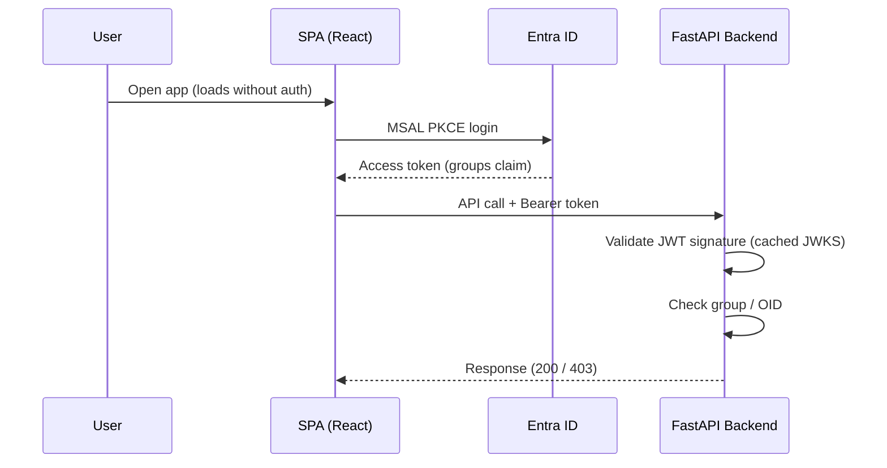
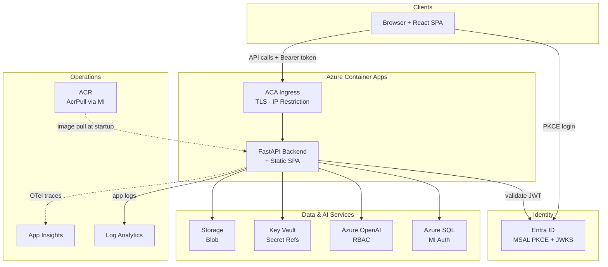

# PyRIT Azure Deployment

Deploy the CoPyRIT GUI as an Azure Container App with MSAL PKCE authentication,
managed identity, security response headers (CSP, HSTS, X-Frame-Options),
IP-based network restriction, and no embedded secrets.

## Contents

- [Architecture](#architecture)
- [Security](#security)
- [Prerequisites](#prerequisites)
- [Deploy](#deploy)
- [Post-Deployment](#post-deployment)
- [Configuration](#configuration-pyrit_conf-env-and-dev_mode)
- [Technical Notes](#technical-notes)
- [Production Hardening](#production-hardening)
- [Troubleshooting](#troubleshooting)
- [Teardown and Redeployment](#teardown-and-redeployment)

## Architecture

**Auth flow** — browser-driven PKCE, backend validates tokens:


**Infrastructure overview** — all components and connections in a single view:


> **Diagram key**: Solid lines (→) = runtime request/data flow.
> Dashed lines (⇢) = startup or optional flows (image pull, OTel when enabled).

## Security

### Authentication & Authorization

- **Authentication**: MSAL PKCE on the frontend (`@azure/msal-browser`) + FastAPI JWT
  middleware on the backend. The backend validates Bearer tokens against Entra ID JWKS.
  No Easy Auth — the tenant blocks client secrets/certs on app registrations, so PKCE
  (public client) is used instead.
- **Authorization** (three layers, any combination):
  1. **IP restriction** (ingress-level) — `allowedCidr` param restricts to a CIDR range
     (e.g., corp VPN `131.107.0.0/16`). Blocked before auth runs. Empty = all traffic allowed.
  2. **Entra group check** — `allowedGroupObjectId` param. Requires `groupMembershipClaims:
     "ApplicationGroup"` + optional claims + the security group assigned to the enterprise app
     (see Prerequisites §3). Using `ApplicationGroup` instead of `SecurityGroup` avoids groups
     overage (>200 groups) by only emitting app-assigned groups in the token.
  3. **OID allowlist** — `allowedOids` param. Comma-separated user OIDs. Fallback when the
     groups claim is unavailable. The `oid` claim is always present in tokens.
  - If neither group nor OID restriction is set, all authenticated users pass.
  - The frontend (static SPA) loads without auth. Authorization is enforced at the `/api/*`
    layer — unauthorized users see the GUI shell but all API calls return 403.
- **Identity**: User-assigned managed identity — created before the container app so
  RBAC roles (AcrPull, KV Secrets User) are active before the first revision starts.
  Set `AZURE_CLIENT_ID` to the UAMI's client ID so `DefaultAzureCredential` uses
  the correct identity.

### Network & Transport

- **Network**: Public ingress with optional IP restriction via `allowedCidr`. Private
  Endpoint can be enabled via `enablePrivateEndpoint` (see Technical Notes).
- **Response headers**: `SecurityHeadersMiddleware` adds Content-Security-Policy,
  X-Content-Type-Options, X-Frame-Options, Referrer-Policy, Permissions-Policy,
  and HSTS (production only). API routes get a strict `default-src 'none'` CSP;
  frontend routes allow `script-src 'self'` and `style-src 'self' 'unsafe-inline'`
  (required for Fluent UI Griffel CSS-in-JS).
- **Swagger/OpenAPI**: Disabled in production (`PYRIT_DEV_MODE=false`). The `/docs`,
  `/redoc`, and `/openapi.json` endpoints are only available when `PYRIT_DEV_MODE=true`.
- **CORS**: Restricted to explicit method and header lists (`GET`, `POST`, `PUT`,
  `DELETE`, `OPTIONS`; `Authorization`, `Content-Type`, `X-Request-ID`). Origins
  configurable via `PYRIT_CORS_ORIGINS` env var.

### Data & Supply Chain

- **Data**: Azure SQL with managed identity authentication (no passwords)
- **Secrets**: Key Vault with RBAC (existing vault, secrets referenced via ACA secretRef)
- **Images**: Unique tags or digests required — `:latest` triggers a warning output
- **Container registry**: ACR pull via managed identity RBAC (AcrPull role assigned in IaC)
- **npm packages**: `frontend/.npmrc` points to an Azure Artifacts feed (`copyrit-npm`
  in the AI Red Team ADO project) that proxies npmjs.org. This satisfies Microsoft
  Secure Supply Chain (CSSC) policies CFS0001 and CFS0003, which require every
  `package.json` to have a sibling `.npmrc` pointing to an Azure Artifacts feed.
  The feed is a read-through cache — same packages, same source, but routed through
  Microsoft-controlled infrastructure for audit trail and caching. Docker builds
  override the registry via `NPM_CONFIG_REGISTRY` env var (see Technical Notes).
- **Docker base image**: `docker/Dockerfile` declares `ARG BASE_IMAGE` with no default
  value. All callers (pipeline, `build_pyrit_docker.py`, `docker-compose.yaml`) pass
  `--build-arg BASE_IMAGE=pyrit-devcontainer` explicitly. This avoids CSSC warnings
  about unqualified image references and ensures builds fail fast if the arg is omitted.

### Governance

- **Logging**: Log Analytics (app logs) + optional OTel via Application Insights
- **Tags**: All resources tagged with Service/Owner/DataClass for governance

## Prerequisites

The Bicep template creates most infrastructure automatically (ACR, Log Analytics,
managed identity, RBAC role assignments). Entra ID resources must be created
separately (Microsoft Graph, not ARM). Key Vault must be an existing vault
(avoids purge-protection issues on redeployment).

**Requirements:**
- Azure CLI **2.84+** (version 2.77 has a known `content-already-consumed` bug)
- Container image must be pushed to ACR **before** deployment

**Quick reference** — what you need before running `az deployment group create`:

| # | What | How | Key Output |
|---|------|-----|------------|
| 1 | Resource group | `az group create` | `<rg>` name |
| 2 | Entra app registration | Portal or CLI (Graph API) | `entraClientId`, `entraTenantId` |
| 3 | Security group + SP assignment | Portal or CLI | `allowedGroupObjectId` |
| 4 | SQL server with Entra admin | Existing server | `sqlServerFqdn`, `sqlDatabaseName` |
| 5 | Container image in ACR | Docker build + push | `containerImage` |
| 6 | Key Vault | Existing vault | `keyVaultResourceId` |

### 1. Resource group

```bash
az group create --name <rg> --location <region>
```

### 2. Entra ID app registration (manual — not an ARM resource)

No secrets or certificates needed — MSAL PKCE uses only the client ID (public client).

```bash
# Create app registration (--service-management-reference may be required by your org)
az ad app create --display-name pyrit-gui --sign-in-audience AzureADMyOrg \
  --service-management-reference "<your-asset-id-or-ticket>"

# Get the client ID (use this as entraClientId)
APP_ID=$(az ad app list --display-name pyrit-gui --query '[0].appId' -o tsv)
echo "entraClientId: $APP_ID"

# Get the tenant ID (use this as entraTenantId)
az account show --query tenantId -o tsv
```

> **Note**: The redirect URI requires the app FQDN, which is only known after
> the first deployment. After deploying, set the SPA redirect URI:
> ```bash
> FQDN=$(az deployment group show -g <rg> -n main \
>   --query properties.outputs.appFqdn.value -o tsv)
> az ad app update --id $APP_ID \
>   --spa-redirect-uris "https://$FQDN"
> ```

**Expose an API scope** (required — the frontend requests `{clientId}/access` tokens):

1. In Azure Portal → App registrations → your app → **Expose an API**
2. Set the Application ID URI (accept the default `api://<client-id>`)
3. **Add a scope**: value = `access`, admin consent display name = "Access PyRIT GUI",
   who can consent = "Admins and users", state = Enabled

Or via CLI:
```bash
# Set application ID URI
APP_OBJ_ID=$(az ad app show --id $APP_ID --query id -o tsv)
az rest --method PATCH \
  --url "https://graph.microsoft.com/v1.0/applications/$APP_OBJ_ID" \
  --body "{\"identifierUris\": [\"api://$APP_ID\"]}"

# Add the 'access' scope (generate a unique GUID for the scope ID)
SCOPE_ID=$(python3 -c "import uuid; print(uuid.uuid4())")
az rest --method PATCH \
  --url "https://graph.microsoft.com/v1.0/applications/$APP_OBJ_ID" \
  --body "{\"api\":{\"oauth2PermissionScopes\":[{\"id\":\"$SCOPE_ID\",\"isEnabled\":true,\"type\":\"User\",\"value\":\"access\",\"adminConsentDisplayName\":\"Access PyRIT GUI\",\"adminConsentDescription\":\"Allow access to the PyRIT GUI API\",\"userConsentDisplayName\":\"Access PyRIT GUI\",\"userConsentDescription\":\"Allow access to the PyRIT GUI API\"}]}}"
```

**Configure group claims** for group-based authorization:

```bash
# Set groupMembershipClaims to ApplicationGroup (not SecurityGroup — the latter
# causes groups overage for users in >200 groups, breaking token-based group checks)
az rest --method PATCH \
  --url "https://graph.microsoft.com/v1.0/applications/$APP_OBJ_ID" \
  --body '{"groupMembershipClaims": "ApplicationGroup"}'
```

Then add `groups` as an optional claim for both ID tokens and access tokens:
Azure Portal → App registrations → your app → Token configuration → Add optional
claim → Token type: Access → check `groups` → Save. Repeat for ID token.

### 3. Entra security group (required for group-based authorization)

```bash
# Create security group for authorized users
# NOTE: This may require elevated permissions. If it fails, create the group
# in Azure Portal → Entra ID → Groups → New group (Security type).
az ad group create --display-name "PyRIT GUI Users" --mail-nickname pyrit-gui-users

# Get the group Object ID (use this as allowedGroupObjectId)
GROUP_ID=$(az ad group show --group "PyRIT GUI Users" --query id -o tsv)
echo "allowedGroupObjectId: $GROUP_ID"

# Add users to the group
az ad group member add --group "PyRIT GUI Users" --member-id <user-object-id>

# List current members
az ad group member list --group "PyRIT GUI Users" --query '[].displayName' -o tsv
```

**IMPORTANT: Assign the group to the enterprise application.** This is required for
`ApplicationGroup` to emit the group ID in tokens:

```bash
# Get the service principal (enterprise app) object ID
SP_ID=$(az ad sp show --id $APP_ID --query id -o tsv)

# Assign the security group (uses default access role)
az rest --method POST \
  --url "https://graph.microsoft.com/v1.0/servicePrincipals/$SP_ID/appRoleAssignments" \
  --body "{\"principalId\": \"$GROUP_ID\", \"resourceId\": \"$SP_ID\", \"appRoleId\": \"00000000-0000-0000-0000-000000000000\"}"

# Restrict token issuance to assigned users/groups only (recommended).
# Without this, any tenant user can obtain a token — they'll get a 403 from
# the backend group check, but defense-in-depth says reject at the IdP level.
az ad sp update --id $SP_ID --set appRoleAssignmentRequired=true
```

### 4. Azure SQL server with Entra admin (existing)

The container app's managed identity authenticates via Entra — no SQL passwords.

```bash
# Check if Entra admin is already configured
az sql server ad-admin list \
  --resource-group <sql-rg> --server-name <sql-server>

# Set Entra admin (if not configured) — use your own user or a group
az sql server ad-admin create \
  --resource-group <sql-rg> \
  --server-name <sql-server> \
  --display-name "SQL Entra Admin" \
  --object-id <your-user-or-group-object-id>

# Get the SQL server FQDN (use this as sqlServerFqdn)
az sql server show \
  --resource-group <sql-rg> --name <sql-server> \
  --query fullyQualifiedDomainName -o tsv
```

### 5. Container image (**must be pushed to ACR before deployment**)

```bash
# Build image locally
cd <repo-root>
python docker/build_pyrit_docker.py --source local

# Tag with commit SHA (never use :latest)
COMMIT_SHA=$(git rev-parse --short HEAD)

# If using a template-created ACR, get its name after first deploy:
# ACR_NAME=$(az deployment group show -g <rg> -n main \
#   --query properties.outputs.acrLoginServer.value -o tsv | cut -d. -f1)
# Or if using an existing ACR:
ACR_NAME=<your-acr-name>

docker tag pyrit:latest $ACR_NAME.azurecr.io/pyrit:$COMMIT_SHA
az acr login --name $ACR_NAME
docker push $ACR_NAME.azurecr.io/pyrit:$COMMIT_SHA
echo "containerImage: $ACR_NAME.azurecr.io/pyrit:$COMMIT_SHA"
```

### 6. Key Vault (existing — required)

Use an existing Key Vault to avoid soft-delete/purge-protection naming conflicts
on redeployment. The template grants the container app's MI `Key Vault Secrets User`.

```bash
# Create a vault (if your org doesn't provide one)
az keyvault create \
  --resource-group <kv-rg> \
  --name <vault-name> \
  --enable-rbac-authorization true \
  --enable-purge-protection true

# Get the vault resource ID (use this as keyVaultResourceId)
az keyvault show --name <vault-name> --query id -o tsv
```

> **Note**: The vault should have `enableRbacAuthorization: true` so the template
> can grant the MI access. Diagnostic settings (AuditEvent logs) should be
> configured on the vault separately by the vault owner.

## Deploy

### Automated (CI/CD pipeline)

An Azure DevOps pipeline (`gui-deploy.yml` in this repo) automates
build → push → deploy. It triggers on pushes to `main` that change GUI-relevant
paths (`pyrit/backend/`, `frontend/`, `docker/`, `infra/`). Environment-specific
parameters (Entra IDs, SQL connection, etc.) are stored in ADO variable groups —
nothing sensitive appears in the pipeline YAML. Production deployment is opt-in
via a `deployToProd` parameter toggle.

### Manual

> **Note**: The heredoc syntax below (`cat > ... <<'EOF'`) works on Linux/macOS.
> On Windows (PowerShell), create `infra/parameters.json` manually or use
> `Set-Content` instead.

```bash
# Create a parameters file with your values
cat > infra/parameters.json <<'EOF'
{
  "$schema": "https://schema.management.azure.com/schemas/2019-04-01/deploymentParameters.json#",
  "contentVersion": "1.0.0.0",
  "parameters": {
    "appName":                { "value": "<app-name>" },
    "containerImage":         { "value": "<acr>.azurecr.io/pyrit:<commit-sha>" },
    "entraTenantId":          { "value": "<tenant-id>" },
    "entraClientId":          { "value": "<app-registration-client-id>" },
    "allowedGroupObjectId":   { "value": "<entra-group-object-id>" },
    "allowedOids":            { "value": "" },
    "allowedCidr":            { "value": "" },
    "enablePrivateEndpoint":  { "value": false },
    "sqlServerFqdn":          { "value": "<server>.database.windows.net" },
    "sqlDatabaseName":        { "value": "<database>" },
    "keyVaultResourceId":     { "value": "/subscriptions/<sub>/resourceGroups/<rg>/providers/Microsoft.KeyVault/vaults/<vault>" },
    "enableOtel":             { "value": false },
    "acrResourceId":          { "value": "/subscriptions/<sub>/resourceGroups/<rg>/providers/Microsoft.ContainerRegistry/registries/<acr>" }
  }
}
EOF
# Edit parameters.json with your values

# Deploy
az deployment group create \
  --resource-group <rg> \
  --template-file infra/main.bicep \
  --parameters @infra/parameters.json
```

## Post-Deployment

1. **Set SPA redirect URI** on the app registration (requires the FQDN from deploy output):
   ```bash
   FQDN=$(az deployment group show -g <rg> -n main \
     --query properties.outputs.appFqdn.value -o tsv)
   az ad app update --id <entraClientId> \
     --spa-redirect-uris "https://$FQDN"
   ```

2. **Grant managed identity RBAC on Azure resources**:
   ```bash
   # Get the MI's principal ID from deployment output
   MI_ID=$(az deployment group show -g <rg> -n main \
     --query properties.outputs.managedIdentityPrincipalId.value -o tsv)

   # Azure OpenAI — Cognitive Services OpenAI User on each AOAI instance (required)
   az role assignment create \
     --assignee-object-id $MI_ID \
     --role "Cognitive Services OpenAI User" \
     --scope /subscriptions/<sub>/resourceGroups/<rg>/providers/Microsoft.CognitiveServices/accounts/<aoai-name>

   # Content Safety — Cognitive Services User (required if using content safety scorers)
   az role assignment create \
     --assignee-object-id $MI_ID \
     --role "Cognitive Services User" \
     --scope /subscriptions/<sub>/resourceGroups/<rg>/providers/Microsoft.CognitiveServices/accounts/<content-safety-name>

   # Azure Storage — Storage Blob Data Contributor (required if using blob storage for results)
   az role assignment create \
     --assignee-object-id $MI_ID \
     --role "Storage Blob Data Contributor" \
     --scope /subscriptions/<sub>/resourceGroups/<rg>/providers/Microsoft.Storage/storageAccounts/<storage-name>

   # Azure ML — Azure ML Data Scientist (only if using serverless endpoints e.g. DeepSeek, Phi-4)
   az role assignment create \
     --assignee-object-id $MI_ID \
     --role "Azure ML Data Scientist" \
     --scope /subscriptions/<sub>/resourceGroups/<rg>/providers/Microsoft.MachineLearningServices/workspaces/<workspace-name>
   ```

3. **Create Azure SQL contained user** for the managed identity:
   ```sql
   -- Run on the target database as Entra admin
   -- Use the UAMI name (appName + "-identity")
   -- If recreating the MI, drop the old user first:
   -- DROP USER IF EXISTS [<appName>-identity];
   CREATE USER [<appName>-identity] FROM EXTERNAL PROVIDER;
   ALTER ROLE db_datareader ADD MEMBER [<appName>-identity];
   ALTER ROLE db_datawriter ADD MEMBER [<appName>-identity];
   ```

4. **Manage access** — Add or remove users via Entra security group (if using
   `allowedGroupObjectId`) or update `allowedOids` in parameters.

5. **Configure OTel agent** (if `enableOtel=true`):
   ```bash
   AI_CONN=$(az deployment group show -g <rg> -n main \
     --query properties.outputs.appInsightsConnectionString.value -o tsv)
   az containerapp env telemetry app-insights set \
     --name <appName>-env -g <rg> --connection-string "$AI_CONN"
   ```

6. **Verify deployment and access the GUI**:
   ```bash
   FQDN=$(az deployment group show -g <rg> -n main \
     --query properties.outputs.appFqdn.value -o tsv)

   # Health check (should return {"status": "healthy", ...})
   curl -sf "https://$FQDN/api/health" | python3 -m json.tool

   # Auth config endpoint (should return clientId and tenantId)
   curl -sf "https://$FQDN/api/auth/config" | python3 -m json.tool
   ```
   Then open `https://<FQDN>` in a browser. The SPA shell loads without
   authentication. Click **Sign In** to authenticate via Entra ID MSAL PKCE.
   After login, API calls include a Bearer token and the backend validates
   group membership. If `allowedCidr` is set, only traffic from that CIDR
   range (e.g., corp VPN) can reach the app.

## Configuration: .pyrit_conf, .env, and DEV_MODE

The template replaces `.pyrit_conf` and `.env` with Bicep parameters — no files
needed in the container.

### PYRIT_DEV_MODE

Set the `PYRIT_DEV_MODE` environment variable to control development vs production
behavior:

| `PYRIT_DEV_MODE` | Swagger/OpenAPI | HSTS header | CSP on docs paths |
|---|---|---|---|
| `true` | Enabled (`/docs`, `/redoc`, `/openapi.json`) | Skipped (avoids breaking local HTTP) | Skipped (Swagger loads CDN scripts) |
| `false` (default) | Disabled (404) | Enabled (`max-age=63072000; includeSubDomains`) | N/A (routes don't exist) |

In production deployments, leave this unset or set to `false`.

### .pyrit_conf fields → Bicep params

| .pyrit_conf field | Bicep param | Env var | Notes |
|-------------------|-------------|---------|-------|
| `initializers` | `pyritInitializer` | `PYRIT_INITIALIZER` | Default `targets airt`: `targets` populates the TargetRegistry (read by the GUI), `airt` sets up converter/scorer/adversarial defaults |
| `operator` | — | Set per-user in the GUI | |
| `operation` | — | Set per-user in the GUI | |

### .env file → Key Vault secret

The entire `.env` file is stored as a single Key Vault secret (`env-global` by
default). The template references it via ACA secret and injects it as the
`PYRIT_ENV_CONTENTS` env var. PyRIT parses this at startup to set all endpoint,
model, and API key environment variables.

To update the `.env` contents:
```bash
az keyvault secret set --vault-name <vault> --name env-global --file ~/.pyrit/.env
```

Azure services (OpenAI, Content Safety, Speech) support managed identity — when
API key env vars are not set, PyRIT auto-falls back to `DefaultAzureCredential`,
which picks up the container app's user-assigned MI. Set the `AZURE_CLIENT_ID`
env var to the UAMI's client ID so `DefaultAzureCredential` selects the correct
identity. Non-Azure providers (OpenAI Platform, Groq, Google Gemini) require API
keys in the `.env`.

## Technical Notes

- **IP restriction**: When `allowedCidr` is set, only traffic from that CIDR range
  can reach the app at the ingress level (blocked before auth runs). When empty, all
  traffic is allowed and authorization relies solely on MSAL + group/OID checks.
  **Caveat**: Azure Cloud PCs route traffic to Azure services through CGNAT IPs
  (`100.64.0.0/10`), not the public NAT IPs shown by `ifconfig.me`. IP restrictions
  based on `ifconfig.me` will not work for Cloud PC → ACA traffic.
- **Private Endpoint**: Set `enablePrivateEndpoint=true` to create a Private Endpoint,
  Private DNS zone, and VNet link for the ACA environment. This disables public network
  access — the app is only reachable via the PE's private network path. Requires that
  clients (e.g., Cloud PCs, dev machines) are on the PE's VNet or a peered VNet.
  When disabled (default for test deployments), the app uses public ingress.
- **Log Analytics shared key**: The ACA environment uses `listKeys()` to connect to
  Log Analytics. This is the standard pattern required by the ACA API. The key is used
  only during deployment and is not exposed to the application.
- **Workload profiles**: The environment uses workload profiles mode (Consumption tier).
- **Scaling**: Defaults to 1 replica (no auto-scale). Adjust `minReplicas`/`maxReplicas`
  in parameters if needed.
- **Key Vault**: Must be an existing vault (passed via `keyVaultResourceId`).
  The template grants `Key Vault Secrets User` to the user-assigned MI.
- **OpenTelemetry (SFI-SM 2.3.1)**: When `enableOtel=true`, the template creates
  Application Insights. The OTel agent must be configured as a post-deploy step
  (see Post-Deployment §5).
- **Existing resources**: Log Analytics (`logAnalyticsWorkspaceId` + credentials),
  VNet (`infrastructureSubnetId`), and ACR (`acrResourceId`) can optionally be
  provided as existing resources to skip creation.
- **Azure CLI**: Version 2.84+ required (2.77 has a known bug).
- **npm registry in Docker builds**: The repo-level `frontend/.npmrc` points to an
  Azure Artifacts feed (required by CSSC policy), but Docker containers lack ADO auth
  context. The Dockerfile sets `ENV NPM_CONFIG_REGISTRY=https://registry.npmjs.org/`
  to override the `.npmrc` during `npm install`. This is safe — the Artifacts feed
  itself is just a proxy to the same npmjs.org registry; the env var override simply
  skips the proxy when auth is unavailable. No security posture change.

## Production Hardening

The default configuration (Entra MSAL PKCE + security group authorization) is
sufficient for test deployments. For production, add defense-in-depth.

### Already built-in

These are enabled by default — no additional configuration needed:

- **Security response headers** — `SecurityHeadersMiddleware` adds CSP, HSTS,
  X-Frame-Options, X-Content-Type-Options, Referrer-Policy, and Permissions-Policy.
  HSTS is production-only (skipped when `PYRIT_DEV_MODE=true`).
- **Swagger disabled in production** — `/docs`, `/openapi.json`, and `/redoc`
  return 404 when `PYRIT_DEV_MODE=false` (the default).
- **CORS tightened** — Methods restricted to `GET`, `POST`, `PUT`, `DELETE`,
  `OPTIONS`; headers to `Authorization`, `Content-Type`, `X-Request-ID`.
  Origins configurable via `PYRIT_CORS_ORIGINS` env var.

### Remaining for production

| # | Item | Effort | Detail |
|---|------|--------|--------|
| 1 | **Private Endpoint + VNet peering** | Medium | Set `enablePrivateEndpoint=true` with an `infrastructureSubnetId` on a VNet peered with clients (Cloud PC, VPN gateway). Disables public access entirely. |
| 2 | **`appRoleAssignmentRequired=true`** | Small | Set on the service principal (covered in Prerequisites §3). Rejects tokens for unassigned users at the IdP level. |
| 3 | **Entra Conditional Access Policies** | Small | Require compliant devices, MFA, or named locations. Configured in Entra ID → Security → Conditional Access (not in Bicep). |
| 4 | **IP restrictions as fallback** | Small | If using public access, set `allowedCidr` to restrict ingress. Note the CGNAT caveat for Cloud PCs (see Technical Notes). |
| 5 | **WAF / Front Door** | Medium | Azure Front Door with WAF policies for DDoS protection, bot filtering, and geo-restrictions. |
| 6 | **Audit logging** | Small | Enable `enableOtel=true` for App Insights telemetry. Ensure Log Analytics retention meets compliance. |
| 7 | **Container image scanning** | Medium | Add Trivy or Defender for Containers to CI to scan for CVEs before pushing to ACR. |
| 8 | **Slim production image** | Medium | Current Dockerfile builds on devcontainer (includes dev tools, passwordless sudo). Use multi-stage build to strip these. |

## Troubleshooting

**Admin consent required error during login**
The frontend requests the `{clientId}/access` scope. If the app registration uses
`.default` instead, it resolves `requiredResourceAccess` which triggers mandatory
admin consent in some tenants (e.g., Microsoft). Fix: ensure the frontend requests
the explicit `/access` scope and that it's defined in "Expose an API".

**`ERR_CONNECTION_CLOSED` or TLS handshake failure**
If `enablePrivateEndpoint=true`, the ACA environment disables public network access.
Clients must be on the PE's VNet or a peered VNet. Check that VNet peering is
configured and the Private DNS zone resolves the app FQDN to the PE's private IP.

**Groups claim missing from token (empty `groups` array)**
- Verify `groupMembershipClaims` is set to `"ApplicationGroup"` (not `"SecurityGroup"`)
- Verify the security group is **assigned to the enterprise application** (not just
  created) — see Prerequisites §3
- Verify `groups` is added as an optional claim for both ID and access tokens
- If the user is in >200 groups and using `SecurityGroup`, the token replaces
  `groups` with `_claim_sources` (overage). Switch to `ApplicationGroup` to avoid this.

**IP restriction not working for Cloud PCs**
Azure Cloud PCs route traffic to Azure services through CGNAT IPs (`100.64.0.0/10`),
not the public NAT IPs shown by `ifconfig.me`. IP restrictions based on public IP
lookup tools will not match Cloud PC → ACA traffic. Use Private Endpoint instead.

**`DefaultAzureCredential` fails / wrong identity used**
Ensure `AZURE_CLIENT_ID` is set to the user-assigned managed identity's client ID.
Without this, `DefaultAzureCredential` tries all credential types and may pick the
wrong one or fail entirely. The Bicep template sets this automatically.

## Teardown and Redeployment

You can safely delete the resource group and redeploy — Key Vault is external
to the RG so there are no purge-protection naming conflicts:

```bash
az group delete --name <rg> --yes
```

All resources created by the template (ACR, ACA, Log Analytics, App Insights,
VNet) are deleted cleanly with no naming conflicts.
